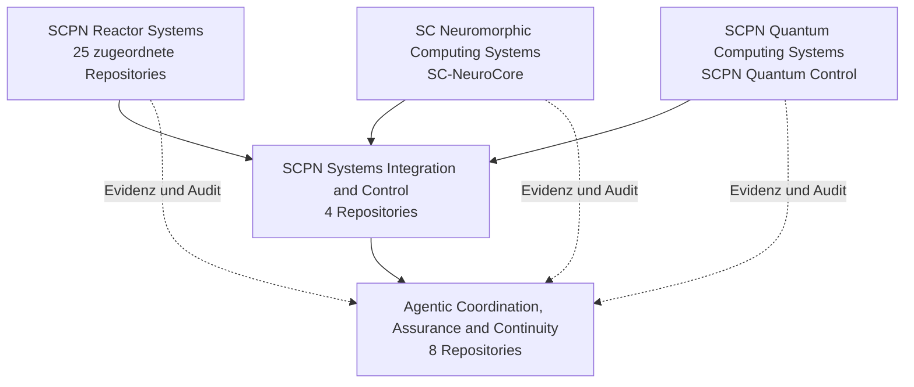

<!--
SPDX-License-Identifier: AGPL-3.0-or-later
Kommerzielle Lizenz verfügbar
© Konzepte 1996–2026 Miroslav Šotek. Alle Rechte vorbehalten.
© Code 2020–2026 Miroslav Šotek. Alle Rechte vorbehalten.
ORCID: 0009-0009-3560-0851
Kontakt: www.anulum.li | protoscience@anulum.li
Persönliche GitHub-Profilübersicht
-->

<p align="center">
  
</p>

<p align="center">
  <a href="README.md"><kbd>EN</kbd></a>
  <a href="README.de.md"><kbd>DE</kbd></a>
  <a href="README.sk.md"><kbd>SK</kbd></a>
  <a href="README.zh-CN.md"><kbd>中文</kbd></a>
  <a href="README.ja.md"><kbd>日本語</kbd></a>
</p>

<p align="center">
  <a href="https://anulum.li">Website</a> ·
  <a href="https://orcid.org/0009-0009-3560-0851">ORCID</a> ·
  <a href="https://github.com/sponsors/anulum">Sponsoring</a> ·
  <a href="mailto:protoscience@anulum.li">protoscience@anulum.li</a>
</p>

# Miroslav Šotek

Unabhängiger Forscher und Systemingenieur am
[Anulum Institute](https://anulum.li) in der Schweiz.

Ich entwickle **evidenzbasierte Infrastruktur** für KI-Systeme und
Multi-Agenten-Engineering: Koordination mit Quittungen, Zuverlässigkeitsschutz
für Modellausgaben und Forschungsstacks, die von der Mathematik bis zu
ausführbaren Hardwarepfaden reichen.

Aussagen sind nur so verlässlich wie die Messungen, Artefakte oder Prüfungen,
die sie belegen.

**Technologien:** Python · Rust · Verilog · formale und prozessbezogene Werkzeuge nach Bedarf.

## Einstieg

| Wenn Sie Folgendes benötigen… | Projekt |
|---|---|
| Parallele Coding-Agenten, die sich nicht gegenseitig überschreiben | [Synapse Channel](https://github.com/anulum/synapse-channel) · [Dokumentation](https://anulum.github.io/synapse-channel/) |
| Schutz von LLM-Aussagen und Prüfung faktischer Konsistenz | [Director-AI](https://github.com/anulum/director-ai) · [Dokumentation](https://anulum.github.io/director-ai/) |
| Repository-Audit und Sanierungsplanung | [Rigor Foundry](https://github.com/anulum/rigor-foundry) · [Dokumentation](https://anulum.github.io/rigor-foundry/) |
| Forschung an neuromorphem und stochastischem Rechnen | [SC-NeuroCore](https://github.com/anulum/sc-neurocore) · [Dokumentation](https://anulum.github.io/sc-neurocore/) |
| Forschung an gekoppelten Oszillatoren und Quantensimulation | [SCPN Quantum Control](https://github.com/anulum/scpn-quantum-control) |

Projektdokumentation befindet sich auch auf den Pages-Seiten der einzelnen
Repositories und auf [anulum.li](https://anulum.li).

## Laborkarte

Anulum ist ein Laborstack, kein einzelnes Produkt:

```text
Director-AI          Zuverlässigkeit von Modellausgaben
Rigor Foundry        evidenzgebundene Audits und Sanierung
Synapse Channel      Multi-Agenten-Koordination, Claims, Quittungen
SC-NeuroCore         neuromorphes / SC-Rechnen (Python · Rust · RTL)
SCPN-Suite           Regelungs-, Plasma-, Phasen- und Quantenforschung
```

### Typische Nutzung des Stacks

1. **Rigor Foundry** — findet, was defekt, unbelegt oder unsicher zu behaupten ist.
2. **Director-AI** — schützt Modellausgaben, denen vertraut werden soll.
3. **Synapse Channel** — führt Multi-Agenten-Arbeit mit Claims, Mailboxen und Quittungen aus.
4. **SC-NeuroCore / SCPN** — für neuromorphe, physikalische oder regelungskritische Berechnung.

Forschung, Validierung und Produktreife bleiben getrennt. Aktive Entwicklung
ist keine Aussage über Einsatzreife.

Die **angehefteten Repositories** dieses Profils entsprechen der nachstehenden
Auswahltabelle. Andere öffentliche Repositories gehören zur SCPN-Forschung oder
zu unterstützenden Werkzeugen.

## Ökosystemkarte

Die aktive Portfoliokarte umfasst **39 zugeordnete Repository-Mitglieder** in
fünf unabhängigen Gruppen: 31 öffentliche Repositories, sechs
private/proprietäre Produktbereiche und zwei Reaktor-Repositories in Vorbereitung.
[HushLine](https://github.com/anulum/HushLine) ist ein eigenständiges
öffentliches Projekt ausserhalb dieser Forschungs- und Produktportfolios.



Die Pfeile stellen Vertrags-, Integrations-, Evidenz- und Auditbeziehungen dar.
Sie führen weder Repository-Verantwortlichkeiten zusammen, noch implizieren
sie wissenschaftliche Validierung, Betriebsbereitschaft oder
Aktuierungsbefugnis.

**Statusschlüssel:** `ÖFFENTLICH` · `PRIVAT / PROPRIETÄR` · `IN VORBEREITUNG`

<details>
<summary><strong>SCPN Reactor Systems — 25 zugeordnete Repositories</strong></summary>

Gerätefamilienphysik, gemeinsame numerische Kerne, Reaktormodelle und
Konfigurationsverantwortung. Das Vorhandensein eines Repositorys ist für sich
allein kein Nachweis validierter Physik oder Maschinenreife.

- [SCPN Beam Target Core](https://github.com/anulum/scpn-beam-target-core) — `ÖFFENTLICH`
- [SCPN Dense Plasma Focus Core](https://github.com/anulum/scpn-dense-plasma-focus-core) — `ÖFFENTLICH`
- [SCPN FRC Core](https://github.com/anulum/scpn-frc-core) — `ÖFFENTLICH`
- [SCPN Fusion Core](https://github.com/anulum/scpn-fusion-core) — `ÖFFENTLICH`
- [SCPN Fusion-Fission Hybrid Core](https://github.com/anulum/scpn-fusion-fission-hybrid-core) — `ÖFFENTLICH`
- [SCPN ICF Beam Core](https://github.com/anulum/scpn-icf-beam-core) — `ÖFFENTLICH`
- [SCPN ICF Impact Core](https://github.com/anulum/scpn-icf-impact-core) — `ÖFFENTLICH`
- [SCPN ICF Laser Core](https://github.com/anulum/scpn-icf-laser-core) — `ÖFFENTLICH`
- [SCPN IEC Core](https://github.com/anulum/scpn-iec-core) — `ÖFFENTLICH`
- [SCPN Levitated Dipole Core](https://github.com/anulum/scpn-levitated-dipole-core) — `ÖFFENTLICH`
- [SCPN Magnetic Cusp Core](https://github.com/anulum/scpn-magnetic-cusp-core) — `ÖFFENTLICH`
- [SCPN MIF Core](https://github.com/anulum/scpn-mif-core) — `ÖFFENTLICH`
- [SCPN MIF Liner Core](https://github.com/anulum/scpn-mif-liner-core) — `ÖFFENTLICH`
- [SCPN MIF MagLIF Core](https://github.com/anulum/scpn-mif-maglif-core) — `ÖFFENTLICH`
- [SCPN MIF Plasma Jet Core](https://github.com/anulum/scpn-mif-plasma-jet-core) — `ÖFFENTLICH`
- [SCPN Mirror Core](https://github.com/anulum/scpn-mirror-core) — `ÖFFENTLICH`
- [SCPN RFP Core](https://github.com/anulum/scpn-rfp-core) — `ÖFFENTLICH`
- [SCPN Spheromak Core](https://github.com/anulum/scpn-spheromak-core) — `ÖFFENTLICH`
- [SCPN Stellarator Core](https://github.com/anulum/scpn-stellarator-core) — `ÖFFENTLICH`
- [SCPN Theta Pinch Core](https://github.com/anulum/scpn-theta-pinch-core) — `ÖFFENTLICH`
- [SCPN Tokamak Core](https://github.com/anulum/scpn-tokamak-core) — `ÖFFENTLICH`
- [SCPN Z-Pinch Core](https://github.com/anulum/scpn-z-pinch-core) — `ÖFFENTLICH`
- [SCPN Reactor Kernels](https://github.com/anulum/scpn-reactor-kernels) — `ÖFFENTLICH`
- **SCPN Lattice Fusion Core** — `IN VORBEREITUNG`
- **SCPN Muon Fusion Core** — `IN VORBEREITUNG`

</details>

<details>
<summary><strong>SCPN Systems Integration and Control — 4 Repositories</strong></summary>

Horizontale Semantik, Regelungszulassung, Föderation, Evidenzdarstellung und
gemeinsame Schnittstellenverträge.

- [SCPN Control](https://github.com/anulum/scpn-control) — `ÖFFENTLICH`
- [SCPN Phase Orchestrator](https://github.com/anulum/scpn-phase-orchestrator) — `ÖFFENTLICH`
- **SCPN Studio** — `PRIVAT / PROPRIETÄR`
- **SCPN Studio Platform** — `PRIVAT / PROPRIETÄR`

</details>

<details>
<summary><strong>Agentic Coordination, Assurance and Continuity — 8 Repositories</strong></summary>

Koordination, Gedächtnis, Antwortsicherung, Repository-Evidenz,
Aktionssteuerung und kommerzielle Control-Plane-Systeme.

- [Director-AI](https://github.com/anulum/director-ai) — `ÖFFENTLICH`
- **Director Class AI** — `PRIVAT / PROPRIETÄR`
- **Director AI Cloud** — `PRIVAT / PROPRIETÄR`
- [Rigor Foundry](https://github.com/anulum/rigor-foundry) — `ÖFFENTLICH`
- [Remanentia](https://github.com/anulum/remanentia) — `ÖFFENTLICH`
- **Remanentia Portal** — `PRIVAT / PROPRIETÄR`
- [Synapse Channel](https://github.com/anulum/synapse-channel) — `ÖFFENTLICH`
- **Synapse Channel Fleet** — `PRIVAT / PROPRIETÄR`

</details>

<details>
<summary><strong>SC Neuromorphic Computing Systems — 1 Repository</strong></summary>

- [SC-NeuroCore](https://github.com/anulum/sc-neurocore) — `ÖFFENTLICH`

Stochastisches Rechnen, Spiking-Systeme, hyperdimensionale Darstellungen,
native Beschleunigung, Compiler und RTL/FPGA-Pfade.

</details>

<details>
<summary><strong>SCPN Quantum Computing Systems — 1 Repository</strong></summary>

- [SCPN Quantum Control](https://github.com/anulum/scpn-quantum-control) — `ÖFFENTLICH`

Evidenzbasierte Quantenkompilierung, Simulation, Hardwareausführung und
hashgebundene Versuchsaufzeichnungen.

</details>

## Ausgewählte Arbeiten

| Projekt | Aufgabe | Reifegrad |
|---|---|---|
| [Synapse Channel](https://github.com/anulum/synapse-channel) | Lokale Control Plane für Coding-Agentenflotten: Claims, Rollen, dauerhafte Mailboxen, Quittungen, Audit und Föderation | **Jetzt nutzbar** — funktionsfähiger Kern, aktive Entwicklung |
| [Rigor Foundry](https://github.com/anulum/rigor-foundry) | Evidenzgebundene Repository-Audits und Sanierungsplanung | **Jetzt nutzbar** — aktive Härtung |
| [Director-AI](https://github.com/anulum/director-ai) | Echtzeit-LLM-Schutz: NLI- und RAG-Faktenprüfung mit optionalem Streaming-Stopp auf Claim-Ebene | **Aktive Forschung** — funktionsfähiges System in Validierung |
| [SC-NeuroCore](https://github.com/anulum/sc-neurocore) | Polyglottes stochastisches und neuromorphes Framework (Python, Rust SIMD, Verilog, HDC/VSA) | **Aktive Forschung** — Plattform in kontinuierlicher Entwicklung |
| [SCPN Quantum Control](https://github.com/anulum/scpn-quantum-control) | Evidenzbasierte Quantensimulation der Synchronisation gekoppelter Oszillatoren | **Experimentell** — präregistriertes Forschungsprogramm |

Verwandte Regelungs- und Fusionsforschung befindet sich in der SCPN-Suite
([control](https://github.com/anulum/scpn-control),
[fusion-core](https://github.com/anulum/scpn-fusion-core),
[phase orchestrator](https://github.com/anulum/scpn-phase-orchestrator),
[MIF-core](https://github.com/anulum/scpn-mif-core)).

### Reifegradbezeichnungen

| Bezeichnung | Bedeutung |
|---|---|
| **Jetzt nutzbar** | Installierbar, dokumentiert und CI-gestützt; entwickelt sich weiter |
| **Aktive Forschung** | Reeller Code und laufende Forschung; kein Stabilitätsversprechen |
| **Experimentell** | Explorativ; Schnittstellen und Aussagen sind nicht als fest zu betrachten |
| **Evidenzgebunden** | Öffentliche Aussagen sind an Messungen oder Artefakte gebunden |

## Evidenz statt Schlagworte

Negative und Nullresultate werden veröffentlicht, wenn sie real sind.
Öffentliche Aussagen bleiben an Artefakte gebunden: Messungen, präregistrierte
Protokolle, Rohdatenpakete oder ausführbare Verifikation — nicht an Schlagworte.

Beispiel: präregistrierte Quantenregelungsprotokolle und hashgebundene
Ergebnispakete in
[scpn-quantum-control](https://github.com/anulum/scpn-quantum-control).

## Arbeitsprinzipien

- Evidenz vor Aussagen.
- Reproduzierbare Artefakte vor Präsentation.
- Klare Grenzen zwischen Forschung, Validierung und Produktreife.
- Sprachübergreifende Implementierungen, wenn Leistung oder
  Hardwareintegration davon profitieren.
- Ehrliche Fehleraufzeichnungen: Negative Ergebnisse gehören zum
  Forschungsergebnis.

## Zusammenarbeit

Ich begrüsse technisch fundierte Zusammenarbeit in neuromorphen Systemen,
zuverlässiger KI-Infrastruktur, wissenschaftlichem Rechnen, formaler
Verifikation und Regelung.

Eine hilfreiche erste Nachricht enthält Problem, Randbedingungen, relevante
Vorarbeiten und die Evidenz, die als Erfolg gelten würde. Kontakt über
[protoscience@anulum.li](mailto:protoscience@anulum.li) oder
[anulum.li](https://anulum.li).

Ich antworte auf technische Vorschläge. Ich übernehme keine unbelegte
Hype-Arbeit, kein Wissenschaftstheater „nur zur Demonstration“ und keine
Aussagen, die nicht überprüft werden können.

[GitHub Sponsors](https://github.com/sponsors/anulum) finanziert für dauerhafte
offene Arbeit CI-Runner, Quanten- und Hardware-Experimentzeit sowie öffentliche
Dokumentation — nicht Marketing.

> **Transparenz:** Diese Repositories umfassen Forschungssoftware,
> Entwicklerwerkzeuge und Produktkandidaten. Aktive Entwicklung bedeutet weder
> Produktionsreife noch wissenschaftliche Validierung, sofern ein Projekt dafür
> keine ausdrückliche Evidenz vorlegt.

<p align="center"><em>I AM THAT</em></p>

<p align="center">
  
</p>
