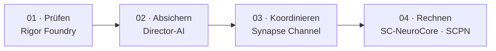

<!--
SPDX-License-Identifier: AGPL-3.0-or-later
Kommerzielle Lizenz verfügbar
© Konzepte 1996–2026 Miroslav Šotek. Alle Rechte vorbehalten.
© Code 2020–2026 Miroslav Šotek. Alle Rechte vorbehalten.
ORCID: 0009-0009-3560-0851
Kontakt: www.anulum.li | protoscience@anulum.li
Persönliche GitHub-Profilübersicht
-->

  <picture>
    <source media="(prefers-color-scheme: dark)" srcset="assets/profile-header-dark.svg">
    <source media="(prefers-color-scheme: light)" srcset="assets/profile-header-light.svg">
    
  </picture>

  
  
  
  
  

  
  
  
  
  
  

  <a href="#projekte">Projekte</a> ·
  <a href="#aktueller-fokus">Aktueller Fokus</a> ·
  <a href="#ökosystemkarte">Ökosystem</a> ·
  <a href="#forschungsergebnisse">Forschungsergebnisse</a> ·
  <a href="#engineering-standards">Standards</a> ·
  <a href="#zusammenarbeit">Zusammenarbeit</a>

Unabhängiger Forscher und Systemingenieur am [Anulum Institute](https://anulum.li)
in der Schweiz. Ich entwickle **evidenzbasierte Infrastruktur** für KI-Systeme,
Multi-Agenten-Engineering, wissenschaftliches Rechnen, neuromorphe Hardware,
Quantensimulation und Regelung: mathematische Modelle, die über reproduzierbare
Software, native Beschleunigung, formale Modelle und ausführbare Hardwarepfade
getragen werden. Aussagen sind nur so verlässlich wie die Messungen, Artefakte
oder Prüfungen, die sie belegen.

<table>
  <tr>
    <td width="25%"><strong>KI-Sicherung</strong> Verankerung in Evidenz, Widerspruchserkennung, Aktionsprüfung, Auditnachweise</td>
    <td width="25%"><strong>Agenteninfrastruktur</strong> Koordination, Claims, dauerhafte Nachrichten, Gedächtnis, Flottensteuerung</td>
    <td width="25%"><strong>Wissenschaftliche Systeme</strong> Plasmaphysik, Oszillatoren, Quantenaufgaben, numerische Validierung</td>
    <td width="25%"><strong>Von der Berechnung zur Hardware</strong> Rust-Beschleunigung, FPGA-RTL, WebGPU, formale Verifikation</td>
  </tr>
</table>

## Einstieg

**[Projekte](#projekte)** für die Software und ihre Evidenz ·
**[Publikationen](https://anulum.li/papers/)** für jede Veröffentlichung und
jedes Softwarearchiv mit BibTeX · **[Kontakt](mailto:protoscience@anulum.li)**
für einen technischen Vorschlag. Für neue Leser wählt
[anulum.li/start/](https://anulum.li/start/) einen Einstieg nach Profil. Jedes
registrierte Projekt, filterbar nach Gruppe, Reaktorfamilie und Evidenz, mit
klickbarer Karte: [anulum.li/portfolio/](https://anulum.li/portfolio/).

## Projekte

Jede Karte verweist auf prüfbare Artefakte, nicht auf zusammenfassende
Aussagen. Evidenzlinks sind an den Commit gebunden, bei dem sie verifiziert
wurden. Release- und CI-Badges melden den Zustand von Registry und Workflow;
sie sind Betriebssignale, keine Bewertung wissenschaftlicher Qualität.

<table>
  <tr>
    <td width="50%" valign="top"><strong><a href="https://github.com/anulum/synapse-channel">Synapse Channel</a></strong> · <strong>Jetzt nutzbar</strong> Control Plane für Coding-Agentenflotten: Claims, Rollen, dauerhafte Mailboxen, Quittungen, Audit und Föderation. <a href="https://anulum.github.io/synapse-channel/">Dokumentation</a> · <a href="https://github.com/anulum/synapse-channel/blob/dd65c898a9693b47fad051e3baa92cef07da2e63/VALIDATION.md">Validierung</a> · <a href="https://github.com/anulum/synapse-channel/blob/dd65c898a9693b47fad051e3baa92cef07da2e63/docs/coordination-spec.md">Koordinationsspezifikation</a> · <a href="https://github.com/anulum/synapse-channel/blob/dd65c898a9693b47fad051e3baa92cef07da2e63/docs/sandbox-threat-model.md">Bedrohungsmodell</a>  </td>
    <td width="50%" valign="top"><strong><a href="https://github.com/anulum/director-ai">Director-AI</a></strong> · <strong>Aktive Forschung</strong> Echtzeit-LLM-Schutz: NLI/RAG-Verankerung, Claim-Prüfung, native Beschleunigung, optionaler Streaming-Stopp auf Claim-Ebene, deklarierte Fähigkeitsgrenzen. <a href="https://anulum.github.io/director-ai/">Dokumentation</a> · <a href="https://github.com/anulum/director-ai/blob/fc155051367bb48180f2f5dc92f4120c2549cddd/VALIDATION.md">Validierung</a> · <a href="https://github.com/anulum/director-ai/blob/fc155051367bb48180f2f5dc92f4120c2549cddd/benchmarks/PUBLIC_BENCHMARKS.md">Öffentliche Benchmarks</a> · <a href="https://github.com/anulum/director-ai/blob/fc155051367bb48180f2f5dc92f4120c2549cddd/docs/_generated/capability_matrix.md">Fähigkeitsmatrix</a>  </td>
  </tr>
  <tr>
    <td width="50%" valign="top"><strong><a href="https://github.com/anulum/rigor-foundry">Rigor Foundry</a></strong> · <strong>Jetzt nutzbar</strong> Evidenzgebundenes Repository-Inventar, Auditkandidaten, Review-Bindung und Sanierungsplanung. <a href="https://anulum.github.io/rigor-foundry/">Dokumentation</a>  </td>
    <td width="50%" valign="top"><strong><a href="https://github.com/anulum/remanentia">Remanentia</a></strong> · <strong>Jetzt nutzbar</strong> Auditierbares Gedächtnis für KI-Agenten und Wissenssysteme: hybrides Retrieval, Graphen, Konsolidierung, CLI, MCP und API. <a href="https://github.com/anulum/remanentia#readme">Dokumentation</a>  </td>
  </tr>
  <tr>
    <td width="50%" valign="top"><strong><a href="https://github.com/anulum/sc-neurocore">SC-NeuroCore</a></strong> · <strong>Aktive Forschung</strong> Stochastisches und neuromorphes Framework: Python-Modelle, Rust-SIMD-Pfade, Verilog-RTL, HDC/VSA, Compiler-Oberflächen und Hardwarenachweise. <a href="https://anulum.github.io/sc-neurocore/">Dokumentation</a> · <a href="https://github.com/anulum/sc-neurocore/blob/4bbc27b808eef0677848c1e484f40bd41e8ce83d/VALIDATION.md">Validierung</a> · <a href="https://github.com/anulum/sc-neurocore/blob/4bbc27b808eef0677848c1e484f40bd41e8ce83d/docs/hardware/SYNTHESIS_RESULTS.md">Syntheseergebnisse</a> · <a href="https://github.com/anulum/sc-neurocore/blob/4bbc27b808eef0677848c1e484f40bd41e8ce83d/docs/safety/TRACEABILITY_MATRIX.md">Rückverfolgbarkeitsmatrix</a>  </td>
    <td width="50%" valign="top"><strong><a href="https://github.com/anulum/scpn-fusion-core">SCPN Fusion Core</a> · <a href="https://github.com/anulum/scpn-control">SCPN Control</a></strong> · <strong>Aktive Forschung</strong> Tokamakphysik, Löser und Validierungskampagnen mit Pfaden zu realen Daten (Fusion Core); regelungstaugliche Laufzeit mit Fail-closed-Zulassung und Replay-Evidenz (Control). <a href="https://github.com/anulum/scpn-fusion-core/blob/3c841fc13109c8efb49bb079d145f70683a4408d/VALIDATION.md">Validierung</a> · <a href="https://github.com/anulum/scpn-fusion-core/blob/3c841fc13109c8efb49bb079d145f70683a4408d/docs/VALIDATION_REAL_DIIID_145419.md">DIII-D-Validierungsakte</a> · <a href="https://doi.org/10.5281/zenodo.18820864">Software-DOI</a>   </td>
  </tr>
  <tr>
    <td width="50%" valign="top"><strong><a href="https://github.com/anulum/scpn-quantum-control">SCPN Quantum Control</a></strong> · <strong>Experimentell</strong> Evidenzbasierte Quantensimulation der Synchronisation gekoppelter Oszillatoren: Präregistrierung, Hardware-Ergebnispakete, Rohzählungen und ausdrückliche Grenzen ohne Vorteilsbehauptung. <a href="https://github.com/anulum/scpn-quantum-control/blob/2bc0f935b75ae7b85a4835caf754b2bfd8770c98/docs/layout_relaxation_preregistration.md">Präregistrierung</a> · <a href="https://github.com/anulum/scpn-quantum-control/blob/2bc0f935b75ae7b85a4835caf754b2bfd8770c98/docs/hardware_result_packs.md">Ergebnispaket-Vertrag</a> · <a href="https://doi.org/10.5281/zenodo.18821929">Software-DOI</a>  </td>
    <td width="50%" valign="top"><strong><a href="https://github.com/anulum/scpn-phase-orchestrator">SCPN Phase Orchestrator</a></strong> · <strong>Aktive Forschung</strong> Evidenzgeführte Synchronisationsanalyse und ausschliesslich zur Prüfung bestimmte Regelungsvorschläge für gekoppelte rhythmische Systeme; Bewertung mit angeglichener Fehlalarmrate, negative Ergebnisse und begrenzte Übertragungsaussagen. <a href="https://github.com/anulum/scpn-phase-orchestrator/blob/1e9eea39fa6681dde2cfbdf074c08ff03a528b58/papers/submissions/README.md">Einreichungsindex</a> · <a href="https://doi.org/10.5281/zenodo.22113062">Preprint mit Negativergebnis</a> · <a href="https://doi.org/10.5281/zenodo.22113116">Preprint zur Netz-Regimekarte</a>  </td>
  </tr>
</table>

| Bezeichnung | Bedeutung |
|---|---|
| **Jetzt nutzbar** | Installierbar, dokumentiert und CI-gestützt; entwickelt sich weiter |
| **Aktive Forschung** | Realer Code und laufende Forschung; kein Stabilitätsversprechen |
| **Experimentell** | Explorativ; Schnittstellen und Aussagen sind nicht als fest zu betrachten |
| **Evidenzgebunden** | Öffentliche Aussagen sind an Messungen oder Artefakte gebunden |

## Aktueller Fokus

Portfoliostand verifiziert am <!-- verified-at -->2026-09-22<!-- /verified-at -->.

<table>
  <tr>
    <td width="33%"><strong>Reaktorportfolio</strong> Konsolidierung gemeinsamer Kerne und kontrollierter Gerätedaten in 25 öffentlichen Reaktor-Repositories.</td>
    <td width="33%"><strong>Agentensicherung</strong> Verbindung von Koordination, Gedächtnis, Antwortsicherung, Aktionsprüfung und Repository-Evidenz ohne Auflösung der Eigentumsgrenzen.</td>
    <td width="33%"><strong>Von der Forschung zur Hardware</strong> Wissenschaftliche Modelle bis zu nativer Beschleunigung, formalen Prüfungen, RTL, Hardwareläufen und prüfbaren Ergebnispaketen.</td>
  </tr>
</table>

<!-- profile-feeds:releases:start -->
### Neueste Releases

| Datum | Projekt | Release | Änderung |
|---|---|---|---|
| 2026-09-05 | SYNAPSE CHANNEL | [v0.99.26](https://github.com/anulum/synapse-channel/releases/tag/v0.99.26) | Dashboard feeds return unconfigured-store responses without starting report worker processes; configured-store reconstruction retains process isolation. |
| 2026-09-05 | SYNAPSE CHANNEL | [v0.99.25](https://github.com/anulum/synapse-channel/releases/tag/v0.99.25) | Add a repeatable JavaScript SDK integration check against an isolated, authenticated Python hub, covering delivery, claim conflicts, release, snapshots, and reconnect. |
| 2026-09-05 | SCPN-Phase-Orchestrator | [v1.4.3](https://github.com/anulum/scpn-phase-orchestrator/releases/tag/v1.4.3) | Generate identical capability inventory ordering from Git checkouts and exported source trees. |
| 2026-09-04 | SYNAPSE CHANNEL | [v0.99.24](https://github.com/anulum/synapse-channel/releases/tag/v0.99.24) | Keep managed Codex pane bridges waiter-reachable while an already-running provider is blocked by an update chooser, report the pending wake and pane compatibility state explicitly, and coalesce later routing hints until the same live pane becomes safe to… |
| 2026-09-04 | SCPN-Phase-Orchestrator | [v1.4.2](https://github.com/anulum/scpn-phase-orchestrator/releases/tag/v1.4.2) | A fourth sealed L3 request now binds only pulsed_electron_beam_icf to the exact SCPN-ICF-BEAM-CORE review. |

Gerendert aus [anulum.li/news](https://anulum.li/news/) (den CHANGELOG-Dateien der Projekte) und [Zenodo](https://zenodo.org/search?q=creators.orcid%3A%220009-0009-3560-0851%22) am 2026-09-22.
<!-- profile-feeds:releases:end -->

<!-- profile-feeds:publication:start -->
### Neueste Publikation

| Datum | Typ | Ergebnis | DOI |
|---|---|---|---|
| 2026-08-26 | Preprint | A domain-specific modal-growth detector clears a matched false-alarm bar on power-grid instability, and an eigenvalue regime map shows when its form transfers | [10.5281/zenodo.22113116](https://doi.org/10.5281/zenodo.22113116) |

Gerendert aus [anulum.li/news](https://anulum.li/news/) (den CHANGELOG-Dateien der Projekte) und [Zenodo](https://zenodo.org/search?q=creators.orcid%3A%220009-0009-3560-0851%22) am 2026-09-22.
<!-- profile-feeds:publication:end -->

## Zeitleiste

| Zeitraum | Öffentlich belegter Meilenstein |
|---|---|
| ab 1996 | Selbst veröffentlichter Horizont der Konzeptentwicklung im breiteren Forschungsprogramm |
| 1998 | Beginn der selbst eingetragenen Gründerrolle bei ANULUM CH&LI im öffentlichen ORCID-Datensatz |
| 2018 | Öffentliches GitHub-Konto eingerichtet |
| 2025 | Öffentliche SCPN-Vorschauen, Framework-Indizes und technische Berichte auf Zenodo hinterlegt |
| 2026 | Ausbau des öffentlichen Software- und Forschungsportfolios in KI-Sicherung, Agenteninfrastruktur, neuromorphem Rechnen, Plasmaregelung und Quantensimulation |

Die Einträge der Zeitleiste unterscheiden Registerfakten von selbst
veröffentlichter Chronologie. Sie implizieren weder akademische Zugehörigkeit
noch externe Validierung, Förderung oder Auszeichnungen.

## Wie der Stack genutzt wird

<table>
  <tr>
    <td width="25%"><strong>01 · Prüfen</strong> Rigor Foundry findet, was defekt, unbelegt oder unsicher zu behaupten ist.</td>
    <td width="25%"><strong>02 · Absichern</strong> Director-AI bewertet Modellausgaben, bevor ihnen vertraut wird.</td>
    <td width="25%"><strong>03 · Koordinieren</strong> Synapse Channel verwaltet Claims, Mailboxen, Pläne und Quittungen.</td>
    <td width="25%"><strong>04 · Rechnen</strong> SC-NeuroCore und SCPN führen wissenschaftliche, physikalische und hardwarenahe Arbeit aus.</td>
  </tr>
</table>

Forschung, Validierung und Produktreife bleiben getrennt. Aktive Entwicklung
ist keine Aussage über Einsatzreife.

## Ökosystemkarte

  
  
  
  

  <picture>
    <source media="(prefers-color-scheme: dark)" srcset="assets/ecosystem-map-dark.svg">
    <source media="(prefers-color-scheme: light)" srcset="assets/ecosystem-map-light.svg">
    
  </picture>

Die Karte umfasst 39 Portfolio-Repositories: 33 öffentliche Repositories und
sechs private Produktbereiche. [HushLine](https://github.com/anulum/HushLine)
ist ein eigenständiges öffentliches Werkzeug ausserhalb der fünf Portfolios.
Verbindungen stellen Vertrags-, Integrations-, Evidenz- und Auditbeziehungen
dar. Sie führen keine Verantwortlichkeiten zusammen und implizieren weder
wissenschaftliche Validierung noch Betriebsbereitschaft oder
Aktuierungsbefugnis. Zahlen verifiziert am <!-- verified-at -->2026-09-22<!-- /verified-at -->.
Die interaktive Fassung dieser Karte, in der jedes registrierte Projekt eine
Zeile ist und sich nach Gruppe, Reaktorfamilie, Sichtbarkeit, Lebenszyklus und
Evidenz filtern lässt, steht unter
[anulum.li/portfolio/](https://anulum.li/portfolio/); jedes Portfolio unten
verweist auf seine eigene Ansicht.
Das Konto führt mehr öffentliche Repositories als die Karte: die 34 kartierten
öffentlichen Projekte plus dieses Profil-Repository und einige zur Referenz
behaltene Forks.

**Statusschlüssel:** `ÖFFENTLICH` · `ÖFFENTLICH / NUR ARCHITEKTUR` · `PRIVAT` ·
`PRIVAT / PROPRIETÄR`

<strong>01 · SCPN Reactor Systems</strong> &nbsp; 25 öffentliche Repositories

Live-Ansicht dieses Portfolios auf anulum.li, filterbar und mit Karte: [anulum.li/portfolio/#g=SCPN-REACTOR-SYSTEMS](https://anulum.li/portfolio/#g=SCPN-REACTOR-SYSTEMS)

Gerätefamilienphysik, gemeinsame numerische Kerne, Reaktormodelle, Geometrie
und Konfigurationsverantwortung. Das Vorhandensein eines Repositorys ist für
sich allein kein Nachweis validierter Physik oder Maschinenreife. Jede
Gerätefamilie hat auf anulum.li ein interaktives Portal mit Physik, Explorer,
Glossar und Quellen; der [Hub der Reaktorsysteme](https://anulum.li/reactor-systems/)
führt jeden Kern mit seiner Evidenzreife auf, und die
[Vergleichsseite](https://anulum.li/reactor-systems/compare.html) stellt ihre
Level-0-Anker nebeneinander.

**Gemeinsame Grundlagen**

| Repository | Umfang | Status |
|---|---|---|
| [SCPN Reactor Kernels](https://github.com/anulum/scpn-reactor-kernels) | Gemeinsame deterministische Physik-, Geometrie- und Numerikkerne für das Reaktorportfolio | `ÖFFENTLICH` |
| [SCPN Fusion Core](https://github.com/anulum/scpn-fusion-core) | Tokamakphysik, Löser, Validierungskampagnen, Transport und Regelungsforschung | `ÖFFENTLICH` |

**[Geschlossener magnetischer Einschluss](https://anulum.li/reactor-systems/closed-magnetic/)** · toroidale Anlagen, die das Plasma auf geschlossenen Magnetflächen halten

| Repository | Umfang | Status |
|---|---|---|
| [SCPN Tokamak Core](https://github.com/anulum/scpn-tokamak-core) | Konfigurations- und Diagnoseplanwahrheit für konventionelle und sphärische Tokamaks | `ÖFFENTLICH` |
| [SCPN Stellarator Core](https://github.com/anulum/scpn-stellarator-core) | Stellarator-, Heliotron- und Torsatronsysteme | `ÖFFENTLICH` |
| [SCPN RFP Core](https://github.com/anulum/scpn-rfp-core) | Fusionssysteme mit umgekehrtem Feld (Reversed-Field-Pinch) | `ÖFFENTLICH` |
| [SCPN Spheromak Core](https://github.com/anulum/scpn-spheromak-core) | Selbstorganisierte kompakte Spheromak-Toroide | `ÖFFENTLICH` |
| [SCPN FRC Core](https://github.com/anulum/scpn-frc-core) | Fusionssysteme mit feldumgekehrter Konfiguration (FRC) | `ÖFFENTLICH` |

**[Offener und nicht-toroidaler magnetischer Einschluss](https://anulum.li/reactor-systems/open-magnetic/)** · Spiegel-, Magnetcusp- und Levitated-Dipole-Konfigurationen mit offenen Feldlinien

| Repository | Umfang | Status |
|---|---|---|
| [SCPN Mirror Core](https://github.com/anulum/scpn-mirror-core) | Einfache, Tandem- und gasdynamische Magnetspiegel | `ÖFFENTLICH` |
| [SCPN Magnetic Cusp Core](https://github.com/anulum/scpn-magnetic-cusp-core) | Rein magnetische Cusp-Einschlusssysteme | `ÖFFENTLICH` |
| [SCPN Levitated Dipole Core](https://github.com/anulum/scpn-levitated-dipole-core) | Einschlusssysteme mit levitiertem Dipol | `ÖFFENTLICH` |

**[Selbstmagnetische und gepulste Pinches](https://anulum.li/reactor-systems/pinches/)** · Anlagen, in denen der treibende Strom selbst das Plasma einschliesst

| Repository | Umfang | Status |
|---|---|---|
| [SCPN Z-Pinch Core](https://github.com/anulum/scpn-z-pinch-core) | Klassische Z-Pinches und Z-Pinches mit Scherströmung, Level-0-Physik und deterministische Geometrie | `ÖFFENTLICH` |
| [SCPN Theta Pinch Core](https://github.com/anulum/scpn-theta-pinch-core) | Theta-Pinch-Anlagen, Diagnoseverträge und zitierte Level-0-Physik | `ÖFFENTLICH` |
| [SCPN Dense Plasma Focus Core](https://github.com/anulum/scpn-dense-plasma-focus-core) | Koaxiale Dense-Plasma-Focus-Anlagen, Diagnostik und Level-0-Physik | `ÖFFENTLICH` |

**[Trägheitseinschluss](https://anulum.li/reactor-systems/inertial/)** · laser-, strahl- und aufprallgetriebene Kompression von Fusionstargets

| Repository | Umfang | Status |
|---|---|---|
| [SCPN ICF Laser Core](https://github.com/anulum/scpn-icf-laser-core) | Laser-Trägheitsfusion mit direktem, indirektem und gestuftem Antrieb | `ÖFFENTLICH` |
| [SCPN ICF Beam Core](https://github.com/anulum/scpn-icf-beam-core) | Trägheitsfusion mit Ionen- und gepulsten Elektronenstrahlen | `ÖFFENTLICH` |
| [SCPN ICF Impact Core](https://github.com/anulum/scpn-icf-impact-core) | Projektil- und aufprallgetriebene Trägheitsfusion | `ÖFFENTLICH` |

**[Magneto-inertiale Systeme und Systeme mit magnetisiertem Target](https://anulum.li/reactor-systems/magneto-inertial/)** · Kompression magnetisierter Targets durch Liner, Plasmajets oder FRC-Kollisionen

| Repository | Umfang | Status |
|---|---|---|
| [SCPN MIF Core](https://github.com/anulum/scpn-mif-core) | Gepulste FRC/MIF-Kinematik, deterministische Triggerlogik, FPGA-RTL und formale Zeitnachweise | `ÖFFENTLICH` |
| [SCPN MIF MagLIF Core](https://github.com/anulum/scpn-mif-maglif-core) | Vormagnetisierte, laservorgeheizte, pulsleistungsgetriebene MagLIF-Systeme | `ÖFFENTLICH` |
| [SCPN MIF Plasma Jet Core](https://github.com/anulum/scpn-mif-plasma-jet-core) | Magneto-inertiale Fusionssysteme mit konvergierendem Plasmajet-Liner | `ÖFFENTLICH` |
| [SCPN MIF Liner Core](https://github.com/anulum/scpn-mif-liner-core) | Fusion mit magnetisiertem Target und mechanischem oder flüssigem Liner | `ÖFFENTLICH` |

**[Elektrostatische, Strahl-Target- und Hybridsysteme](https://anulum.li/reactor-systems/electrostatic-hybrid/)** · inertial-elektrostatische Potentialtöpfe, kollidierende Strahlen und Fusions-Spaltungs-Hybride

| Repository | Umfang | Status |
|---|---|---|
| [SCPN IEC Core](https://github.com/anulum/scpn-iec-core) | Gitter- und Polywell-artiger inertial-elektrostatischer Einschluss | `ÖFFENTLICH` |
| [SCPN Beam Target Core](https://github.com/anulum/scpn-beam-target-core) | Gerätewahrheit für Festtarget- und Kollisionsstrahl-Fusion | `ÖFFENTLICH` |
| [SCPN Fusion-Fission Hybrid Core](https://github.com/anulum/scpn-fusion-fission-hybrid-core) | Fusionsneutronenquellen, gekoppelt an ausdrücklich unterkritische Spaltungsblankets | `ÖFFENTLICH` |

**Reservierte Forschungsgrenzen** · reine Architektur-Repositories, noch ohne Gerätephysik

| Repository | Umfang | Status |
|---|---|---|
| [SCPN Lattice Fusion Core](https://github.com/anulum/scpn-lattice-fusion-core) | Kontrollierte Grenze für die Forschung an extern getriebener Gitterfusion | `ÖFFENTLICH / NUR ARCHITEKTUR` |
| [SCPN Muon Fusion Core](https://github.com/anulum/scpn-muon-fusion-core) | Kontrollierte Grenze für die Forschung an myonkatalysierter Fusion | `ÖFFENTLICH / NUR ARCHITEKTUR` |

<strong>02 · SCPN Systems Integration and Control</strong> &nbsp; 4 Repositories

Live-Ansicht dieses Portfolios auf anulum.li, filterbar und mit Karte: [anulum.li/portfolio/#g=SCPN-SYSTEMS-INTEGRATION-AND-CONTROL](https://anulum.li/portfolio/#g=SCPN-SYSTEMS-INTEGRATION-AND-CONTROL)

| Repository | Umfang | Status |
|---|---|---|
| [SCPN Control](https://github.com/anulum/scpn-control) | Neuro-symbolische Regler, Laufzeitzulassung, Replay, Audit und Grenzen für Softwareaktionen | `ÖFFENTLICH` |
| [SCPN Phase Orchestrator](https://github.com/anulum/scpn-phase-orchestrator) | Analyse gekoppelter Rhythmen, versiegelte Synchronisationsevidenz und ausschliesslich zur Prüfung bestimmte Regelungsvorschläge | `ÖFFENTLICH` |
| **SCPN Studio** | Föderierender Hub für wissenschaftliche Studios, Claim-Grenzen, Portfoliosichtbarkeit und kontrollierte Ausführung | `PRIVAT` |
| **SCPN Studio Platform** | Domänenneutrales SDK für Evidenzbündel, Fähigkeitsmanifeste, Jobs, Identität und Portfoliovalidierung | `PRIVAT / OPEN-CORE` |

<strong>03 · Agentic Coordination, Assurance and Continuity</strong> &nbsp; 8 Repositories

Live-Ansicht dieses Portfolios auf anulum.li, filterbar und mit Karte: [anulum.li/portfolio/#g=AGENTIC-COORDINATION-ASSURANCE-AND-CONTINUITY-SYSTEMS](https://anulum.li/portfolio/#g=AGENTIC-COORDINATION-ASSURANCE-AND-CONTINUITY-SYSTEMS)

| Repository | Umfang | Status |
|---|---|---|
| [Director-AI](https://github.com/anulum/director-ai) | LLM-Halluzinationsschutz mit NLI/RAG-Verankerung, versiegelter Evidenz und optionalen Streaming-Widerspruchsprüfungen | `ÖFFENTLICH / OPEN-CORE` |
| **Director Class AI** | Prüfung vor dem Absenden und Evidenzkontrollen für Aktionen autonomer Agenten mit hoher Tragweite | `PRIVAT / BUSL-1.1` |
| **Director AI Cloud** | Verwaltete mandantenfähige Konten, API-Schlüssel, Messung, Kontingente und Steuerung des gehosteten Dienstes | `PRIVAT / BUSL-1.1` |
| [Rigor Foundry](https://github.com/anulum/rigor-foundry) | Evidenzgebundenes Inventar, Auditkandidaten, Review-Bindung und Sanierungsplanung | `ÖFFENTLICH` |
| [Remanentia](https://github.com/anulum/remanentia) | Auditierbares KI-Gedächtnis mit hybridem Retrieval, Graphen, Konsolidierung, CLI, MCP und API | `ÖFFENTLICH` |
| **Remanentia Portal** | Kundenidentität, Berechtigungen und kommerzielle Control Plane ohne Ausführung von Kundenlasten | `PRIVAT` |
| [Synapse Channel](https://github.com/anulum/synapse-channel) | Lokale Agentenkoordination mit Plänen, Claims, dauerhaften Nachrichten, Audit und Protokolladaptern | `ÖFFENTLICH` |
| **Synapse Channel Fleet** | Lizenzierte Föderation mehrerer Maschinen, Vertrauensverwaltung, Offline-Lizenzzulassung und Hub-übergreifender Betrieb | `PRIVAT / PROPRIETÄR` |

<strong>04 · SC Neuromorphic Computing Systems</strong> &nbsp; 1 öffentliches Repository

Live-Ansicht dieses Portfolios auf anulum.li, filterbar und mit Karte: [anulum.li/portfolio/#g=SC-NEUROMORPHIC-COMPUTING-SYSTEMS](https://anulum.li/portfolio/#g=SC-NEUROMORPHIC-COMPUTING-SYSTEMS)

| Repository | Umfang | Status |
|---|---|---|
| [SC-NeuroCore](https://github.com/anulum/sc-neurocore) | Stochastische und spikende neuronale Systeme mit Python-APIs, Rust-Beschleunigung, HDC/VSA und RTL-Generierung | `ÖFFENTLICH` |

<strong>05 · SCPN Quantum Computing Systems</strong> &nbsp; 1 öffentliches Repository

Live-Ansicht dieses Portfolios auf anulum.li, filterbar und mit Karte: [anulum.li/portfolio/#g=SCPN-QUANTUM-COMPUTING-SYSTEMS](https://anulum.li/portfolio/#g=SCPN-QUANTUM-COMPUTING-SYSTEMS)

| Repository | Umfang | Status |
|---|---|---|
| [SCPN Quantum Control](https://github.com/anulum/scpn-quantum-control) | Quantenexperimente mit gekoppelten Oszillatoren, Simulatoren, Optimierung, Hardwareläufe und hashgebundene Ergebnispakete | `ÖFFENTLICH` |

<strong>Eigenständiges Werkzeug</strong> &nbsp; 1 öffentliches Repository

| Repository | Umfang | Status |
|---|---|---|
| [HushLine](https://github.com/anulum/HushLine) | Deterministischer Kommando-Wrapper zum Filtern, Begrenzen und optionalen Redigieren von stdout und stderr | `ÖFFENTLICH` |

## Forschungsergebnisse

| Oberfläche | Verifizierter Weg |
|---|---|
| Vollständiger Forschungsindex | [Publikationen, Preprints und Softwarearchive](PUBLICATIONS.md) |
| Publikations-Hub | [anulum.li/papers/](https://anulum.li/papers/): jeder Zenodo-Eintrag mit BibTeX |
| Releases und Publikationen | [anulum.li/news/](https://anulum.li/news/) · [RSS](https://anulum.li/news/feed.xml) |
| Lebenslauf | [Einseitiges PDF](cv/Miroslav-Sotek-CV.pdf) · [Markdown-Quelle](cv/Miroslav-Sotek-CV.md) · [JSON Resume](cv/resume.json) |
| Forschungsidentität | [ORCID 0009-0009-3560-0851](https://orcid.org/0009-0009-3560-0851) |
| Software | [19 PyPI-Projekte](https://pypi.org/user/anulum/) |
| Quantum Control | [DOI 10.5281/zenodo.18821929](https://doi.org/10.5281/zenodo.18821929) |
| Fusion Core | [DOI 10.5281/zenodo.18820864](https://doi.org/10.5281/zenodo.18820864) |
| Phasensystem-Preprints | [Studie mit angeglichener Fehlalarmrate](https://doi.org/10.5281/zenodo.22113062) und [Studie zur Netz-Regimekarte](https://doi.org/10.5281/zenodo.22113116) |
| HushLine | [DOI 10.5281/zenodo.20775432](https://doi.org/10.5281/zenodo.20775432) |

## PyPI-Veröffentlichungen

  

Das verifizierte [PyPI-Profil](https://pypi.org/user/anulum/) enthält derzeit
19 veröffentlichte Projekte: Python-Pakete, Rust-beschleunigte Engines,
Domänen-Kernels und Kommandozeilenwerkzeuge.

<strong>Index der veröffentlichten Pakete</strong> &nbsp; 19 Projekte

**Agenten- und Sicherungssysteme:**
[synapse-channel](https://pypi.org/project/synapse-channel/),
[director-ai](https://pypi.org/project/director-ai/),
[director-ai-lite](https://pypi.org/project/director-ai-lite/),
[rigor-foundry](https://pypi.org/project/rigor-foundry/),
[remanentia](https://pypi.org/project/remanentia/),
[backfire-kernel](https://pypi.org/project/backfire-kernel/) und
[hushline](https://pypi.org/project/hushline/).

**SCPN-Systeme:**
[scpn-phase-orchestrator](https://pypi.org/project/scpn-phase-orchestrator/),
[spo-kernel](https://pypi.org/project/spo-kernel/),
[scpn-control](https://pypi.org/project/scpn-control/),
[scpn-fusion](https://pypi.org/project/scpn-fusion/),
[scpn-fusion-rs](https://pypi.org/project/scpn-fusion-rs/),
[scpn-mif-core](https://pypi.org/project/scpn-mif-core/),
[scpn-quantum-control](https://pypi.org/project/scpn-quantum-control/),
[scpn-quantum-engine](https://pypi.org/project/scpn-quantum-engine/),
[oscillatools](https://pypi.org/project/oscillatools/) und
[scpn-studio-platform](https://pypi.org/project/scpn-studio-platform/).

**Neuromorphe Systeme:**
[sc-neurocore](https://pypi.org/project/sc-neurocore/) und
[sc-neurocore-engine](https://pypi.org/project/sc-neurocore-engine/).

## Sprachen und Plattformen

**Primäre Implementierung**

  
  
  
  
  

<strong>Erweiterter wissenschaftlicher, formaler, Hardware- und Betriebsstack</strong>

**Wissenschaftliche, native und formale Arbeit**

  
  
  
  
  
  
  

**Hardware, Web und Betrieb**

  
  
  
  
  
  
  

Das Portfolio enthält ausserdem gepflegte protobuf/gRPC-Verträge, mit PyO3 und
Maturin gebaute Python-Rust-Brücken, WebAssembly-Ziele, native SIMD-Pfade,
wissenschaftliche Notebooks und mehrsprachige API-Dokumentation.

## Engineering-Standards

  
  
  
  
  
  
  

Die konkrete Auswahl richtet sich nach Risiko und Umfang des jeweiligen
Repositorys; nicht jedes Repository führt jedes Werkzeug aus.

| Qualitätsbereich | Verwendete Praktiken |
|---|---|
| Korrektheit | Deterministische pytest- und Cargo-Suiten, zweigsensitive Coverage-Gates, Paritätstests, Regressions-Fixtures und explizite Negativfälle |
| Statische Qualität | Ruff-Formatierung und -Linting, striktes mypy wo deklariert, Cargo fmt, Clippy mit verbotenen Warnungen und API-Vertragsprüfungen |
| Reproduzierbarkeit | Hash-fixierte Abhängigkeiten, präregistrierte Protokolle, Rohdatenpakete, Inhaltsdigests, Benchmark-Metadaten und wiederholbare Auditaufzeichnungen |
| Sicherheit | Bandit, CodeQL und Scorecards wo aktiviert, Bedrohungsmodelle, minimale Autorität, Geheimnisgrenzen und Abhängigkeitsprüfung |
| Lieferkette | SPDX-Header, REUSE-3.x-Prüfungen, SBOMs wo anwendbar, fixierte CI-Actions, signierte oder digestgebundene Evidenz und Release-Manifeste |
| Polyglotte Prüfung | Python/Rust-Parität, PyO3- und Maturin-Brücken, Go- und Julia-Tests, Lean-Builds, WebAssembly-Ziele sowie RTL- und Formalprüfungen wo relevant |
| Dokumentation | Warnungsfatale oder strikte MkDocs/Sphinx-Builds, generierte API-Referenzen, Architekturentscheidungen, Validierungsakten und explizite Nicht-Claims |
| Auslieferung | Repository-lokale Preflight-Gates, CI-Workflows, PyPI-Pakete, Wheels und Quelldistributionen, Container und Benchmark-Harnische |

## Evidenz statt Schlagworte

Negative und Nullresultate werden veröffentlicht, wenn sie real sind.
Öffentliche Aussagen bleiben an Messungen, präregistrierte Protokolle,
Rohdatenpakete, quellengebundene Reviews oder ausführbare Verifikation gebunden.

Beispiel: SCPN Quantum Control veröffentlicht präregistrierte Protokolle und
hashgebundene Ergebnispakete, statt experimentelle Aktivität in eine Reife-
oder Vorteilsbehauptung umzudeuten.

## Arbeitsprinzipien

- Evidenz vor Aussagen.
- Reproduzierbare Artefakte vor Präsentation.
- Klare Grenzen zwischen Forschung, Validierung und Produktreife.
- Sprachübergreifende Implementierungen, wenn Leistung oder Hardwareintegration
  sie rechtfertigen.
- Fail closed, wenn Herkunft, Befugnis oder Evidenz unvollständig sind.
- Negative Ergebnisse und Fehleraufzeichnungen bleiben Teil des
  Forschungsergebnisses.

## Zusammenarbeit

### Lizenzmodelle

| Modell | Typische Grenze |
|---|---|
| Apache-2.0 | Freizügige öffentliche Kerne wie Director-AI und Rigor Foundry |
| AGPL-3.0-or-later | Öffentliche Netzwerk- und Forschungssysteme mit Quellcodepflichten |
| Open Core | Öffentlicher Kern mit separat lizenzierten erweiterten oder verwalteten Bereichen |
| BUSL-1.1 | Ausgewählte private kommerzielle Systeme mit angekündigter späterer Lizenzänderung |
| Kommerzielle Lizenz | Alternative Bedingungen für Organisationen, die die öffentliche Lizenz nicht einsetzen können |

| Modus | Umfang |
|---|---|
| Forschungskooperation | Reproduzierbare Studien in KI-Sicherung, neuromorphen Systemen, Quantensimulation, Plasmaphysik und Regelung |
| Technische Kooperation | Architekturprüfung, Validierungsdesign, Formal- oder Hardwarepfade und evidenzgebundene Softwareentwicklung |
| Kommerzielle Lizenzierung | Dual lizenzierte und verwaltete Produktbereiche über den [Lizenzweg von Anulum](https://www.anulum.li/licensing) |
| Förderung offener Arbeit | CI, Rechenzeit, Hardware- und Quantenexperimente sowie öffentliche Dokumentation über [GitHub Sponsors](https://github.com/sponsors/anulum) |

Ich begrüsse technisch fundierte Zusammenarbeit in zuverlässiger
KI-Infrastruktur, Multi-Agenten-Systemen, neuromorphem Rechnen,
wissenschaftlicher Software, formaler Verifikation, Quantensimulation,
Plasmaphysik und Regelung.

Aufträge werden selektiv angenommen. Das öffentliche GitHub-Profil ist derzeit
als hireable markiert; dies garantiert keine sofortige Kapazität.

Eine hilfreiche erste Nachricht enthält Problem, Randbedingungen, relevante
Vorarbeiten und die Evidenz, die als Erfolg gelten würde. Kontakt über
[protoscience@anulum.li](mailto:protoscience@anulum.li) oder
[anulum.li](https://anulum.li).

Ich antworte auf technische Vorschläge. Ich übernehme keine unbelegte
Hype-Arbeit, kein Wissenschaftstheater „nur zur Demonstration“ und keine
Aussagen, die nicht überprüft werden können.

[GitHub Sponsors](https://github.com/sponsors/anulum) finanziert für dauerhafte
offene Arbeit CI-Runner, Rechenzeit, Hardware- und Quantenexperimentzeit sowie
öffentliche Dokumentation, nicht Marketing.

> **Transparenz:** Diese Repositories umfassen Forschungssoftware,
> Entwicklerwerkzeuge, private Systeme und Produktkandidaten. Aktive
> Entwicklung bedeutet weder Produktionsreife noch wissenschaftliche
> Validierung, sofern ein Projekt dafür keine ausdrückliche Evidenz vorlegt.

<em>I AM THAT</em>

  

