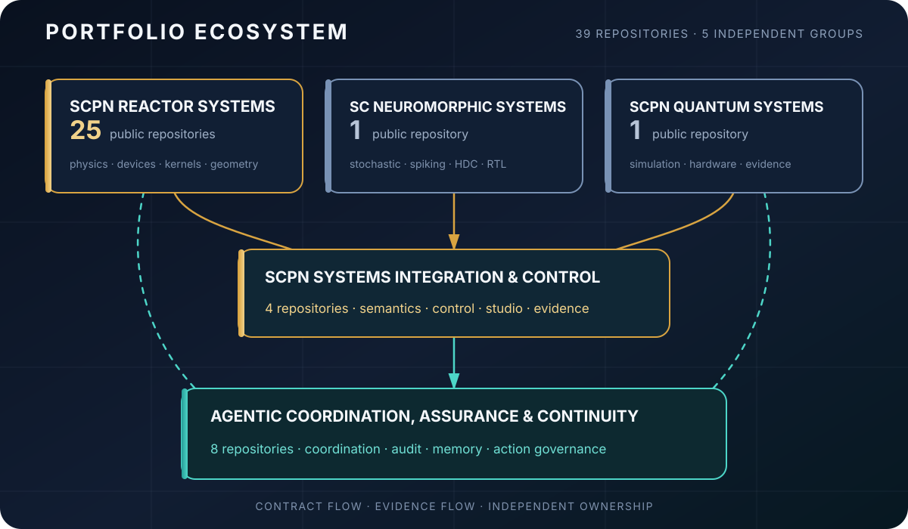

<!--
SPDX-License-Identifier: AGPL-3.0-or-later
商用ライセンスを提供可能
© Concepts 1996–2026 Miroslav Šotek. All rights reserved.
© Code 2020–2026 Miroslav Šotek. All rights reserved.
ORCID: 0009-0009-3560-0851
連絡先：www.anulum.li | protoscience@anulum.li
GitHub 個人プロフィール概要
-->

<p align="center">
  
</p>

<p align="center">
  <a href="README.md"></a>
  <a href="README.de.md"></a>
  <a href="README.sk.md"></a>
  <a href="README.zh-CN.md"></a>
  <a href="README.ja.md"></a>
</p>

<p align="center">
  <a href="https://anulum.li"></a>
  <a href="https://orcid.org/0009-0009-3560-0851"></a>
  <a href="https://pypi.org/user/anulum/"></a>
  <a href="https://github.com/sponsors/anulum"></a>
  <a href="mailto:protoscience@anulum.li"></a>
</p>

# Miroslav Šotek

スイスの [Anulum Institute](https://anulum.li) で活動する独立研究者、
システムエンジニアです。

AI システム、マルチエージェント・エンジニアリング、科学技術計算、
ニューロモーフィックハードウェア、量子シミュレーション、制御のための
**エビデンスに基づくインフラストラクチャ**を構築しています。数理モデルを
再現可能なソフトウェア、ネイティブ高速化、形式モデル、実行可能な
ハードウェア経路へ接続します。

主張の信頼性は、それを支える測定、成果物、検証によって決まります。

## 言語とプラットフォーム

**主要実装：** Python、Rust、TypeScript、JavaScript、Go。

**科学・ネイティブ・形式手法：** Julia、Mojo、C++、C、Lean 4、Jupyter、LaTeX。

**ハードウェア、Web、運用：** Verilog、SystemVerilog、WGSL/WebGPU、
HTML/CSS、Shell、Docker、Linux。

<p>
  
  
  
  
  
  
  
  
  
  
  
  
</p>

## はじめに

| 必要なもの | プロジェクト |
|---|---|
| 互いの作業を上書きしない並列コーディングエージェント | [Synapse Channel](https://github.com/anulum/synapse-channel) · [ドキュメント](https://anulum.github.io/synapse-channel/) |
| LLM の主張保護と事実整合性チェック | [Director-AI](https://github.com/anulum/director-ai) · [ドキュメント](https://anulum.github.io/director-ai/) |
| リポジトリ監査と修復計画 | [Rigor Foundry](https://github.com/anulum/rigor-foundry) · [ドキュメント](https://anulum.github.io/rigor-foundry/) |
| ニューロモーフィックおよび確率的コンピューティング研究 | [SC-NeuroCore](https://github.com/anulum/sc-neurocore) · [ドキュメント](https://anulum.github.io/sc-neurocore/) |
| 結合振動子と量子シミュレーションの研究 | [SCPN Quantum Control](https://github.com/anulum/scpn-quantum-control) |

各プロジェクトのドキュメントは、それぞれの Pages サイトと
[anulum.li](https://anulum.li) にも掲載されています。

## ラボマップ

Anulum は単一製品ではなく、ラボ全体の技術スタックです。

```text
Director-AI          モデル出力の信頼性
Rigor Foundry        エビデンスに基づく監査と修復
Synapse Channel      マルチエージェント協調、主張、受領記録
SC-NeuroCore         ニューロモーフィック / SC 計算（Python · Rust · RTL）
SCPN suite           制御、プラズマ、位相、量子の研究経路
```

### 代表的なスタック利用手順

1. **Rigor Foundry**: 壊れているもの、未証明なもの、安全に主張できないものを特定します。
2. **Director-AI**: 信頼されるモデル出力を保護します。
3. **Synapse Channel**: 主張、メールボックス、受領記録を用いてマルチエージェント作業を運用します。
4. **SC-NeuroCore / SCPN**: ニューロモーフィック、物理、制御級の計算問題を扱います。

研究、検証、製品準備状態は分離されています。活発な開発は準備完了を
意味しません。

このプロフィールの**ピン留めリポジトリ**は、下の主要プロジェクト表と
一致します。その他の公開リポジトリは SCPN 系研究または支援ツールです。

## エコシステムマップ

現在のポートフォリオは、5 つの独立したグループに属する **39 の
リポジトリ**で構成されます。内訳は公開リポジトリ 33、非公開製品領域
6 です。
[HushLine](https://github.com/anulum/HushLine) は、これらの研究・製品
ポートフォリオ外にある独立した公開プロジェクトです。

<p align="center">
  
</p>

矢印は、契約、統合、エビデンス、監査の関係を表します。リポジトリの
所有権を統合するものではなく、科学的検証、運用準備完了、アクチュエータ
制御権限を意味するものでもありません。

**ステータス：** `公開` · `公開 / アーキテクチャのみ` · `非公開` · `非公開 / プロプライエタリ`

<details>
<summary><strong>SCPN Reactor Systems: 25 リポジトリ</strong></summary>

装置ファミリーの物理、共有数値カーネル、炉モデル、構成の所有権を扱います。
リポジトリが存在するだけでは、物理モデルの検証や装置の実用準備完了を
示しません。

- [SCPN Beam Target Core](https://github.com/anulum/scpn-beam-target-core): `公開`
- [SCPN Dense Plasma Focus Core](https://github.com/anulum/scpn-dense-plasma-focus-core): `公開`
- [SCPN FRC Core](https://github.com/anulum/scpn-frc-core): `公開`
- [SCPN Fusion Core](https://github.com/anulum/scpn-fusion-core): `公開`
- [SCPN Fusion-Fission Hybrid Core](https://github.com/anulum/scpn-fusion-fission-hybrid-core): `公開`
- [SCPN ICF Beam Core](https://github.com/anulum/scpn-icf-beam-core): `公開`
- [SCPN ICF Impact Core](https://github.com/anulum/scpn-icf-impact-core): `公開`
- [SCPN ICF Laser Core](https://github.com/anulum/scpn-icf-laser-core): `公開`
- [SCPN IEC Core](https://github.com/anulum/scpn-iec-core): `公開`
- [SCPN Levitated Dipole Core](https://github.com/anulum/scpn-levitated-dipole-core): `公開`
- [SCPN Magnetic Cusp Core](https://github.com/anulum/scpn-magnetic-cusp-core): `公開`
- [SCPN MIF Core](https://github.com/anulum/scpn-mif-core): `公開`
- [SCPN MIF Liner Core](https://github.com/anulum/scpn-mif-liner-core): `公開`
- [SCPN MIF MagLIF Core](https://github.com/anulum/scpn-mif-maglif-core): `公開`
- [SCPN MIF Plasma Jet Core](https://github.com/anulum/scpn-mif-plasma-jet-core): `公開`
- [SCPN Mirror Core](https://github.com/anulum/scpn-mirror-core): `公開`
- [SCPN RFP Core](https://github.com/anulum/scpn-rfp-core): `公開`
- [SCPN Spheromak Core](https://github.com/anulum/scpn-spheromak-core): `公開`
- [SCPN Stellarator Core](https://github.com/anulum/scpn-stellarator-core): `公開`
- [SCPN Theta Pinch Core](https://github.com/anulum/scpn-theta-pinch-core): `公開`
- [SCPN Tokamak Core](https://github.com/anulum/scpn-tokamak-core): `公開`
- [SCPN Z-Pinch Core](https://github.com/anulum/scpn-z-pinch-core): `公開`
- [SCPN Reactor Kernels](https://github.com/anulum/scpn-reactor-kernels): `公開`
- [SCPN Lattice Fusion Core](https://github.com/anulum/scpn-lattice-fusion-core): `公開 / アーキテクチャのみ`
- [SCPN Muon Fusion Core](https://github.com/anulum/scpn-muon-fusion-core): `公開 / アーキテクチャのみ`

</details>

<details>
<summary><strong>SCPN Systems Integration and Control: 4 リポジトリ</strong></summary>

分野横断のセマンティクス、制御受け入れ、フェデレーション、エビデンス表示、
共有インターフェース契約を扱います。

- [SCPN Control](https://github.com/anulum/scpn-control): `公開`
- [SCPN Phase Orchestrator](https://github.com/anulum/scpn-phase-orchestrator): `公開`
- **SCPN Studio**: `非公開 / プロプライエタリ`
- **SCPN Studio Platform**: `非公開 / プロプライエタリ`

</details>

<details>
<summary><strong>Agentic Coordination, Assurance and Continuity: 8 リポジトリ</strong></summary>

エージェント協調、メモリ、応答保証、リポジトリエビデンス、アクション
ガバナンス、商用コントロールプレーンを扱います。

- [Director-AI](https://github.com/anulum/director-ai): `公開`
- **Director Class AI**: `非公開 / プロプライエタリ`
- **Director AI Cloud**: `非公開 / プロプライエタリ`
- [Rigor Foundry](https://github.com/anulum/rigor-foundry): `公開`
- [Remanentia](https://github.com/anulum/remanentia): `公開`
- **Remanentia Portal**: `非公開 / プロプライエタリ`
- [Synapse Channel](https://github.com/anulum/synapse-channel): `公開`
- **Synapse Channel Fleet**: `非公開 / プロプライエタリ`

</details>

<details>
<summary><strong>SC Neuromorphic Computing Systems: 1 リポジトリ</strong></summary>

- [SC-NeuroCore](https://github.com/anulum/sc-neurocore): `公開`

確率的コンピューティング、スパイキングシステム、超次元表現、ネイティブ
高速化、コンパイラ、RTL/FPGA 経路を扱います。

</details>

<details>
<summary><strong>SCPN Quantum Computing Systems: 1 リポジトリ</strong></summary>

- [SCPN Quantum Control](https://github.com/anulum/scpn-quantum-control): `公開`

エビデンスに基づく量子コンパイル、シミュレーション、ハードウェア実行、
ハッシュで結合された実験記録を扱います。

</details>

<details>
<summary><strong>独立ツール</strong> &nbsp; 公開リポジトリ 1</summary>

- [HushLine](https://github.com/anulum/HushLine)：stdout と stderr を
  フィルタリング、制限し、必要に応じて秘匿化する決定論的コマンドラッパー。

</details>

## エンジニアリング標準

<p>
  
  
  
  
  
  
</p>

具体的な実践は各リポジトリのリスクと範囲に応じて選択され、すべての
リポジトリがすべてのツールを実行するわけではありません。

| 品質領域 | ポートフォリオで使用する実践 |
|---|---|
| 正確性 | 決定論的 pytest/Cargo テスト、カバレッジゲート、同等性テスト、回帰フィクスチャ、明示的な負例 |
| 静的品質 | Ruff、宣言された範囲での strict mypy、Cargo fmt、警告を拒否する Clippy、API 契約チェック |
| 再現性 | ハッシュ固定依存関係、事前登録プロトコル、生の結果パック、コンテンツダイジェスト、再生可能な監査記録 |
| セキュリティ | 必要に応じた Bandit、CodeQL、Scorecards、脅威モデル、最小権限、依存関係レビュー |
| サプライチェーン | SPDX、REUSE 3.x、適用時の SBOM、固定 CI Actions、リリースマニフェスト |
| 多言語検証 | Python/Rust 同等性、PyO3/Maturin、Go/Julia テスト、Lean ビルド、WebAssembly、RTL、形式チェック |
| ドキュメント | strict MkDocs/Sphinx、API リファレンス、設計判断、検証記録、明示的な非主張 |

## PyPI 公開

<p align="center">
  <a href="https://pypi.org/user/anulum/"></a>
</p>

検証済みの [PyPI プロフィール](https://pypi.org/user/anulum/) には現在、
Python パッケージ、Rust 高速化エンジン、ドメインカーネル、CLI ツールを
含む 19 プロジェクトが公開されています。

## 主なプロジェクト

| プロジェクト | 役割 | 成熟度 |
|---|---|---|
| [Synapse Channel](https://github.com/anulum/synapse-channel) | コーディングエージェント群向けのローカルファースト・コントロールプレーン：主張、役割、永続メールボックス、受領記録、監査、フェデレーション | **現在利用可能**: 機能するコア、活発に開発中 |
| [Rigor Foundry](https://github.com/anulum/rigor-foundry) | エビデンスに結び付いたリポジトリ監査と修復計画 | **現在利用可能**: 強化作業を継続中 |
| [Director-AI](https://github.com/anulum/director-ai) | NLI と RAG の事実確認、任意の主張単位ストリーミング停止を備えるリアルタイム LLM ガードレール | **研究進行中**: 検証中の機能的システム |
| [SC-NeuroCore](https://github.com/anulum/sc-neurocore) | 多言語の確率的・ニューロモーフィックフレームワーク（Python、Rust SIMD、Verilog、HDC/VSA） | **研究進行中**: 継続的に開発中のプラットフォーム |
| [SCPN Quantum Control](https://github.com/anulum/scpn-quantum-control) | エビデンスに基づく結合振動子同期の量子シミュレーション | **実験的**: 事前登録された研究プログラム |

関連する制御・核融合研究は SCPN スイートにあります：
[control](https://github.com/anulum/scpn-control)、
[fusion-core](https://github.com/anulum/scpn-fusion-core)、
[phase orchestrator](https://github.com/anulum/scpn-phase-orchestrator)、
[MIF-core](https://github.com/anulum/scpn-mif-core)。

### 成熟度ラベル

| ラベル | 意味 |
|---|---|
| **現在利用可能** | インストール可能、文書化済み、CI 対応。現在も進化中 |
| **研究進行中** | 実際のコードと継続中の研究。安定性を保証するものではない |
| **実験的** | 探索段階。インターフェースや主張を固定と見なさないこと |
| **エビデンス準拠** | 公開主張が測定または成果物に結び付いている |

## スローガンではなくエビデンス

否定的結果や帰無結果も、実在する場合は公開します。公開主張はスローガン
ではなく、測定、事前登録プロトコル、生の結果パック、実行可能な検証などの
成果物に結び付けます。

例：[scpn-quantum-control](https://github.com/anulum/scpn-quantum-control)
にある事前登録済み量子制御プロトコルとハッシュ結合結果パック。

## 作業原則

- 主張より先にエビデンスを示す。
- 発表より先に再現可能な成果物を作る。
- 研究、検証、製品準備状態の境界を明確にする。
- 性能またはハードウェア統合に有用な場合は言語横断実装を行う。
- 失敗を正直に記録する。否定的結果も研究成果の一部である。

## 共同研究・協力

ニューロモーフィックシステム、信頼できる AI インフラストラクチャ、
科学技術計算、形式検証、制御に関する技術的根拠のある協力を歓迎します。

最初の連絡には、課題、制約、関連する先行研究、成功を示すエビデンスを
含めてください。[protoscience@anulum.li](mailto:protoscience@anulum.li)
または [anulum.li](https://anulum.li) の連絡窓口をご利用ください。

技術提案には対応します。根拠のない誇大宣伝、「デモだけ」の科学演出、
検証できない主張を伴う仕事は引き受けません。

[GitHub Sponsors](https://github.com/sponsors/anulum) からの支援は、継続的な
オープンワークの CI ランナー、量子・ハードウェア実験時間、公開
ドキュメントに充てられ、マーケティングには使用しません。

> **透明性：** これらのリポジトリには、研究用ソフトウェア、開発者向け
> ツール、製品候補が含まれます。プロジェクトが明示的なエビデンスを提示
> しない限り、活発な開発は製品運用準備完了や科学的検証を意味しません。

<p align="center"><em>I AM THAT</em></p>

<p align="center">
  
</p>
