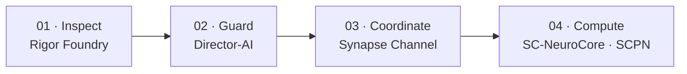

<!--
SPDX-License-Identifier: AGPL-3.0-or-later
Commercial licence available
© Concepts 1996–2026 Miroslav Šotek. All rights reserved.
© Code 2020–2026 Miroslav Šotek. All rights reserved.
ORCID: 0009-0009-3560-0851
Contact: www.anulum.li | protoscience@anulum.li
Personal GitHub profile overview
-->

  <picture>
    <source media="(prefers-color-scheme: dark)" srcset="assets/profile-header-dark.svg">
    <source media="(prefers-color-scheme: light)" srcset="assets/profile-header-light.svg">
    
  </picture>

  
  
  
  
  

  
  
  
  
  
  

  <a href="#projects">Projects</a> ·
  <a href="#current-focus">Current focus</a> ·
  <a href="#portfolio-ecosystem">Ecosystem</a> ·
  <a href="#research-output">Research output</a> ·
  <a href="#engineering-practice">Standards</a> ·
  <a href="#collaboration">Collaboration</a>

Independent researcher and systems engineer at the
[Anulum Institute](https://anulum.li) in Switzerland. I build
**evidence-governed infrastructure** for AI systems, multi-agent engineering,
scientific computing, neuromorphic hardware, quantum simulation, and control:
mathematical models carried through reproducible software, native
acceleration, formal models, and executable hardware paths. Claims are only as
good as the measurements, artefacts, or verification that support them.

<table>
  <tr>
    <td width="25%"><strong>AI assurance</strong> Grounding, contradiction detection, action review, audit evidence</td>
    <td width="25%"><strong>Agent infrastructure</strong> Coordination, claims, durable messaging, memory, fleet control</td>
    <td width="25%"><strong>Scientific systems</strong> Plasma physics, oscillators, quantum workloads, numerical validation</td>
    <td width="25%"><strong>Compute to hardware</strong> Rust acceleration, FPGA RTL, WebGPU, formal verification</td>
  </tr>
</table>

## Start here

**[Projects](#projects)** for the software and its evidence ·
**[Papers](https://anulum.li/papers/)** for every publication and software
archive with BibTeX · **[Contact](mailto:protoscience@anulum.li)** for a
technical proposal. Cold readers: [anulum.li/start/](https://anulum.li/start/)
picks an entry point by profile. Every registered project, filterable by group,
reactor family and evidence, with a clickable map:
[anulum.li/portfolio/](https://anulum.li/portfolio/).

## Projects

Each card links to inspectable artefacts, not summary claims. Evidence links
are pinned to the commit they were verified at. Release and CI badges report
registry and workflow state; they are operational signals, not scientific-quality
scores.

<table>
  <tr>
    <td width="50%" valign="top"><strong><a href="https://github.com/anulum/synapse-channel">Synapse Channel</a></strong> · <strong>Usable now</strong> Control plane for coding-agent fleets: claims, roles, durable mailboxes, receipts, audit, and federation. <a href="https://anulum.github.io/synapse-channel/">Documentation</a> · <a href="https://github.com/anulum/synapse-channel/blob/dd65c898a9693b47fad051e3baa92cef07da2e63/VALIDATION.md">Validation</a> · <a href="https://github.com/anulum/synapse-channel/blob/dd65c898a9693b47fad051e3baa92cef07da2e63/docs/coordination-spec.md">Coordination specification</a> · <a href="https://github.com/anulum/synapse-channel/blob/dd65c898a9693b47fad051e3baa92cef07da2e63/docs/sandbox-threat-model.md">Threat model</a>  </td>
    <td width="50%" valign="top"><strong><a href="https://github.com/anulum/director-ai">Director-AI</a></strong> · <strong>Research active</strong> Real-time LLM guardrail: NLI/RAG grounding, claim review, native acceleration, optional claim-level streaming halt, declared capability boundaries. <a href="https://anulum.github.io/director-ai/">Documentation</a> · <a href="https://github.com/anulum/director-ai/blob/fc155051367bb48180f2f5dc92f4120c2549cddd/VALIDATION.md">Validation</a> · <a href="https://github.com/anulum/director-ai/blob/fc155051367bb48180f2f5dc92f4120c2549cddd/benchmarks/PUBLIC_BENCHMARKS.md">Public benchmarks</a> · <a href="https://github.com/anulum/director-ai/blob/fc155051367bb48180f2f5dc92f4120c2549cddd/docs/_generated/capability_matrix.md">Capability matrix</a>  </td>
  </tr>
  <tr>
    <td width="50%" valign="top"><strong><a href="https://github.com/anulum/rigor-foundry">Rigor Foundry</a></strong> · <strong>Usable now</strong> Evidence-bound repository inventory, audit candidates, review binding, and remediation planning. <a href="https://anulum.github.io/rigor-foundry/">Documentation</a>  </td>
    <td width="50%" valign="top"><strong><a href="https://github.com/anulum/remanentia">Remanentia</a></strong> · <strong>Usable now</strong> Auditable memory for AI agents and knowledge systems: hybrid retrieval, graphs, consolidation, CLI, MCP, and API surfaces. <a href="https://github.com/anulum/remanentia#readme">Documentation</a>  </td>
  </tr>
  <tr>
    <td width="50%" valign="top"><strong><a href="https://github.com/anulum/sc-neurocore">SC-NeuroCore</a></strong> · <strong>Research active</strong> Stochastic and neuromorphic framework: Python models, Rust SIMD paths, Verilog RTL, HDC/VSA, compiler surfaces, and hardware evidence. <a href="https://anulum.github.io/sc-neurocore/">Documentation</a> · <a href="https://github.com/anulum/sc-neurocore/blob/4bbc27b808eef0677848c1e484f40bd41e8ce83d/VALIDATION.md">Validation</a> · <a href="https://github.com/anulum/sc-neurocore/blob/4bbc27b808eef0677848c1e484f40bd41e8ce83d/docs/hardware/SYNTHESIS_RESULTS.md">Synthesis results</a> · <a href="https://github.com/anulum/sc-neurocore/blob/4bbc27b808eef0677848c1e484f40bd41e8ce83d/docs/safety/TRACEABILITY_MATRIX.md">Traceability matrix</a>  </td>
    <td width="50%" valign="top"><strong><a href="https://github.com/anulum/scpn-fusion-core">SCPN Fusion Core</a> · <a href="https://github.com/anulum/scpn-control">SCPN Control</a></strong> · <strong>Research active</strong> Tokamak physics, solvers, and validation campaigns with real-data paths (Fusion Core); control-grade runtime with fail-closed admission and replay evidence (Control). <a href="https://github.com/anulum/scpn-fusion-core/blob/3c841fc13109c8efb49bb079d145f70683a4408d/VALIDATION.md">Validation</a> · <a href="https://github.com/anulum/scpn-fusion-core/blob/3c841fc13109c8efb49bb079d145f70683a4408d/docs/VALIDATION_REAL_DIIID_145419.md">DIII-D validation record</a> · <a href="https://doi.org/10.5281/zenodo.18820864">Software DOI</a>   </td>
  </tr>
  <tr>
    <td width="50%" valign="top"><strong><a href="https://github.com/anulum/scpn-quantum-control">SCPN Quantum Control</a></strong> · <strong>Experimental</strong> Evidence-governed quantum simulation of coupled-oscillator synchronisation: preregistration, hardware result packs, raw counts, and explicit non-advantage boundaries. <a href="https://github.com/anulum/scpn-quantum-control/blob/2bc0f935b75ae7b85a4835caf754b2bfd8770c98/docs/layout_relaxation_preregistration.md">Preregistration</a> · <a href="https://github.com/anulum/scpn-quantum-control/blob/2bc0f935b75ae7b85a4835caf754b2bfd8770c98/docs/hardware_result_packs.md">Result-pack contract</a> · <a href="https://doi.org/10.5281/zenodo.18821929">Software DOI</a>  </td>
    <td width="50%" valign="top"><strong><a href="https://github.com/anulum/scpn-phase-orchestrator">SCPN Phase Orchestrator</a></strong> · <strong>Research active</strong> Evidence-first synchronisation analysis and review-only control proposals for coupled rhythmic systems; matched-false-alarm evaluation, negative results, and bounded transfer claims. <a href="https://github.com/anulum/scpn-phase-orchestrator/blob/1e9eea39fa6681dde2cfbdf074c08ff03a528b58/papers/submissions/README.md">Submission index</a> · <a href="https://doi.org/10.5281/zenodo.22113062">Negative-result preprint</a> · <a href="https://doi.org/10.5281/zenodo.22113116">Grid regime-map preprint</a>  </td>
  </tr>
</table>

| Label | Meaning |
|---|---|
| **Usable now** | Installable, documented, and CI-backed; still evolving |
| **Research active** | Real code and ongoing science; not a stability promise |
| **Experimental** | Exploratory; interfaces and claims are not fixed |
| **Evidence-bound** | Public claims are tied to measurements or artefacts |

## Current focus

Portfolio state verified <!-- verified-at -->2026-09-14<!-- /verified-at -->.

<table>
  <tr>
    <td width="33%"><strong>Reactor portfolio</strong> Consolidating shared kernels and governed device truth across 25 public reactor repositories.</td>
    <td width="33%"><strong>Agentic assurance</strong> Joining coordination, memory, response assurance, action review, and repository evidence without collapsing ownership boundaries.</td>
    <td width="33%"><strong>Research to hardware</strong> Carrying scientific models through native acceleration, formal checks, RTL, hardware runs, and inspectable result packs.</td>
  </tr>
</table>

<!-- profile-feeds:releases:start -->
### Latest releases

| Date | Project | Release | Change |
|---|---|---|---|
| 2026-09-05 | SYNAPSE CHANNEL | [v0.99.26](https://github.com/anulum/synapse-channel/releases/tag/v0.99.26) | Dashboard feeds return unconfigured-store responses without starting report worker processes; configured-store reconstruction retains process isolation. |
| 2026-09-05 | SYNAPSE CHANNEL | [v0.99.25](https://github.com/anulum/synapse-channel/releases/tag/v0.99.25) | Add a repeatable JavaScript SDK integration check against an isolated, authenticated Python hub, covering delivery, claim conflicts, release, snapshots, and reconnect. |
| 2026-09-05 | SCPN-Phase-Orchestrator | [v1.4.3](https://github.com/anulum/scpn-phase-orchestrator/releases/tag/v1.4.3) | Generate identical capability inventory ordering from Git checkouts and exported source trees. |
| 2026-09-04 | SYNAPSE CHANNEL | [v0.99.24](https://github.com/anulum/synapse-channel/releases/tag/v0.99.24) | Keep managed Codex pane bridges waiter-reachable while an already-running provider is blocked by an update chooser, report the pending wake and pane compatibility state explicitly, and coalesce later routing hints until the same live pane becomes safe to… |
| 2026-09-04 | SCPN-Phase-Orchestrator | [v1.4.2](https://github.com/anulum/scpn-phase-orchestrator/releases/tag/v1.4.2) | A fourth sealed L3 request now binds only pulsed_electron_beam_icf to the exact SCPN-ICF-BEAM-CORE review. |

Rendered from [anulum.li/news](https://anulum.li/news/) (the projects' CHANGELOG files) and [Zenodo](https://zenodo.org/search?q=creators.orcid%3A%220009-0009-3560-0851%22) on 2026-09-14.
<!-- profile-feeds:releases:end -->

<!-- profile-feeds:publication:start -->
### Latest publication

| Date | Type | Output | DOI |
|---|---|---|---|
| 2026-08-26 | Preprint | A domain-specific modal-growth detector clears a matched false-alarm bar on power-grid instability, and an eigenvalue regime map shows when its form transfers | [10.5281/zenodo.22113116](https://doi.org/10.5281/zenodo.22113116) |

Rendered from [anulum.li/news](https://anulum.li/news/) (the projects' CHANGELOG files) and [Zenodo](https://zenodo.org/search?q=creators.orcid%3A%220009-0009-3560-0851%22) on 2026-09-14.
<!-- profile-feeds:publication:end -->

## Timeline

| Period | Publicly supported milestone |
|---|---|
| 1996 onward | Self-published concept-development horizon across the broader research programme |
| 1998 | Founder role at ANULUM CH&LI begins in the self-entered public ORCID record |
| 2018 | Public GitHub account established |
| 2025 | Public SCPN previews, framework indexes, and technical reports deposited on Zenodo |
| 2026 | Public software and research portfolio expands across AI assurance, agent infrastructure, neuromorphic computing, plasma control, and quantum simulation |

Timeline entries distinguish registry facts from self-published chronology. They
do not imply academic affiliation, external validation, funding, or awards.

## How the stack is used

<table>
  <tr>
    <td width="25%"><strong>01 · Inspect</strong> Rigor Foundry identifies broken, unproven, or unsafe-to-claim surfaces.</td>
    <td width="25%"><strong>02 · Guard</strong> Director-AI evaluates model output before it is trusted.</td>
    <td width="25%"><strong>03 · Coordinate</strong> Synapse Channel manages claims, mailboxes, plans, and receipts.</td>
    <td width="25%"><strong>04 · Compute</strong> SC-NeuroCore and SCPN execute scientific, physical, and hardware-facing work.</td>
  </tr>
</table>

Research, validation, and product readiness remain separate. Active development
is not a readiness claim.

## Portfolio ecosystem

  
  
  
  

  <picture>
    <source media="(prefers-color-scheme: dark)" srcset="assets/ecosystem-map-dark.svg">
    <source media="(prefers-color-scheme: light)" srcset="assets/ecosystem-map-light.svg">
    
  </picture>

The map contains 39 portfolio repositories: 33 public repositories and six
private product surfaces. [HushLine](https://github.com/anulum/HushLine) is a
standalone public utility outside the five portfolios. Connections represent
contract, integration, evidence, and audit flow. They do not merge ownership or
imply scientific validation, operational readiness, or actuation authority.
The interactive version of this map, with every registered project as a row
that filters by group, reactor family, visibility, lifecycle and evidence, is
[anulum.li/portfolio/](https://anulum.li/portfolio/); each portfolio below
links to its own view of it.
Counts verified <!-- verified-at -->2026-09-14<!-- /verified-at -->. The
account lists more public repositories than the map: the 34 mapped public
projects plus this profile repository and a few forks kept for reference.

**Access key:** `PUBLIC` · `PUBLIC / ARCHITECTURE-ONLY` · `PRIVATE` ·
`PRIVATE / PROPRIETARY`

<strong>01 · SCPN Reactor Systems</strong> &nbsp; 25 public repositories

Live view of this portfolio on anulum.li, filterable and with the map: [anulum.li/portfolio/#g=SCPN-REACTOR-SYSTEMS](https://anulum.li/portfolio/#g=SCPN-REACTOR-SYSTEMS)

Device-family physics, shared numerical kernels, reactor models, geometry, and
configuration ownership. Repository presence does not by itself establish
validated physics or machine readiness. Each device family has an interactive
portal on anulum.li with physics, an explorer, a glossary, and sources; the
[reactor systems hub](https://anulum.li/reactor-systems/) lists every core with
its evidence maturity and the [comparison page](https://anulum.li/reactor-systems/compare.html)
sets their level-0 anchors side by side.

**Shared foundations**

| Repository | Scope | Access |
|---|---|---|
| [SCPN Reactor Kernels](https://github.com/anulum/scpn-reactor-kernels) | Shared deterministic physics, geometry, and numerical kernels for the reactor portfolio | `PUBLIC` |
| [SCPN Fusion Core](https://github.com/anulum/scpn-fusion-core) | Tokamak physics, solvers, validation campaigns, transport, and control research | `PUBLIC` |

**[Closed magnetic confinement](https://anulum.li/reactor-systems/closed-magnetic/)** · toroidal devices that hold the plasma on closed magnetic surfaces

| Repository | Scope | Access |
|---|---|---|
| [SCPN Tokamak Core](https://github.com/anulum/scpn-tokamak-core) | Configuration and diagnostic-plan truth for conventional and spherical tokamaks | `PUBLIC` |
| [SCPN Stellarator Core](https://github.com/anulum/scpn-stellarator-core) | Stellarator, heliotron, and torsatron systems | `PUBLIC` |
| [SCPN RFP Core](https://github.com/anulum/scpn-rfp-core) | Reversed-field-pinch fusion systems | `PUBLIC` |
| [SCPN Spheromak Core](https://github.com/anulum/scpn-spheromak-core) | Self-organised spheromak compact toroids | `PUBLIC` |
| [SCPN FRC Core](https://github.com/anulum/scpn-frc-core) | Field-reversed-configuration fusion systems | `PUBLIC` |

**[Open and non-toroidal magnetic confinement](https://anulum.li/reactor-systems/open-magnetic/)** · mirror, magnetic-cusp and levitated-dipole configurations with open field lines

| Repository | Scope | Access |
|---|---|---|
| [SCPN Mirror Core](https://github.com/anulum/scpn-mirror-core) | Simple, tandem, and gas-dynamic magnetic mirrors | `PUBLIC` |
| [SCPN Magnetic Cusp Core](https://github.com/anulum/scpn-magnetic-cusp-core) | Purely magnetic cusp-confinement systems | `PUBLIC` |
| [SCPN Levitated Dipole Core](https://github.com/anulum/scpn-levitated-dipole-core) | Levitated-dipole confinement systems | `PUBLIC` |

**[Self-magnetic and pulsed pinches](https://anulum.li/reactor-systems/pinches/)** · devices where the driving current itself confines the plasma

| Repository | Scope | Access |
|---|---|---|
| [SCPN Z-Pinch Core](https://github.com/anulum/scpn-z-pinch-core) | Classical and sheared-flow Z-pinches, level-0 physics, and deterministic geometry | `PUBLIC` |
| [SCPN Theta Pinch Core](https://github.com/anulum/scpn-theta-pinch-core) | Theta-pinch devices, diagnostic contracts, and cited level-0 physics | `PUBLIC` |
| [SCPN Dense Plasma Focus Core](https://github.com/anulum/scpn-dense-plasma-focus-core) | Coaxial dense-plasma-focus devices, diagnostics, and level-0 physics | `PUBLIC` |

**[Inertial confinement](https://anulum.li/reactor-systems/inertial/)** · laser-, beam- and impact-driven compression of fusion targets

| Repository | Scope | Access |
|---|---|---|
| [SCPN ICF Laser Core](https://github.com/anulum/scpn-icf-laser-core) | Direct-drive, indirect-drive, and staged laser inertial confinement fusion | `PUBLIC` |
| [SCPN ICF Beam Core](https://github.com/anulum/scpn-icf-beam-core) | Ion- and pulsed-electron-beam inertial confinement fusion | `PUBLIC` |
| [SCPN ICF Impact Core](https://github.com/anulum/scpn-icf-impact-core) | Projectile- and impact-driven inertial confinement fusion | `PUBLIC` |

**[Magneto-inertial and magnetised-target systems](https://anulum.li/reactor-systems/magneto-inertial/)** · compression of magnetised targets by liners, plasma jets or FRC collisions

| Repository | Scope | Access |
|---|---|---|
| [SCPN MIF Core](https://github.com/anulum/scpn-mif-core) | Pulsed FRC/MIF kinematics, deterministic trigger logic, FPGA RTL, and formal timing evidence | `PUBLIC` |
| [SCPN MIF MagLIF Core](https://github.com/anulum/scpn-mif-maglif-core) | Premagnetised, laser-preheated, pulsed-power-driven MagLIF systems | `PUBLIC` |
| [SCPN MIF Plasma Jet Core](https://github.com/anulum/scpn-mif-plasma-jet-core) | Converging plasma-jet-liner magneto-inertial fusion systems | `PUBLIC` |
| [SCPN MIF Liner Core](https://github.com/anulum/scpn-mif-liner-core) | Mechanical- and liquid-liner magnetised-target fusion | `PUBLIC` |

**[Electrostatic, beam-target and hybrid systems](https://anulum.li/reactor-systems/electrostatic-hybrid/)** · inertial-electrostatic wells, colliding beams and fusion–fission hybrids

| Repository | Scope | Access |
|---|---|---|
| [SCPN IEC Core](https://github.com/anulum/scpn-iec-core) | Gridded and Polywell-style inertial electrostatic confinement | `PUBLIC` |
| [SCPN Beam Target Core](https://github.com/anulum/scpn-beam-target-core) | Fixed-target and colliding-beam fusion device truth | `PUBLIC` |
| [SCPN Fusion-Fission Hybrid Core](https://github.com/anulum/scpn-fusion-fission-hybrid-core) | Fusion neutron sources coupled to explicitly subcritical fission blankets | `PUBLIC` |

**Reserved research boundaries** · architecture-only repositories with no device physics yet

| Repository | Scope | Access |
|---|---|---|
| [SCPN Lattice Fusion Core](https://github.com/anulum/scpn-lattice-fusion-core) | Governed boundary for externally driven lattice-confinement fusion research | `PUBLIC / ARCHITECTURE-ONLY` |
| [SCPN Muon Fusion Core](https://github.com/anulum/scpn-muon-fusion-core) | Governed boundary for muon-catalysed fusion research | `PUBLIC / ARCHITECTURE-ONLY` |

<strong>02 · SCPN Systems Integration and Control</strong> &nbsp; 4 repositories

Live view of this portfolio on anulum.li, filterable and with the map: [anulum.li/portfolio/#g=SCPN-SYSTEMS-INTEGRATION-AND-CONTROL](https://anulum.li/portfolio/#g=SCPN-SYSTEMS-INTEGRATION-AND-CONTROL)

| Repository | Scope | Access |
|---|---|---|
| [SCPN Control](https://github.com/anulum/scpn-control) | Neuro-symbolic controllers, runtime admission, replay, audit, and software action boundaries | `PUBLIC` |
| [SCPN Phase Orchestrator](https://github.com/anulum/scpn-phase-orchestrator) | Coupled-rhythm analysis, sealed synchronisation evidence, and review-only control proposals | `PUBLIC` |
| **SCPN Studio** | Federating Hub for scientific studios, claim boundaries, portfolio visibility, and gated execution | `PRIVATE` |
| **SCPN Studio Platform** | Domain-neutral SDK for evidence bundles, capability manifests, jobs, identity, and portfolio validation | `PRIVATE / OPEN-CORE` |

<strong>03 · Agentic Coordination, Assurance and Continuity</strong> &nbsp; 8 repositories

Live view of this portfolio on anulum.li, filterable and with the map: [anulum.li/portfolio/#g=AGENTIC-COORDINATION-ASSURANCE-AND-CONTINUITY-SYSTEMS](https://anulum.li/portfolio/#g=AGENTIC-COORDINATION-ASSURANCE-AND-CONTINUITY-SYSTEMS)

| Repository | Scope | Access |
|---|---|---|
| [Director-AI](https://github.com/anulum/director-ai) | LLM hallucination guardrail with NLI/RAG grounding, sealed evidence, and optional streaming contradiction checks | `PUBLIC / OPEN-CORE` |
| **Director Class AI** | Pre-dispatch review and evidence controls for high-impact autonomous-agent actions | `PRIVATE / BUSL-1.1` |
| **Director AI Cloud** | Managed multi-tenant accounts, API keys, metering, quotas, and hosted-service gating | `PRIVATE / BUSL-1.1` |
| [Rigor Foundry](https://github.com/anulum/rigor-foundry) | Evidence-bound inventory, audit candidates, review binding, and remediation planning | `PUBLIC` |
| [Remanentia](https://github.com/anulum/remanentia) | Auditable AI memory with hybrid retrieval, graphs, consolidation, CLI, MCP, and API surfaces | `PUBLIC` |
| **Remanentia Portal** | Customer identity, entitlement, and commercial control plane without customer-workload execution | `PRIVATE` |
| [Synapse Channel](https://github.com/anulum/synapse-channel) | Local-first agent coordination with plans, claims, durable messaging, audit, and protocol adapters | `PUBLIC` |
| **Synapse Channel Fleet** | Licensed multi-machine federation, trust management, offline licence admission, and cross-hub operations | `PRIVATE / PROPRIETARY` |

<strong>04 · SC Neuromorphic Computing Systems</strong> &nbsp; 1 public repository

Live view of this portfolio on anulum.li, filterable and with the map: [anulum.li/portfolio/#g=SC-NEUROMORPHIC-COMPUTING-SYSTEMS](https://anulum.li/portfolio/#g=SC-NEUROMORPHIC-COMPUTING-SYSTEMS)

| Repository | Scope | Access |
|---|---|---|
| [SC-NeuroCore](https://github.com/anulum/sc-neurocore) | Stochastic and spiking neural systems with Python APIs, Rust acceleration, HDC/VSA, and RTL-generation workflows | `PUBLIC` |

<strong>05 · SCPN Quantum Computing Systems</strong> &nbsp; 1 public repository

Live view of this portfolio on anulum.li, filterable and with the map: [anulum.li/portfolio/#g=SCPN-QUANTUM-COMPUTING-SYSTEMS](https://anulum.li/portfolio/#g=SCPN-QUANTUM-COMPUTING-SYSTEMS)

| Repository | Scope | Access |
|---|---|---|
| [SCPN Quantum Control](https://github.com/anulum/scpn-quantum-control) | Coupled-oscillator quantum experiments, simulators, optimisation, hardware runs, and hash-bound result packs | `PUBLIC` |

<strong>Standalone utility</strong> &nbsp; 1 public repository

| Repository | Scope | Access |
|---|---|---|
| [HushLine](https://github.com/anulum/HushLine) | Deterministic command wrapper that filters, bounds, and optionally redacts stdout and stderr | `PUBLIC` |

## Research output

| Surface | Verified route |
|---|---|
| Complete research index | [Publications, preprints, software archives, and evidence boundaries](PUBLICATIONS.md) |
| Publications hub | [anulum.li/papers/](https://anulum.li/papers/): every Zenodo record with BibTeX |
| Releases and publications stream | [anulum.li/news/](https://anulum.li/news/) · [RSS](https://anulum.li/news/feed.xml) |
| Curriculum vitae | [One-page PDF](cv/Miroslav-Sotek-CV.pdf) · [Markdown source](cv/Miroslav-Sotek-CV.md) · [JSON Resume](cv/resume.json) |
| Research identity | [ORCID 0009-0009-3560-0851](https://orcid.org/0009-0009-3560-0851) |
| Software publication | [19 projects on PyPI](https://pypi.org/user/anulum/) |
| Quantum-control software | [Zenodo DOI 10.5281/zenodo.18821929](https://doi.org/10.5281/zenodo.18821929) |
| Fusion software | [Zenodo DOI 10.5281/zenodo.18820864](https://doi.org/10.5281/zenodo.18820864) |
| Phase-system preprints | [Matched false-alarm study](https://doi.org/10.5281/zenodo.22113062) and [grid regime-map study](https://doi.org/10.5281/zenodo.22113116) |
| HushLine software | [Zenodo DOI 10.5281/zenodo.20775432](https://doi.org/10.5281/zenodo.20775432) |

## PyPI publication

  

The verified [PyPI profile](https://pypi.org/user/anulum/) currently contains
19 published projects. They include public Python packages, Rust-accelerated
engines, domain kernels, and command-line tools.

<strong>Published package index</strong> &nbsp; 19 projects

**Agent and assurance systems:**
[synapse-channel](https://pypi.org/project/synapse-channel/),
[director-ai](https://pypi.org/project/director-ai/),
[director-ai-lite](https://pypi.org/project/director-ai-lite/),
[rigor-foundry](https://pypi.org/project/rigor-foundry/),
[remanentia](https://pypi.org/project/remanentia/),
[backfire-kernel](https://pypi.org/project/backfire-kernel/), and
[hushline](https://pypi.org/project/hushline/).

**SCPN systems:**
[scpn-phase-orchestrator](https://pypi.org/project/scpn-phase-orchestrator/),
[spo-kernel](https://pypi.org/project/spo-kernel/),
[scpn-control](https://pypi.org/project/scpn-control/),
[scpn-fusion](https://pypi.org/project/scpn-fusion/),
[scpn-fusion-rs](https://pypi.org/project/scpn-fusion-rs/),
[scpn-mif-core](https://pypi.org/project/scpn-mif-core/),
[scpn-quantum-control](https://pypi.org/project/scpn-quantum-control/),
[scpn-quantum-engine](https://pypi.org/project/scpn-quantum-engine/),
[oscillatools](https://pypi.org/project/oscillatools/), and
[scpn-studio-platform](https://pypi.org/project/scpn-studio-platform/).

**Neuromorphic systems:**
[sc-neurocore](https://pypi.org/project/sc-neurocore/) and
[sc-neurocore-engine](https://pypi.org/project/sc-neurocore-engine/).

## Languages and platforms

**Primary implementation**

  
  
  
  
  

<strong>Extended scientific, formal, hardware, and operations stack</strong>

**Scientific, native, and formal work**

  
  
  
  
  
  
  

**Hardware, web, and operations**

  
  
  
  
  
  
  
  

The portfolio also contains maintained protobuf/gRPC contracts, Python-Rust
bridges built with PyO3 and Maturin, WebAssembly targets, native SIMD paths,
scientific notebooks, and multi-language API documentation.

## Engineering practice

  
  
  
  
  
  
  

Practices are applied according to each repository's risk and scope. Not every
repository runs every tool.

| Quality dimension | Practices used across the portfolio |
|---|---|
| Correctness | Deterministic pytest and Cargo suites, branch-aware coverage gates, parity tests, regression fixtures, and explicit negative cases |
| Static quality | Ruff formatting and linting, strict mypy where declared, Cargo fmt, Clippy with warnings denied, and API-contract checks |
| Reproducibility | Hash-pinned dependency locks, preregistered protocols, raw result packs, content digests, benchmark metadata, and replayable audit records |
| Security | Bandit, CodeQL and scorecards where enabled, threat models, least-authority execution, secret boundaries, and dependency review |
| Supply chain | SPDX headers, REUSE 3.x checks, SBOM generation where applicable, pinned CI actions, signed or digest-bound evidence, and release manifests |
| Polyglot verification | Python/Rust parity, PyO3 and Maturin bridges, Go and Julia tests, Lean builds, WebAssembly targets, and RTL/formal checks where relevant |
| Documentation | Warning-fatal or strict MkDocs/Sphinx builds, generated API references, architecture decisions, validation records, and explicit non-claims |
| Delivery | Repository-local preflight gates, CI workflows, PyPI packages, wheels and source distributions, containers, and benchmark harnesses |

## Evidence, not slogans

Negative and null results are published when they are real. Public claims stay
tied to measurements, preregistered protocols, raw packs, source-bound reviews,
or executable verification.

Example: SCPN Quantum Control publishes preregistered protocols and hash-bound
result packs rather than converting experimental activity into a readiness or
advantage claim.

## Working principles

- Evidence before claims.
- Reproducible artefacts before presentation.
- Clear boundaries between research, validation, and product readiness.
- Cross-language implementations where performance or hardware integration
  justifies them.
- Fail closed when provenance, authority, or evidence is incomplete.
- Negative results and failure records remain part of the research output.

## Collaboration

### Licensing model

| Model | Typical boundary |
|---|---|
| Apache-2.0 | Permissive public cores such as Director-AI and Rigor Foundry |
| AGPL-3.0-or-later | Public network-facing and research systems with source-sharing obligations |
| Open core | Public core with separately licensed advanced or managed product surfaces |
| BUSL-1.1 | Selected private commercial systems with a declared future change licence |
| Commercial licence | Alternative terms for organisations that cannot use the public licence |

| Mode | Scope |
|---|---|
| Research collaboration | Reproducible studies in AI assurance, neuromorphic systems, quantum simulation, plasma physics, and control |
| Technical collaboration | Architecture review, validation design, formal or hardware paths, and evidence-bound software engineering |
| Commercial licensing | Dual-licensed and managed product surfaces through the [Anulum licensing route](https://www.anulum.li/licensing) |
| Open-work sponsorship | CI, compute, hardware and quantum experiment time, and public documentation through [GitHub Sponsors](https://github.com/sponsors/anulum) |

I welcome technically grounded collaboration in reliable AI infrastructure,
multi-agent systems, neuromorphic computing, scientific software, formal
verification, quantum simulation, plasma physics, and control.

Engagements are taken selectively. The public GitHub profile currently marks
the account as hireable; this is not a guarantee of immediate capacity.

A useful first message includes the problem, constraints, relevant prior art,
and what evidence would count as success. Contact me through
[protoscience@anulum.li](mailto:protoscience@anulum.li) or
[anulum.li](https://anulum.li).

I respond to technical proposals. I do not take on ungrounded hype work,
demo-only science theatre, or claims that cannot be checked.

For sustained open work, [GitHub Sponsors](https://github.com/sponsors/anulum)
funds CI runners, compute, hardware and quantum experiment time, and public
documentation rather than marketing.

> **Transparency:** These repositories span research software, developer tools,
> private systems, and product candidates. Active development does not imply
> production readiness or scientific validation unless a project provides
> explicit evidence.

<em>I AM THAT</em>

  

