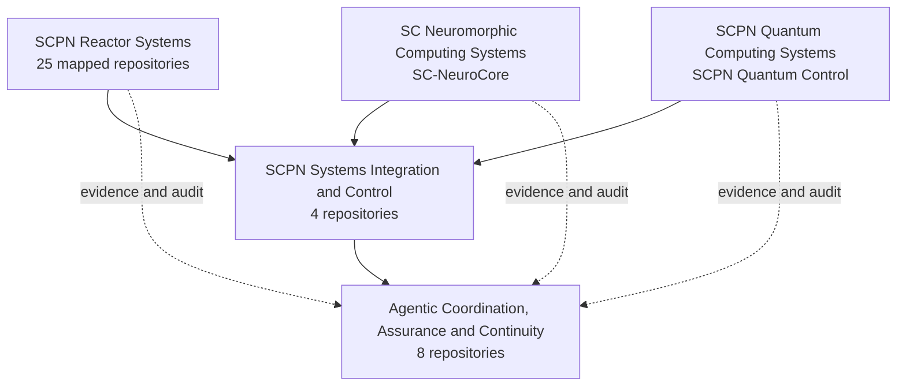

<!--
SPDX-License-Identifier: AGPL-3.0-or-later
Commercial licence available
© Concepts 1996–2026 Miroslav Šotek. All rights reserved.
© Code 2020–2026 Miroslav Šotek. All rights reserved.
ORCID: 0009-0009-3560-0851
Contact: www.anulum.li | protoscience@anulum.li
Personal GitHub profile overview
-->

<p align="center">
  
</p>

<p align="center">
  <a href="README.md"><kbd>EN</kbd></a>
  <a href="README.de.md"><kbd>DE</kbd></a>
  <a href="README.sk.md"><kbd>SK</kbd></a>
  <a href="README.zh-CN.md"><kbd>中文</kbd></a>
  <a href="README.ja.md"><kbd>日本語</kbd></a>
</p>

<p align="center">
  <a href="https://anulum.li">Website</a> ·
  <a href="https://orcid.org/0009-0009-3560-0851">ORCID</a> ·
  <a href="https://github.com/sponsors/anulum">Sponsors</a> ·
  <a href="mailto:protoscience@anulum.li">protoscience@anulum.li</a>
</p>

# Miroslav Šotek

Independent researcher and systems engineer at the
[Anulum Institute](https://anulum.li) in Switzerland.

I build **evidence-governed infrastructure** for AI systems and multi-agent
engineering: coordination with receipts, reliability guards for model output,
and research stacks that reach from mathematics into executable hardware paths.

Claims are only as good as the measurements, artefacts, or verification that
back them.

**Stack:** Python · Rust · Verilog · formal and process tooling where needed.

## Start here

| If you need… | Go to |
|---|---|
| Parallel coding agents that do not clobber each other | [Synapse Channel](https://github.com/anulum/synapse-channel) · [docs](https://anulum.github.io/synapse-channel/) |
| LLM claim guarding / factual-consistency checks | [Director-AI](https://github.com/anulum/director-ai) · [docs](https://anulum.github.io/director-ai/) |
| Repository audit and remediation planning | [Rigor Foundry](https://github.com/anulum/rigor-foundry) · [docs](https://anulum.github.io/rigor-foundry/) |
| Neuromorphic / stochastic computing research | [SC-NeuroCore](https://github.com/anulum/sc-neurocore) · [docs](https://anulum.github.io/sc-neurocore/) |
| Coupled-oscillator / quantum simulation research | [SCPN Quantum Control](https://github.com/anulum/scpn-quantum-control) |

Project documentation also lives under each repository’s Pages site and on
[anulum.li](https://anulum.li).

## Lab map

Anulum is a lab stack, not a single product:

```text
Director-AI          reliability of model output
Rigor Foundry        evidence-bound audit and remediation
Synapse Channel      multi-agent coordination, claims, receipts
SC-NeuroCore         neuromorphic / SC compute (Python · Rust · RTL)
SCPN suite           control, plasma, phase, and quantum research paths
```

### Typical stack use

1. **Rigor Foundry** — find what is broken, unproven, or unsafe to claim.
2. **Director-AI** — guard model output that will be trusted.
3. **Synapse Channel** — run multi-agent work with claims, mailboxes, and receipts.
4. **SC-NeuroCore / SCPN** — when the problem is neuromorphic, physical, or
   control-grade compute.

Research, validation, and product readiness are kept separate. Active
development is not a readiness claim.

The **pinned repositories** on this profile match the selected-work table below.
Other public repos are either SCPN-family research or supporting tooling.

## Ecosystem map

The active portfolio map contains **39 mapped repository members** across five
independent groups: 31 public repositories, six private/proprietary product
surfaces, and two reactor repositories in preparation.
[HushLine](https://github.com/anulum/HushLine) is a separate public project
outside these research and product portfolios.



Arrows represent contract, integration, evidence, and audit relationships. They
do not merge repository ownership or imply scientific validation, operational
readiness, or actuation authority.

**Status key:** `PUBLIC` · `PRIVATE / PROPRIETARY` · `IN PREPARATION`

<details>
<summary><strong>SCPN Reactor Systems — 25 mapped repositories</strong></summary>

Device-family physics, shared numerical kernels, reactor models, and
configuration ownership. Repository presence does not by itself claim validated
physics or machine readiness.

- [SCPN Beam Target Core](https://github.com/anulum/scpn-beam-target-core) — `PUBLIC`
- [SCPN Dense Plasma Focus Core](https://github.com/anulum/scpn-dense-plasma-focus-core) — `PUBLIC`
- [SCPN FRC Core](https://github.com/anulum/scpn-frc-core) — `PUBLIC`
- [SCPN Fusion Core](https://github.com/anulum/scpn-fusion-core) — `PUBLIC`
- [SCPN Fusion-Fission Hybrid Core](https://github.com/anulum/scpn-fusion-fission-hybrid-core) — `PUBLIC`
- [SCPN ICF Beam Core](https://github.com/anulum/scpn-icf-beam-core) — `PUBLIC`
- [SCPN ICF Impact Core](https://github.com/anulum/scpn-icf-impact-core) — `PUBLIC`
- [SCPN ICF Laser Core](https://github.com/anulum/scpn-icf-laser-core) — `PUBLIC`
- [SCPN IEC Core](https://github.com/anulum/scpn-iec-core) — `PUBLIC`
- [SCPN Levitated Dipole Core](https://github.com/anulum/scpn-levitated-dipole-core) — `PUBLIC`
- [SCPN Magnetic Cusp Core](https://github.com/anulum/scpn-magnetic-cusp-core) — `PUBLIC`
- [SCPN MIF Core](https://github.com/anulum/scpn-mif-core) — `PUBLIC`
- [SCPN MIF Liner Core](https://github.com/anulum/scpn-mif-liner-core) — `PUBLIC`
- [SCPN MIF MagLIF Core](https://github.com/anulum/scpn-mif-maglif-core) — `PUBLIC`
- [SCPN MIF Plasma Jet Core](https://github.com/anulum/scpn-mif-plasma-jet-core) — `PUBLIC`
- [SCPN Mirror Core](https://github.com/anulum/scpn-mirror-core) — `PUBLIC`
- [SCPN Reactor Kernels](https://github.com/anulum/scpn-reactor-kernels) — `PUBLIC`
- [SCPN RFP Core](https://github.com/anulum/scpn-rfp-core) — `PUBLIC`
- [SCPN Spheromak Core](https://github.com/anulum/scpn-spheromak-core) — `PUBLIC`
- [SCPN Stellarator Core](https://github.com/anulum/scpn-stellarator-core) — `PUBLIC`
- [SCPN Theta Pinch Core](https://github.com/anulum/scpn-theta-pinch-core) — `PUBLIC`
- [SCPN Tokamak Core](https://github.com/anulum/scpn-tokamak-core) — `PUBLIC`
- [SCPN Z-Pinch Core](https://github.com/anulum/scpn-z-pinch-core) — `PUBLIC`
- **SCPN Lattice Fusion Core** — `IN PREPARATION`
- **SCPN Muon Fusion Core** — `IN PREPARATION`

</details>

<details>
<summary><strong>SCPN Systems Integration and Control — 4 repositories</strong></summary>

Horizontal semantics, control admission, federation, evidence rendering, and
shared interface contracts.

- [SCPN Control](https://github.com/anulum/scpn-control) — `PUBLIC`
- [SCPN Phase Orchestrator](https://github.com/anulum/scpn-phase-orchestrator) — `PUBLIC`
- **SCPN Studio** — `PRIVATE / PROPRIETARY`
- **SCPN Studio Platform** — `PRIVATE / PROPRIETARY`

</details>

<details>
<summary><strong>Agentic Coordination, Assurance and Continuity — 8 repositories</strong></summary>

Coordination, memory, response assurance, repository evidence, action
governance, and commercial control-plane systems.

- [Director-AI](https://github.com/anulum/director-ai) — `PUBLIC`
- **Director Class AI** — `PRIVATE / PROPRIETARY`
- **Director AI Cloud** — `PRIVATE / PROPRIETARY`
- [Rigor Foundry](https://github.com/anulum/rigor-foundry) — `PUBLIC`
- [Remanentia](https://github.com/anulum/remanentia) — `PUBLIC`
- **Remanentia Portal** — `PRIVATE / PROPRIETARY`
- [Synapse Channel](https://github.com/anulum/synapse-channel) — `PUBLIC`
- **Synapse Channel Fleet** — `PRIVATE / PROPRIETARY`

</details>

<details>
<summary><strong>SC Neuromorphic Computing Systems — 1 repository</strong></summary>

- [SC-NeuroCore](https://github.com/anulum/sc-neurocore) — `PUBLIC`

Stochastic computing, spiking systems, hyperdimensional representations,
native acceleration, compilers, and RTL/FPGA paths.

</details>

<details>
<summary><strong>SCPN Quantum Computing Systems — 1 repository</strong></summary>

- [SCPN Quantum Control](https://github.com/anulum/scpn-quantum-control) — `PUBLIC`

Evidence-governed quantum compilation, simulation, hardware execution, and
hash-bound experimental records.

</details>

## Selected work

| Project | Job | Maturity |
|---|---|---|
| [Synapse Channel](https://github.com/anulum/synapse-channel) | Local-first control plane for coding-agent fleets: claims, roles, durable mailboxes, receipts, audit, and federation | **Usable now** — functional core, active development |
| [Rigor Foundry](https://github.com/anulum/rigor-foundry) | Evidence-bound repository auditing and remediation planning | **Usable now** — active hardening |
| [Director-AI](https://github.com/anulum/director-ai) | Real-time LLM guardrails: NLI + RAG fact-checking with optional claim-level streaming halt | **Research active** — functional system under validation |
| [SC-NeuroCore](https://github.com/anulum/sc-neurocore) | Polyglot stochastic and neuromorphic framework (Python, Rust SIMD, Verilog, HDC/VSA) | **Research active** — platform under continuous development |
| [SCPN Quantum Control](https://github.com/anulum/scpn-quantum-control) | Evidence-governed quantum simulation of coupled-oscillator synchronisation | **Experimental** — preregistered research programme |

Related control and fusion research lives in the SCPN suite
([control](https://github.com/anulum/scpn-control),
[fusion-core](https://github.com/anulum/scpn-fusion-core),
[phase orchestrator](https://github.com/anulum/scpn-phase-orchestrator),
[MIF-core](https://github.com/anulum/scpn-mif-core)).

### Maturity labels

| Label | Meaning |
|---|---|
| **Usable now** | Installable, documented, CI-backed; still evolving |
| **Research active** | Real code and ongoing science; not a stability promise |
| **Experimental** | Exploratory; do not treat interfaces or claims as fixed |
| **Evidence-bound** | Public claims are tied to measurements or artefacts |

## Evidence, not slogans

Negative and null results are published when they are real. Public claims stay
tied to artefacts: measurements, preregistered protocols, raw packs, or
executable verification — not slogans.

Example: preregistered quantum-control protocols and hash-bound result packs in
[scpn-quantum-control](https://github.com/anulum/scpn-quantum-control).

## Working principles

- Evidence before claims.
- Reproducible artefacts before presentation.
- Clear boundaries between research, validation, and product readiness.
- Cross-language implementations where performance or hardware integration
  makes them useful.
- Honest failure records: negative results are part of the research output.

## Collaboration

I welcome technically grounded collaboration in neuromorphic systems, reliable
AI infrastructure, scientific computing, formal verification, and control.

A useful first message includes: problem, constraints, relevant prior art, and
what evidence would count as success. Prefer email
([protoscience@anulum.li](mailto:protoscience@anulum.li)) or the contact path on
[anulum.li](https://anulum.li).

I respond to technical proposals. I do not take on ungrounded hype work,
“demo-only” science theatre, or claims that cannot be checked.

For sustained open work, [GitHub Sponsors](https://github.com/sponsors/anulum)
funds CI runners, quantum and hardware experiment time, and public docs — not
marketing.

> **Transparency:** These repositories span research software, developer tools,
> and product candidates. Active development does not imply production readiness
> or scientific validation unless a project provides explicit evidence for it.

<p align="center"><em>I AM THAT</em></p>

<p align="center">
  
</p>
