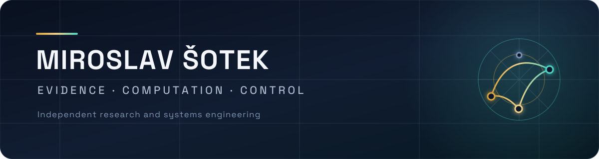
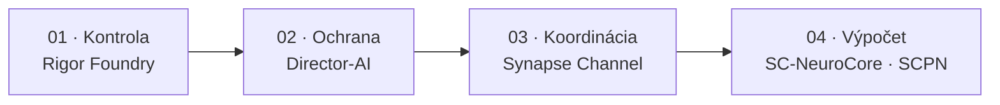
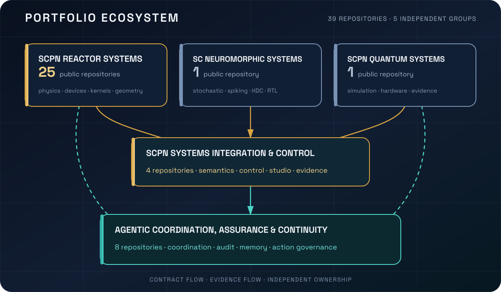
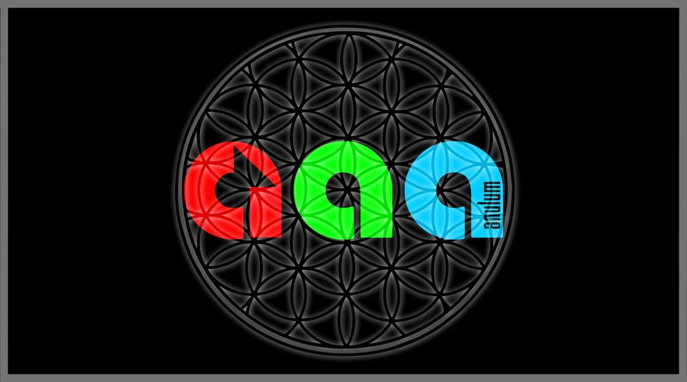

<!--
SPDX-License-Identifier: AGPL-3.0-or-later
Komerčná licencia je dostupná
© Koncepty 1996–2026 Miroslav Šotek. Všetky práva vyhradené.
© Kód 2020–2026 Miroslav Šotek. Všetky práva vyhradené.
ORCID: 0009-0009-3560-0851
Kontakt: www.anulum.li | protoscience@anulum.li
Prehľad osobného profilu GitHub
-->

  <picture>
    <source media="(prefers-color-scheme: dark)" srcset="assets/profile-header-dark.svg">
    <source media="(prefers-color-scheme: light)" srcset="assets/profile-header-light.svg">
    
  </picture>

  
  
  
  
  

  
  
  
  
  
  

  <a href="#projekty">Projekty</a> ·
  <a href="#aktuálne-zameranie">Aktuálne zameranie</a> ·
  <a href="#mapa-ekosystému">Ekosystém</a> ·
  <a href="#výskumné-výstupy">Výskumné výstupy</a> ·
  <a href="#inžinierske-štandardy">Štandardy</a> ·
  <a href="#spolupráca">Spolupráca</a>

Nezávislý výskumník a systémový inžinier v [Anulum Institute](https://anulum.li)
vo Švajčiarsku. Budujem **infraštruktúru riadenú dôkazmi** pre systémy umelej
inteligencie, multiagentové inžinierstvo, vedecké výpočty, neuromorfný hardvér,
kvantové simulácie a riadenie: matematické modely prevedené cez
reprodukovateľný softvér, natívnu akceleráciu, formálne modely a vykonateľné
hardvérové cesty. Tvrdenia majú iba takú hodnotu, akú majú merania, artefakty
alebo overenie, ktoré ich podporujú.

<table>
  <tr>
    <td width="25%"><strong>Spoľahlivosť AI</strong> Ukotvenie v dôkazoch, detekcia rozporov, kontrola akcií, auditné záznamy</td>
    <td width="25%"><strong>Agentová infraštruktúra</strong> Koordinácia, tvrdenia, trvalé správy, pamäť, riadenie flotily</td>
    <td width="25%"><strong>Vedecké systémy</strong> Fyzika plazmy, oscilátory, kvantové úlohy, numerická validácia</td>
    <td width="25%"><strong>Od výpočtu k hardvéru</strong> Akcelerácia v Ruste, FPGA RTL, WebGPU, formálne overovanie</td>
  </tr>
</table>

## Kde začať

**[Projekty](#projekty)** pre softvér a jeho dôkazy ·
**[Publikácie](https://anulum.li/papers/)** pre každú publikáciu a softvérový
archív s BibTeX · **[Kontakt](mailto:protoscience@anulum.li)** pre technický
návrh. Pre nových čitateľov: [anulum.li/start/](https://anulum.li/start/)
vyberie vstupný bod podľa profilu. Každý registrovaný projekt s filtrami podľa
skupiny, reaktorovej rodiny a dôkazov a s klikateľnou mapou:
[anulum.li/portfolio/](https://anulum.li/portfolio/).

## Projekty

Každá karta odkazuje na kontrolovateľné artefakty, nie na súhrnné tvrdenia.
Dôkazové odkazy sú pripnuté na commit, pri ktorom boli overené. Badge-y vydania a
CI hlásia stav registra a workflow; sú to prevádzkové signály, nie hodnotenie
vedeckej kvality.

<table>
  <tr>
    <td width="50%" valign="top"><strong><a href="https://github.com/anulum/synapse-channel">Synapse Channel</a></strong> · <strong>Použiteľný teraz</strong> Riadiaca rovina pre flotily programovacích agentov: tvrdenia, roly, trvalé schránky, potvrdenia, audit a federácia. <a href="https://anulum.github.io/synapse-channel/">Dokumentácia</a> · <a href="https://github.com/anulum/synapse-channel/blob/dd65c898a9693b47fad051e3baa92cef07da2e63/VALIDATION.md">Validácia</a> · <a href="https://github.com/anulum/synapse-channel/blob/dd65c898a9693b47fad051e3baa92cef07da2e63/docs/coordination-spec.md">Špecifikácia koordinácie</a> · <a href="https://github.com/anulum/synapse-channel/blob/dd65c898a9693b47fad051e3baa92cef07da2e63/docs/sandbox-threat-model.md">Model hrozieb</a>  </td>
    <td width="50%" valign="top"><strong><a href="https://github.com/anulum/director-ai">Director-AI</a></strong> · <strong>Aktívny výskum</strong> Ochrana LLM v reálnom čase: NLI/RAG ukotvenie, kontrola tvrdení, natívna akcelerácia, voliteľné zastavenie prúdu na úrovni tvrdení, deklarované hranice schopností. <a href="https://anulum.github.io/director-ai/">Dokumentácia</a> · <a href="https://github.com/anulum/director-ai/blob/fc155051367bb48180f2f5dc92f4120c2549cddd/VALIDATION.md">Validácia</a> · <a href="https://github.com/anulum/director-ai/blob/fc155051367bb48180f2f5dc92f4120c2549cddd/benchmarks/PUBLIC_BENCHMARKS.md">Verejné benchmarky</a> · <a href="https://github.com/anulum/director-ai/blob/fc155051367bb48180f2f5dc92f4120c2549cddd/docs/_generated/capability_matrix.md">Matica schopností</a>  </td>
  </tr>
  <tr>
    <td width="50%" valign="top"><strong><a href="https://github.com/anulum/rigor-foundry">Rigor Foundry</a></strong> · <strong>Použiteľný teraz</strong> Inventár repozitárov viazaný na dôkazy, kandidáti na audit, väzba na recenzie a plánovanie nápravy. <a href="https://anulum.github.io/rigor-foundry/">Dokumentácia</a>  </td>
    <td width="50%" valign="top"><strong><a href="https://github.com/anulum/remanentia">Remanentia</a></strong> · <strong>Použiteľný teraz</strong> Auditovateľná pamäť pre agentov AI a znalostné systémy: hybridné vyhľadávanie, grafy, konsolidácia, CLI, MCP a API. <a href="https://github.com/anulum/remanentia#readme">Dokumentácia</a>  </td>
  </tr>
  <tr>
    <td width="50%" valign="top"><strong><a href="https://github.com/anulum/sc-neurocore">SC-NeuroCore</a></strong> · <strong>Aktívny výskum</strong> Stochastický a neuromorfný rámec: modely v Pythone, SIMD cesty v Ruste, Verilog RTL, HDC/VSA, kompilátorové rozhrania a hardvérové dôkazy. <a href="https://anulum.github.io/sc-neurocore/">Dokumentácia</a> · <a href="https://github.com/anulum/sc-neurocore/blob/4bbc27b808eef0677848c1e484f40bd41e8ce83d/VALIDATION.md">Validácia</a> · <a href="https://github.com/anulum/sc-neurocore/blob/4bbc27b808eef0677848c1e484f40bd41e8ce83d/docs/hardware/SYNTHESIS_RESULTS.md">Výsledky syntézy</a> · <a href="https://github.com/anulum/sc-neurocore/blob/4bbc27b808eef0677848c1e484f40bd41e8ce83d/docs/safety/TRACEABILITY_MATRIX.md">Matica sledovateľnosti</a>  </td>
    <td width="50%" valign="top"><strong><a href="https://github.com/anulum/scpn-fusion-core">SCPN Fusion Core</a> · <a href="https://github.com/anulum/scpn-control">SCPN Control</a></strong> · <strong>Aktívny výskum</strong> Fyzika tokamaku, riešiče a validačné kampane s cestami k reálnym dátam (Fusion Core); riadiaci runtime s fail-closed prijímaním a dôkazmi z prehrávania (Control). <a href="https://github.com/anulum/scpn-fusion-core/blob/3c841fc13109c8efb49bb079d145f70683a4408d/VALIDATION.md">Validácia</a> · <a href="https://github.com/anulum/scpn-fusion-core/blob/3c841fc13109c8efb49bb079d145f70683a4408d/docs/VALIDATION_REAL_DIIID_145419.md">Validačný záznam DIII-D</a> · <a href="https://doi.org/10.5281/zenodo.18820864">DOI softvéru</a>   </td>
  </tr>
  <tr>
    <td width="50%" valign="top"><strong><a href="https://github.com/anulum/scpn-quantum-control">SCPN Quantum Control</a></strong> · <strong>Experimentálny</strong> Kvantová simulácia synchronizácie viazaných oscilátorov riadená dôkazmi: preregistrácia, hardvérové balíky výsledkov, surové početnosti a výslovné hranice bez tvrdenia o výhode. <a href="https://github.com/anulum/scpn-quantum-control/blob/2bc0f935b75ae7b85a4835caf754b2bfd8770c98/docs/layout_relaxation_preregistration.md">Preregistrácia</a> · <a href="https://github.com/anulum/scpn-quantum-control/blob/2bc0f935b75ae7b85a4835caf754b2bfd8770c98/docs/hardware_result_packs.md">Kontrakt balíkov výsledkov</a> · <a href="https://doi.org/10.5281/zenodo.18821929">DOI softvéru</a>  </td>
    <td width="50%" valign="top"><strong><a href="https://github.com/anulum/scpn-phase-orchestrator">SCPN Phase Orchestrator</a></strong> · <strong>Aktívny výskum</strong> Analýza synchronizácie viazaných rytmických systémov s dôkazmi na prvom mieste a návrhy riadenia len na posúdenie; hodnotenie s vyrovnanou mierou falošných poplachov, negatívne výsledky a ohraničené tvrdenia o prenose. <a href="https://github.com/anulum/scpn-phase-orchestrator/blob/1e9eea39fa6681dde2cfbdf074c08ff03a528b58/papers/submissions/README.md">Index podaní</a> · <a href="https://doi.org/10.5281/zenodo.22113062">Preprint s negatívnym výsledkom</a> · <a href="https://doi.org/10.5281/zenodo.22113116">Preprint o mape režimov siete</a>  </td>
  </tr>
</table>

| Označenie | Význam |
|---|---|
| **Použiteľný teraz** | Inštalovateľný, zdokumentovaný a podporený CI; stále sa vyvíja |
| **Aktívny výskum** | Skutočný kód a prebiehajúca veda; nie prísľub stability |
| **Experimentálny** | Prieskumný; rozhrania ani tvrdenia nepovažujte za nemenné |
| **Viazaný na dôkazy** | Verejné tvrdenia sú spojené s meraniami alebo artefaktmi |

## Aktuálne zameranie

Stav portfólia overený <!-- verified-at -->2026-09-13<!-- /verified-at -->.

<table>
  <tr>
    <td width="33%"><strong>Reaktorové portfólio</strong> Konsolidácia spoločných jadier a riadenej pravdy zariadení v 25 verejných reaktorových repozitároch.</td>
    <td width="33%"><strong>Spoľahlivosť agentov</strong> Spojenie koordinácie, pamäte, overovania odpovedí, kontroly akcií a dôkazov o repozitároch bez zotretia hraníc vlastníctva.</td>
    <td width="33%"><strong>Od výskumu k hardvéru</strong> Vedecké modely prevedené cez natívnu akceleráciu, formálne kontroly, RTL, hardvérové behy a kontrolovateľné balíky výsledkov.</td>
  </tr>
</table>

<!-- profile-feeds:releases:start -->
### Najnovšie vydania

| Dátum | Projekt | Vydanie | Zmena |
|---|---|---|---|
| 2026-09-05 | SYNAPSE CHANNEL | [v0.99.26](https://github.com/anulum/synapse-channel/releases/tag/v0.99.26) | Dashboard feeds return unconfigured-store responses without starting report worker processes; configured-store reconstruction retains process isolation. |
| 2026-09-05 | SYNAPSE CHANNEL | [v0.99.25](https://github.com/anulum/synapse-channel/releases/tag/v0.99.25) | Add a repeatable JavaScript SDK integration check against an isolated, authenticated Python hub, covering delivery, claim conflicts, release, snapshots, and reconnect. |
| 2026-09-05 | SCPN-Phase-Orchestrator | [v1.4.3](https://github.com/anulum/scpn-phase-orchestrator/releases/tag/v1.4.3) | Generate identical capability inventory ordering from Git checkouts and exported source trees. |
| 2026-09-04 | SYNAPSE CHANNEL | [v0.99.24](https://github.com/anulum/synapse-channel/releases/tag/v0.99.24) | Keep managed Codex pane bridges waiter-reachable while an already-running provider is blocked by an update chooser, report the pending wake and pane compatibility state explicitly, and coalesce later routing hints until the same live pane becomes safe to… |
| 2026-09-04 | SCPN-Phase-Orchestrator | [v1.4.2](https://github.com/anulum/scpn-phase-orchestrator/releases/tag/v1.4.2) | A fourth sealed L3 request now binds only pulsed_electron_beam_icf to the exact SCPN-ICF-BEAM-CORE review. |

Vykreslené z [anulum.li/news](https://anulum.li/news/) (súbory CHANGELOG projektov) a [Zenodo](https://zenodo.org/search?q=creators.orcid%3A%220009-0009-3560-0851%22) dňa 2026-09-13.
<!-- profile-feeds:releases:end -->

<!-- profile-feeds:publication:start -->
### Najnovšia publikácia

| Dátum | Typ | Výstup | DOI |
|---|---|---|---|
| 2026-08-26 | Preprint | A domain-specific modal-growth detector clears a matched false-alarm bar on power-grid instability, and an eigenvalue regime map shows when its form transfers | [10.5281/zenodo.22113116](https://doi.org/10.5281/zenodo.22113116) |

Vykreslené z [anulum.li/news](https://anulum.li/news/) (súbory CHANGELOG projektov) a [Zenodo](https://zenodo.org/search?q=creators.orcid%3A%220009-0009-3560-0851%22) dňa 2026-09-13.
<!-- profile-feeds:publication:end -->

## Časová os

| Obdobie | Verejne podložený míľnik |
|---|---|
| od 1996 | Vlastný publikovaný horizont vývoja konceptov v širšom výskumnom programe |
| 1998 | Začiatok vlastnoručne uvedenej zakladateľskej roly v ANULUM CH&LI vo verejnom ORCID zázname |
| 2018 | Založenie verejného GitHub účtu |
| 2025 | Verejné SCPN preview dokumenty, indexy rámca a technické správy uložené na Zenodo |
| 2026 | Rozšírenie verejného softvérového a výskumného portfólia v spoľahlivosti AI, agentovej infraštruktúre, neuromorfných výpočtoch, riadení plazmy a kvantovej simulácii |

Položky časovej osi rozlišujú fakty z registrov od vlastnej chronológie.
Neznamenajú akademickú afiliáciu, externú validáciu, financovanie ani ocenenia.

## Ako sa celok používa

<table>
  <tr>
    <td width="25%"><strong>01 · Kontrola</strong> Rigor Foundry zistí, čo je pokazené, nepreukázané alebo nebezpečné tvrdiť.</td>
    <td width="25%"><strong>02 · Ochrana</strong> Director-AI posúdi výstup modelu skôr, než sa mu dôveruje.</td>
    <td width="25%"><strong>03 · Koordinácia</strong> Synapse Channel spravuje tvrdenia, schránky, plány a potvrdenia.</td>
    <td width="25%"><strong>04 · Výpočet</strong> SC-NeuroCore a SCPN vykonávajú vedeckú, fyzikálnu a hardvérovú prácu.</td>
  </tr>
</table>

Výskum, validácia a produktová pripravenosť zostávajú oddelené. Aktívny vývoj
nie je tvrdením o pripravenosti.

## Mapa ekosystému

  
  
  
  

  <picture>
    <source media="(prefers-color-scheme: dark)" srcset="assets/ecosystem-map-dark.svg">
    <source media="(prefers-color-scheme: light)" srcset="assets/ecosystem-map-light.svg">
    
  </picture>

Mapa obsahuje 39 portfóliových repozitárov: 33 verejných repozitárov a šesť
súkromných produktových plôch. [HushLine](https://github.com/anulum/HushLine)
je samostatný verejný nástroj mimo piatich portfólií. Spojnice znázorňujú
zmluvné, integračné, dôkazové a auditné vzťahy. Nespájajú vlastníctvo a
neznamenajú vedeckú validáciu, prevádzkovú pripravenosť ani oprávnenie na
fyzické riadenie. Počty overené <!-- verified-at -->2026-09-13<!-- /verified-at -->.
Interaktívna verzia tejto mapy, v ktorej je každý registrovaný projekt riadkom
s filtrami podľa skupiny, reaktorovej rodiny, viditeľnosti, životného cyklu a
dôkazov, je na [anulum.li/portfolio/](https://anulum.li/portfolio/); každé
portfólio nižšie odkazuje na svoj vlastný pohľad.
Účet uvádza viac verejných repozitárov než mapa: 34 zmapovaných verejných
projektov plus tento profilový repozitár a niekoľko forkov ponechaných na
referenciu.

**Stavy:** `VEREJNÝ` · `VEREJNÝ / IBA ARCHITEKTÚRA` · `SÚKROMNÝ` ·
`SÚKROMNÝ / PROPRIETÁRNY`

<strong>01 · SCPN Reactor Systems</strong> &nbsp; 25 verejných repozitárov

Živý pohľad na toto portfólio na anulum.li, s filtrami a mapou: [anulum.li/portfolio/#g=SCPN-REACTOR-SYSTEMS](https://anulum.li/portfolio/#g=SCPN-REACTOR-SYSTEMS)

Fyzika rodín zariadení, spoločné numerické jadrá, reaktorové modely, geometria
a vlastníctvo konfigurácií. Samotná existencia repozitára nepreukazuje
validovanú fyziku ani pripravenosť stroja. Každá rodina zariadení má na
anulum.li interaktívny portál s fyzikou, explorerom, slovníkom a zdrojmi;
[hub reaktorových systémov](https://anulum.li/reactor-systems/) uvádza každé
jadro s jeho dôkazovou zrelosťou a [porovnávacia stránka](https://anulum.li/reactor-systems/compare.html)
kladie ich kotvy úrovne 0 vedľa seba.

**Spoločné základy**

| Repozitár | Rozsah | Stav |
|---|---|---|
| [SCPN Reactor Kernels](https://github.com/anulum/scpn-reactor-kernels) | Spoločné deterministické fyzikálne, geometrické a numerické jadrá reaktorového portfólia | `VEREJNÝ` |
| [SCPN Fusion Core](https://github.com/anulum/scpn-fusion-core) | Fyzika tokamaku, riešiče, validačné kampane, transport a výskum riadenia | `VEREJNÝ` |

**[Uzavreté magnetické udržanie](https://anulum.li/reactor-systems/closed-magnetic/)** · toroidálne zariadenia, ktoré držia plazmu na uzavretých magnetických plochách

| Repozitár | Rozsah | Stav |
|---|---|---|
| [SCPN Tokamak Core](https://github.com/anulum/scpn-tokamak-core) | Pravda konfigurácie a diagnostického plánu pre konvenčné a sférické tokamaky | `VEREJNÝ` |
| [SCPN Stellarator Core](https://github.com/anulum/scpn-stellarator-core) | Stellarátory, heliotrony a torsatrony | `VEREJNÝ` |
| [SCPN RFP Core](https://github.com/anulum/scpn-rfp-core) | Fúzne systémy s obráteným poľom (reversed-field pinch) | `VEREJNÝ` |
| [SCPN Spheromak Core](https://github.com/anulum/scpn-spheromak-core) | Samoorganizované kompaktné toroidy typu spheromak | `VEREJNÝ` |
| [SCPN FRC Core](https://github.com/anulum/scpn-frc-core) | Fúzne systémy s konfiguráciou obráteného poľa (FRC) | `VEREJNÝ` |

**[Otvorené a netoroidálne magnetické udržanie](https://anulum.li/reactor-systems/open-magnetic/)** · zrkadlové, kuspové a levitované dipólové konfigurácie s otvorenými siločiarami

| Repozitár | Rozsah | Stav |
|---|---|---|
| [SCPN Mirror Core](https://github.com/anulum/scpn-mirror-core) | Jednoduché, tandemové a plynodynamické magnetické zrkadlá | `VEREJNÝ` |
| [SCPN Magnetic Cusp Core](https://github.com/anulum/scpn-magnetic-cusp-core) | Čisto magnetické kuspové udržanie | `VEREJNÝ` |
| [SCPN Levitated Dipole Core](https://github.com/anulum/scpn-levitated-dipole-core) | Udržanie levitovaným dipólom | `VEREJNÝ` |

**[Samomagnetické a pulzné pinče](https://anulum.li/reactor-systems/pinches/)** · zariadenia, v ktorých plazmu udržiava samotný hnací prúd

| Repozitár | Rozsah | Stav |
|---|---|---|
| [SCPN Z-Pinch Core](https://github.com/anulum/scpn-z-pinch-core) | Klasické z-pinče a z-pinče so strihovým tokom, fyzika úrovne 0 a deterministická geometria | `VEREJNÝ` |
| [SCPN Theta Pinch Core](https://github.com/anulum/scpn-theta-pinch-core) | Theta-pinče, diagnostické kontrakty a citovaná fyzika úrovne 0 | `VEREJNÝ` |
| [SCPN Dense Plasma Focus Core](https://github.com/anulum/scpn-dense-plasma-focus-core) | Koaxiálne zariadenia dense plasma focus, diagnostika a fyzika úrovne 0 | `VEREJNÝ` |

**[Inerciálne udržanie](https://anulum.li/reactor-systems/inertial/)** · stláčanie fúznych terčov laserom, zväzkom alebo nárazom

| Repozitár | Rozsah | Stav |
|---|---|---|
| [SCPN ICF Laser Core](https://github.com/anulum/scpn-icf-laser-core) | Laserová inerciálna fúzia s priamym, nepriamym a stupňovitým pohonom | `VEREJNÝ` |
| [SCPN ICF Beam Core](https://github.com/anulum/scpn-icf-beam-core) | Inerciálna fúzia hnaná iónovými a pulznými elektrónovými zväzkami | `VEREJNÝ` |
| [SCPN ICF Impact Core](https://github.com/anulum/scpn-icf-impact-core) | Inerciálna fúzia hnaná projektilom a nárazom | `VEREJNÝ` |

**[Magneto-inerciálne systémy a systémy s magnetizovaným terčom](https://anulum.li/reactor-systems/magneto-inertial/)** · stláčanie magnetizovaných terčov linermi, plazmovými prúdmi alebo zrážkami FRC

| Repozitár | Rozsah | Stav |
|---|---|---|
| [SCPN MIF Core](https://github.com/anulum/scpn-mif-core) | Pulzná kinematika FRC/MIF, deterministická spúšťacia logika, FPGA RTL a formálne časové dôkazy | `VEREJNÝ` |
| [SCPN MIF MagLIF Core](https://github.com/anulum/scpn-mif-maglif-core) | Predmagnetizované, laserom predhriate systémy MagLIF hnané pulzným výkonom | `VEREJNÝ` |
| [SCPN MIF Plasma Jet Core](https://github.com/anulum/scpn-mif-plasma-jet-core) | Magneto-inerciálne systémy so zbiehavým linerom z plazmových prúdov | `VEREJNÝ` |
| [SCPN MIF Liner Core](https://github.com/anulum/scpn-mif-liner-core) | Fúzia s magnetizovaným terčom a mechanickým alebo kvapalným linerom | `VEREJNÝ` |

**[Elektrostatické, terčové a hybridné systémy](https://anulum.li/reactor-systems/electrostatic-hybrid/)** · inerciálno-elektrostatické jamy, zrážajúce sa zväzky a fúzno-štiepne hybridy

| Repozitár | Rozsah | Stav |
|---|---|---|
| [SCPN IEC Core](https://github.com/anulum/scpn-iec-core) | Mriežkové a polywellové inerciálne elektrostatické udržanie | `VEREJNÝ` |
| [SCPN Beam Target Core](https://github.com/anulum/scpn-beam-target-core) | Pravda zariadení s pevným terčom a zrážajúcimi sa zväzkami | `VEREJNÝ` |
| [SCPN Fusion-Fission Hybrid Core](https://github.com/anulum/scpn-fusion-fission-hybrid-core) | Fúzne zdroje neutrónov spojené s výslovne podkritickými štiepnymi plášťami | `VEREJNÝ` |

**Rezervované výskumné hranice** · repozitáre iba s architektúrou, zatiaľ bez fyziky zariadenia

| Repozitár | Rozsah | Stav |
|---|---|---|
| [SCPN Lattice Fusion Core](https://github.com/anulum/scpn-lattice-fusion-core) | Riadená hranica pre výskum externe budenej mriežkovej fúzie | `VEREJNÝ / IBA ARCHITEKTÚRA` |
| [SCPN Muon Fusion Core](https://github.com/anulum/scpn-muon-fusion-core) | Riadená hranica pre výskum miónmi katalyzovanej fúzie | `VEREJNÝ / IBA ARCHITEKTÚRA` |

<strong>02 · SCPN Systems Integration and Control</strong> &nbsp; 4 repozitáre

Živý pohľad na toto portfólio na anulum.li, s filtrami a mapou: [anulum.li/portfolio/#g=SCPN-SYSTEMS-INTEGRATION-AND-CONTROL](https://anulum.li/portfolio/#g=SCPN-SYSTEMS-INTEGRATION-AND-CONTROL)

| Repozitár | Rozsah | Stav |
|---|---|---|
| [SCPN Control](https://github.com/anulum/scpn-control) | Neuro-symbolické regulátory, prijímanie za behu, prehrávanie, audit a hranice softvérových akcií | `VEREJNÝ` |
| [SCPN Phase Orchestrator](https://github.com/anulum/scpn-phase-orchestrator) | Analýza viazaných rytmov, zapečatené dôkazy o synchronizácii a návrhy riadenia len na posúdenie | `VEREJNÝ` |
| **SCPN Studio** | Federačný hub pre vedecké štúdiá, hranice tvrdení, viditeľnosť portfólia a riadené vykonávanie | `SÚKROMNÝ` |
| **SCPN Studio Platform** | Doménovo neutrálne SDK pre balíky dôkazov, manifesty schopností, úlohy, identitu a validáciu portfólia | `SÚKROMNÝ / OPEN-CORE` |

<strong>03 · Agentic Coordination, Assurance and Continuity</strong> &nbsp; 8 repozitárov

Živý pohľad na toto portfólio na anulum.li, s filtrami a mapou: [anulum.li/portfolio/#g=AGENTIC-COORDINATION-ASSURANCE-AND-CONTINUITY-SYSTEMS](https://anulum.li/portfolio/#g=AGENTIC-COORDINATION-ASSURANCE-AND-CONTINUITY-SYSTEMS)

| Repozitár | Rozsah | Stav |
|---|---|---|
| [Director-AI](https://github.com/anulum/director-ai) | Ochrana pred halucináciami LLM s NLI/RAG ukotvením, zapečatenými dôkazmi a voliteľnou kontrolou rozporov v prúde | `VEREJNÝ / OPEN-CORE` |
| **Director Class AI** | Posúdenie pred odoslaním a dôkazové kontroly pre akcie autonómnych agentov s vysokým dopadom | `SÚKROMNÝ / BUSL-1.1` |
| **Director AI Cloud** | Spravované viacnájomné účty, API kľúče, meranie, kvóty a riadenie hostovanej služby | `SÚKROMNÝ / BUSL-1.1` |
| [Rigor Foundry](https://github.com/anulum/rigor-foundry) | Inventár viazaný na dôkazy, kandidáti na audit, väzba na recenzie a plánovanie nápravy | `VEREJNÝ` |
| [Remanentia](https://github.com/anulum/remanentia) | Auditovateľná pamäť AI s hybridným vyhľadávaním, grafmi, konsolidáciou, CLI, MCP a API | `VEREJNÝ` |
| **Remanentia Portal** | Identita zákazníka, oprávnenia a komerčná riadiaca rovina bez vykonávania zákazníckych úloh | `SÚKROMNÝ` |
| [Synapse Channel](https://github.com/anulum/synapse-channel) | Lokálna koordinácia agentov s plánmi, tvrdeniami, trvalými správami, auditom a protokolovými adaptérmi | `VEREJNÝ` |
| **Synapse Channel Fleet** | Licencovaná federácia viacerých strojov, správa dôvery, offline prijímanie licencií a operácie medzi hubmi | `SÚKROMNÝ / PROPRIETÁRNY` |

<strong>04 · SC Neuromorphic Computing Systems</strong> &nbsp; 1 verejný repozitár

Živý pohľad na toto portfólio na anulum.li, s filtrami a mapou: [anulum.li/portfolio/#g=SC-NEUROMORPHIC-COMPUTING-SYSTEMS](https://anulum.li/portfolio/#g=SC-NEUROMORPHIC-COMPUTING-SYSTEMS)

| Repozitár | Rozsah | Stav |
|---|---|---|
| [SC-NeuroCore](https://github.com/anulum/sc-neurocore) | Stochastické a spiking neurónové systémy s Python API, akceleráciou v Ruste, HDC/VSA a generovaním RTL | `VEREJNÝ` |

<strong>05 · SCPN Quantum Computing Systems</strong> &nbsp; 1 verejný repozitár

Živý pohľad na toto portfólio na anulum.li, s filtrami a mapou: [anulum.li/portfolio/#g=SCPN-QUANTUM-COMPUTING-SYSTEMS](https://anulum.li/portfolio/#g=SCPN-QUANTUM-COMPUTING-SYSTEMS)

| Repozitár | Rozsah | Stav |
|---|---|---|
| [SCPN Quantum Control](https://github.com/anulum/scpn-quantum-control) | Kvantové experimenty s viazanými oscilátormi, simulátory, optimalizácia, hardvérové behy a balíky výsledkov viazané hashom | `VEREJNÝ` |

<strong>Samostatný nástroj</strong> &nbsp; 1 verejný repozitár

| Repozitár | Rozsah | Stav |
|---|---|---|
| [HushLine](https://github.com/anulum/HushLine) | Deterministický príkazový wrapper, ktorý filtruje, ohraničuje a voliteľne rediguje stdout a stderr | `VEREJNÝ` |

## Výskumné výstupy

| Plocha | Overená cesta |
|---|---|
| Kompletný výskumný index | [Publikácie, preprinty a softvérové archívy](PUBLICATIONS.md) |
| Hub publikácií | [anulum.li/papers/](https://anulum.li/papers/): každý záznam na Zenodo s BibTeX |
| Vydania a publikácie | [anulum.li/news/](https://anulum.li/news/) · [RSS](https://anulum.li/news/feed.xml) |
| Životopis | [Jednostranové PDF](cv/Miroslav-Sotek-CV.pdf) · [zdroj v Markdowne](cv/Miroslav-Sotek-CV.md) · [JSON Resume](cv/resume.json) |
| Výskumná identita | [ORCID 0009-0009-3560-0851](https://orcid.org/0009-0009-3560-0851) |
| Softvér | [19 projektov na PyPI](https://pypi.org/user/anulum/) |
| Quantum Control | [DOI 10.5281/zenodo.18821929](https://doi.org/10.5281/zenodo.18821929) |
| Fusion Core | [DOI 10.5281/zenodo.18820864](https://doi.org/10.5281/zenodo.18820864) |
| Preprinty fázových systémov | [Štúdia s vyrovnanou mierou falošných poplachov](https://doi.org/10.5281/zenodo.22113062) a [štúdia mapy režimov siete](https://doi.org/10.5281/zenodo.22113116) |
| HushLine | [DOI 10.5281/zenodo.20775432](https://doi.org/10.5281/zenodo.20775432) |

## Publikovanie na PyPI

  

Overený [PyPI profil](https://pypi.org/user/anulum/) momentálne obsahuje 19
publikovaných projektov: Python balíky, enginy akcelerované v Ruste, doménové
jadrá a nástroje príkazového riadka.

<strong>Index publikovaných balíkov</strong> &nbsp; 19 projektov

**Agentové systémy a spoľahlivosť:**
[synapse-channel](https://pypi.org/project/synapse-channel/),
[director-ai](https://pypi.org/project/director-ai/),
[director-ai-lite](https://pypi.org/project/director-ai-lite/),
[rigor-foundry](https://pypi.org/project/rigor-foundry/),
[remanentia](https://pypi.org/project/remanentia/),
[backfire-kernel](https://pypi.org/project/backfire-kernel/) a
[hushline](https://pypi.org/project/hushline/).

**Systémy SCPN:**
[scpn-phase-orchestrator](https://pypi.org/project/scpn-phase-orchestrator/),
[spo-kernel](https://pypi.org/project/spo-kernel/),
[scpn-control](https://pypi.org/project/scpn-control/),
[scpn-fusion](https://pypi.org/project/scpn-fusion/),
[scpn-fusion-rs](https://pypi.org/project/scpn-fusion-rs/),
[scpn-mif-core](https://pypi.org/project/scpn-mif-core/),
[scpn-quantum-control](https://pypi.org/project/scpn-quantum-control/),
[scpn-quantum-engine](https://pypi.org/project/scpn-quantum-engine/),
[oscillatools](https://pypi.org/project/oscillatools/) a
[scpn-studio-platform](https://pypi.org/project/scpn-studio-platform/).

**Neuromorfné systémy:**
[sc-neurocore](https://pypi.org/project/sc-neurocore/) a
[sc-neurocore-engine](https://pypi.org/project/sc-neurocore-engine/).

## Jazyky a platformy

**Primárna implementácia**

  
  
  
  
  

<strong>Rozšírený vedecký, formálny, hardvérový a prevádzkový stack</strong>

**Vedecká, natívna a formálna práca**

  
  
  
  
  
  
  

**Hardvér, web a prevádzka**

  
  
  
  
  
  
  

Portfólio obsahuje aj udržiavané kontrakty protobuf/gRPC, mosty Python-Rust
postavené na PyO3 a Maturin, ciele WebAssembly, natívne SIMD cesty, vedecké
notebooky a viacjazyčnú dokumentáciu API.

## Inžinierske štandardy

  
  
  
  
  
  
  

Konkrétne praktiky sa vyberajú podľa rizika a rozsahu repozitára; nie každý
repozitár používa každý nástroj.

| Oblasť kvality | Používané praktiky |
|---|---|
| Správnosť | Deterministické pytest a Cargo testy, coverage gates citlivé na vetvy, paritné testy, regresné fixtures a explicitné negatívne prípady |
| Statická kvalita | Formátovanie a lint v Ruffe, strict mypy tam, kde je deklarovaný, Cargo fmt, Clippy so zakázanými warnings a kontroly API kontraktov |
| Reprodukovateľnosť | Hash-pinned závislosti, preregistrované protokoly, surové balíky výsledkov, obsahové digesty, metadáta benchmarkov a opakovateľné auditné záznamy |
| Bezpečnosť | Bandit, CodeQL a scorecards tam, kde sú zapnuté, modely hrozieb, minimálna autorita, hranice tajomstiev a kontrola závislostí |
| Dodávateľský reťazec | Hlavičky SPDX, kontroly REUSE 3.x, SBOM tam, kde je relevantný, pinned CI actions, podpísané alebo digestom viazané dôkazy a release manifesty |
| Polyglotné overovanie | Parita Python/Rust, mosty PyO3 a Maturin, testy v Go a Julii, buildy Lean, ciele WebAssembly a kontroly RTL/formálne tam, kde sú relevantné |
| Dokumentácia | Buildy MkDocs/Sphinx so zlyhaním na warning alebo strict, generované API referencie, architektonické rozhodnutia, validačné záznamy a explicitné non-claims |
| Dodávanie | Lokálne preflight gates repozitárov, CI workflowy, balíky na PyPI, wheels a zdrojové distribúcie, kontajnery a benchmarkové sady |

## Dôkazy namiesto sloganov

Negatívne a nulové výsledky sa zverejňujú, keď sú skutočné. Verejné tvrdenia
zostávajú viazané na merania, preregistrované protokoly, surové balíky,
recenzie viazané na zdroj alebo vykonateľné overenie.

Príklad: SCPN Quantum Control zverejňuje preregistrované protokoly a balíky
výsledkov viazané hashom namiesto toho, aby experimentálnu činnosť menil na
tvrdenie o pripravenosti alebo výhode.

## Pracovné princípy

- Dôkazy pred tvrdeniami.
- Reprodukovateľné artefakty pred prezentáciou.
- Jasné hranice medzi výskumom, validáciou a produktovou pripravenosťou.
- Viacjazyčné implementácie tam, kde ich odôvodňuje výkon alebo integrácia
  hardvéru.
- Fail closed, keď je pôvod, oprávnenie alebo dôkaz neúplný.
- Negatívne výsledky a záznamy zlyhaní zostávajú súčasťou výstupu výskumu.

## Spolupráca

### Licenčné modely

| Model | Typická hranica |
|---|---|
| Apache-2.0 | Permisívne verejné jadrá, napríklad Director-AI a Rigor Foundry |
| AGPL-3.0-or-later | Verejné sieťové a výskumné systémy s povinnosťami zdieľania zdroja |
| Open core | Verejné jadro so samostatne licencovanými pokročilými alebo spravovanými plochami |
| BUSL-1.1 | Vybrané súkromné komerčné systémy s deklarovanou budúcou zmenou licencie |
| Komerčná licencia | Alternatívne podmienky pre organizácie, ktoré nemôžu použiť verejnú licenciu |

| Forma | Rozsah |
|---|---|
| Výskumná spolupráca | Reprodukovateľné štúdie v spoľahlivosti AI, neuromorfných systémoch, kvantovej simulácii, fyzike plazmy a riadení |
| Technická spolupráca | Architektonické posúdenie, návrh validácie, formálne alebo hardvérové cesty a softvérové inžinierstvo viazané na dôkazy |
| Komerčné licencovanie | Dvojito licencované a spravované produktové plochy cez [licenčnú cestu Anulum](https://www.anulum.li/licensing) |
| Podpora otvorenej práce | CI, výpočty, hardvérové a kvantové experimenty a verejná dokumentácia cez [GitHub Sponsors](https://github.com/sponsors/anulum) |

Vítam technicky podloženú spoluprácu v spoľahlivej infraštruktúre AI,
multiagentových systémoch, neuromorfných výpočtoch, vedeckom softvéri,
formálnom overovaní, kvantovej simulácii, fyzike plazmy a riadení.

Spolupráce prijímam selektívne. Verejný GitHub profil je aktuálne označený ako
hireable; nejde o záruku okamžitej kapacity.

Užitočná prvá správa obsahuje problém, obmedzenia, relevantné predchádzajúce
práce a dôkazy, ktoré by predstavovali úspech. Kontaktujte ma cez
[protoscience@anulum.li](mailto:protoscience@anulum.li) alebo cez
[anulum.li](https://anulum.li).

Odpovedám na technické návrhy. Neprijímam nepodloženú reklamne ladenú prácu,
vedecké divadlo „iba na ukážku“ ani tvrdenia, ktoré sa nedajú overiť.

[GitHub Sponsors](https://github.com/sponsors/anulum) pri dlhodobej otvorenej
práci financuje CI runnery, výpočty, čas na hardvérové a kvantové experimenty a
verejnú dokumentáciu, nie marketing.

> **Transparentnosť:** Tieto repozitáre zahŕňajú výskumný softvér, vývojárske
> nástroje, súkromné systémy a produktových kandidátov. Aktívny vývoj neznamená
> pripravenosť na produkciu ani vedeckú validáciu, pokiaľ projekt neposkytuje
> explicitné dôkazy.

<em>I AM THAT</em>

  

