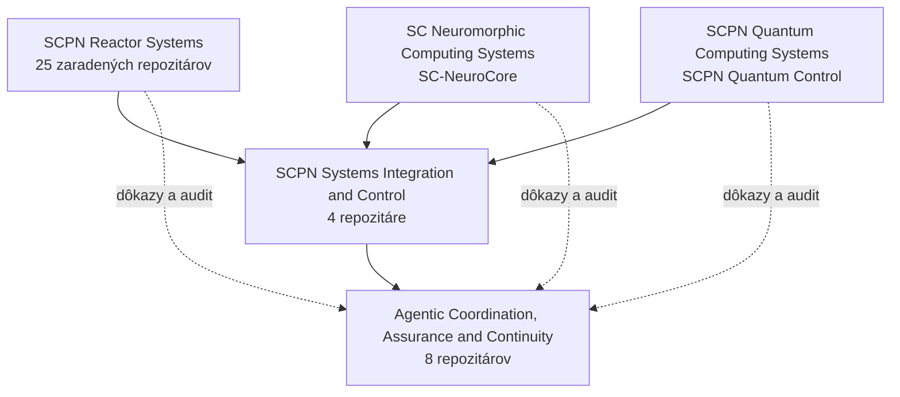

<!--
SPDX-License-Identifier: AGPL-3.0-or-later
Komerčná licencia je dostupná
© Koncepty 1996–2026 Miroslav Šotek. Všetky práva vyhradené.
© Kód 2020–2026 Miroslav Šotek. Všetky práva vyhradené.
ORCID: 0009-0009-3560-0851
Kontakt: www.anulum.li | protoscience@anulum.li
Prehľad osobného profilu GitHub
-->

<p align="center">
  
</p>

<p align="center">
  <a href="README.md"><kbd>EN</kbd></a>
  <a href="README.de.md"><kbd>DE</kbd></a>
  <a href="README.sk.md"><kbd>SK</kbd></a>
  <a href="README.zh-CN.md"><kbd>中文</kbd></a>
  <a href="README.ja.md"><kbd>日本語</kbd></a>
</p>

<p align="center">
  <a href="https://anulum.li">Web</a> ·
  <a href="https://orcid.org/0009-0009-3560-0851">ORCID</a> ·
  <a href="https://github.com/sponsors/anulum">Podpora</a> ·
  <a href="mailto:protoscience@anulum.li">protoscience@anulum.li</a>
</p>

# Miroslav Šotek

Nezávislý výskumník a systémový inžinier v
[Anulum Institute](https://anulum.li) vo Švajčiarsku.

Budujem **infraštruktúru riadenú dôkazmi** pre systémy umelej inteligencie a
multiagentové inžinierstvo: koordináciu s potvrdeniami, ochranu spoľahlivosti
výstupov modelov a výskumné technologické celky siahajúce od matematiky po
vykonateľné hardvérové cesty.

Tvrdenia majú iba takú hodnotu, akú majú merania, artefakty alebo overenie,
ktoré ich podporujú.

**Technológie:** Python · Rust · Verilog · formálne a procesné nástroje podľa potreby.

## Kde začať

| Ak potrebujete… | Prejdite na |
|---|---|
| Paralelných programovacích agentov, ktorí si navzájom neprepisujú prácu | [Synapse Channel](https://github.com/anulum/synapse-channel) · [dokumentácia](https://anulum.github.io/synapse-channel/) |
| Ochranu tvrdení LLM a kontrolu faktickej konzistentnosti | [Director-AI](https://github.com/anulum/director-ai) · [dokumentácia](https://anulum.github.io/director-ai/) |
| Audit repozitárov a plánovanie nápravy | [Rigor Foundry](https://github.com/anulum/rigor-foundry) · [dokumentácia](https://anulum.github.io/rigor-foundry/) |
| Výskum neuromorfných a stochastických výpočtov | [SC-NeuroCore](https://github.com/anulum/sc-neurocore) · [dokumentácia](https://anulum.github.io/sc-neurocore/) |
| Výskum viazaných oscilátorov a kvantových simulácií | [SCPN Quantum Control](https://github.com/anulum/scpn-quantum-control) |

Dokumentácia projektov sa nachádza aj na Pages stránkach jednotlivých
repozitárov a na [anulum.li](https://anulum.li).

## Mapa laboratória

Anulum je technologický celok laboratória, nie jeden produkt:

```text
Director-AI          spoľahlivosť výstupov modelov
Rigor Foundry        audit a náprava viazané na dôkazy
Synapse Channel      multiagentová koordinácia, tvrdenia, potvrdenia
SC-NeuroCore         neuromorfné / SC výpočty (Python · Rust · RTL)
SCPN suite           riadenie, plazma, fáza a kvantové výskumné cesty
```

### Typické použitie celku

1. **Rigor Foundry** — zistí, čo je pokazené, nepreukázané alebo nebezpečné tvrdiť.
2. **Director-AI** — chráni výstup modelu, ktorému sa má dôverovať.
3. **Synapse Channel** — riadi multiagentovú prácu s tvrdeniami, schránkami a potvrdeniami.
4. **SC-NeuroCore / SCPN** — pre neuromorfné, fyzikálne alebo riadiace výpočty.

Výskum, validácia a produktová pripravenosť zostávajú oddelené. Aktívny vývoj
nie je tvrdením o pripravenosti.

**Pripnuté repozitáre** na tomto profile zodpovedajú tabuľke vybraných projektov
nižšie. Ostatné verejné repozitáre patria k výskumu rodiny SCPN alebo k
podporným nástrojom.

## Mapa ekosystému

Aktívna portfóliová mapa obsahuje **39 zaradených repozitárov** v piatich
nezávislých skupinách: 31 verejných repozitárov, šesť súkromných alebo
proprietárnych produktových plôch a dva pripravované reaktorové repozitáre.
[HushLine](https://github.com/anulum/HushLine) je samostatný verejný projekt
mimo týchto výskumných a produktových portfólií.



Šípky znázorňujú zmluvné, integračné, dôkazové a auditné vzťahy. Nespájajú
vlastníctvo repozitárov a neznamenajú vedeckú validáciu, prevádzkovú pripravenosť
ani oprávnenie na fyzické riadenie.

**Stavy:** `VEREJNÝ` · `SÚKROMNÝ / PROPRIETÁRNY` · `V PRÍPRAVE`

<details>
<summary><strong>SCPN Reactor Systems — 25 zaradených repozitárov</strong></summary>

Fyzika rodín zariadení, spoločné numerické jadrá, reaktorové modely a
vlastníctvo konfigurácií. Samotná existencia repozitára nepreukazuje validovanú
fyziku ani pripravenosť stroja.

- [SCPN Beam Target Core](https://github.com/anulum/scpn-beam-target-core) — `VEREJNÝ`
- [SCPN Dense Plasma Focus Core](https://github.com/anulum/scpn-dense-plasma-focus-core) — `VEREJNÝ`
- [SCPN FRC Core](https://github.com/anulum/scpn-frc-core) — `VEREJNÝ`
- [SCPN Fusion Core](https://github.com/anulum/scpn-fusion-core) — `VEREJNÝ`
- [SCPN Fusion-Fission Hybrid Core](https://github.com/anulum/scpn-fusion-fission-hybrid-core) — `VEREJNÝ`
- [SCPN ICF Beam Core](https://github.com/anulum/scpn-icf-beam-core) — `VEREJNÝ`
- [SCPN ICF Impact Core](https://github.com/anulum/scpn-icf-impact-core) — `VEREJNÝ`
- [SCPN ICF Laser Core](https://github.com/anulum/scpn-icf-laser-core) — `VEREJNÝ`
- [SCPN IEC Core](https://github.com/anulum/scpn-iec-core) — `VEREJNÝ`
- [SCPN Levitated Dipole Core](https://github.com/anulum/scpn-levitated-dipole-core) — `VEREJNÝ`
- [SCPN Magnetic Cusp Core](https://github.com/anulum/scpn-magnetic-cusp-core) — `VEREJNÝ`
- [SCPN MIF Core](https://github.com/anulum/scpn-mif-core) — `VEREJNÝ`
- [SCPN MIF Liner Core](https://github.com/anulum/scpn-mif-liner-core) — `VEREJNÝ`
- [SCPN MIF MagLIF Core](https://github.com/anulum/scpn-mif-maglif-core) — `VEREJNÝ`
- [SCPN MIF Plasma Jet Core](https://github.com/anulum/scpn-mif-plasma-jet-core) — `VEREJNÝ`
- [SCPN Mirror Core](https://github.com/anulum/scpn-mirror-core) — `VEREJNÝ`
- [SCPN RFP Core](https://github.com/anulum/scpn-rfp-core) — `VEREJNÝ`
- [SCPN Spheromak Core](https://github.com/anulum/scpn-spheromak-core) — `VEREJNÝ`
- [SCPN Stellarator Core](https://github.com/anulum/scpn-stellarator-core) — `VEREJNÝ`
- [SCPN Theta Pinch Core](https://github.com/anulum/scpn-theta-pinch-core) — `VEREJNÝ`
- [SCPN Tokamak Core](https://github.com/anulum/scpn-tokamak-core) — `VEREJNÝ`
- [SCPN Z-Pinch Core](https://github.com/anulum/scpn-z-pinch-core) — `VEREJNÝ`
- [SCPN Reactor Kernels](https://github.com/anulum/scpn-reactor-kernels) — `VEREJNÝ`
- **SCPN Lattice Fusion Core** — `V PRÍPRAVE`
- **SCPN Muon Fusion Core** — `V PRÍPRAVE`

</details>

<details>
<summary><strong>SCPN Systems Integration and Control — 4 repozitáre</strong></summary>

Horizontálna sémantika, prijímanie riadenia, federácia, zobrazovanie dôkazov a
spoločné zmluvy rozhraní.

- [SCPN Control](https://github.com/anulum/scpn-control) — `VEREJNÝ`
- [SCPN Phase Orchestrator](https://github.com/anulum/scpn-phase-orchestrator) — `VEREJNÝ`
- **SCPN Studio** — `SÚKROMNÝ / PROPRIETÁRNY`
- **SCPN Studio Platform** — `SÚKROMNÝ / PROPRIETÁRNY`

</details>

<details>
<summary><strong>Agentic Coordination, Assurance and Continuity — 8 repozitárov</strong></summary>

Koordinácia, pamäť, overovanie odpovedí, dôkazy o repozitároch, správa akcií a
komerčné systémy riadiacej roviny.

- [Director-AI](https://github.com/anulum/director-ai) — `VEREJNÝ`
- **Director Class AI** — `SÚKROMNÝ / PROPRIETÁRNY`
- **Director AI Cloud** — `SÚKROMNÝ / PROPRIETÁRNY`
- [Rigor Foundry](https://github.com/anulum/rigor-foundry) — `VEREJNÝ`
- [Remanentia](https://github.com/anulum/remanentia) — `VEREJNÝ`
- **Remanentia Portal** — `SÚKROMNÝ / PROPRIETÁRNY`
- [Synapse Channel](https://github.com/anulum/synapse-channel) — `VEREJNÝ`
- **Synapse Channel Fleet** — `SÚKROMNÝ / PROPRIETÁRNY`

</details>

<details>
<summary><strong>SC Neuromorphic Computing Systems — 1 repozitár</strong></summary>

- [SC-NeuroCore](https://github.com/anulum/sc-neurocore) — `VEREJNÝ`

Stochastické výpočty, spiking systémy, hyperdimenzionálne reprezentácie,
natívna akcelerácia, kompilátory a RTL/FPGA cesty.

</details>

<details>
<summary><strong>SCPN Quantum Computing Systems — 1 repozitár</strong></summary>

- [SCPN Quantum Control](https://github.com/anulum/scpn-quantum-control) — `VEREJNÝ`

Kvantová kompilácia riadená dôkazmi, simulácia, vykonávanie na hardvéri a
experimentálne záznamy viazané hashom.

</details>

## Vybrané projekty

| Projekt | Úloha | Stav |
|---|---|---|
| [Synapse Channel](https://github.com/anulum/synapse-channel) | Lokálna riadiaca rovina pre flotily programovacích agentov: tvrdenia, roly, trvalé schránky, potvrdenia, audit a federácia | **Použiteľný teraz** — funkčné jadro, aktívny vývoj |
| [Rigor Foundry](https://github.com/anulum/rigor-foundry) | Audit repozitárov a plánovanie nápravy viazané na dôkazy | **Použiteľný teraz** — aktívne spevňovanie |
| [Director-AI](https://github.com/anulum/director-ai) | Ochrana LLM v reálnom čase: NLI + RAG kontrola faktov s voliteľným zastavením prúdu na úrovni tvrdení | **Aktívny výskum** — funkčný systém vo validácii |
| [SC-NeuroCore](https://github.com/anulum/sc-neurocore) | Polyglotný stochastický a neuromorfný rámec (Python, Rust SIMD, Verilog, HDC/VSA) | **Aktívny výskum** — platforma v nepretržitom vývoji |
| [SCPN Quantum Control](https://github.com/anulum/scpn-quantum-control) | Kvantová simulácia synchronizácie viazaných oscilátorov riadená dôkazmi | **Experimentálny** — vopred registrovaný výskumný program |

Súvisiaci výskum riadenia a fúzie sa nachádza v súprave SCPN
([control](https://github.com/anulum/scpn-control),
[fusion-core](https://github.com/anulum/scpn-fusion-core),
[phase orchestrator](https://github.com/anulum/scpn-phase-orchestrator),
[MIF-core](https://github.com/anulum/scpn-mif-core)).

### Označenia zrelosti

| Označenie | Význam |
|---|---|
| **Použiteľný teraz** | Inštalovateľný, zdokumentovaný a podporený CI; stále sa vyvíja |
| **Aktívny výskum** | Skutočný kód a prebiehajúca veda; nie prísľub stability |
| **Experimentálny** | Prieskumný; rozhrania ani tvrdenia nepovažujte za nemenné |
| **Viazaný na dôkazy** | Verejné tvrdenia sú spojené s meraniami alebo artefaktmi |

## Dôkazy namiesto sloganov

Negatívne a nulové výsledky sa zverejňujú, keď sú skutočné. Verejné tvrdenia
zostávajú viazané na artefakty: merania, vopred registrované protokoly, balíky
surových výsledkov alebo vykonateľné overenie — nie na slogany.

Príklad: vopred registrované protokoly kvantového riadenia a balíky výsledkov
viazané hashom v
[scpn-quantum-control](https://github.com/anulum/scpn-quantum-control).

## Pracovné princípy

- Dôkazy pred tvrdeniami.
- Reprodukovateľné artefakty pred prezentáciou.
- Jasné hranice medzi výskumom, validáciou a produktovou pripravenosťou.
- Viacjazyčné implementácie tam, kde sú užitočné pre výkon alebo integráciu
  hardvéru.
- Čestné záznamy zlyhaní: negatívne výsledky sú súčasťou výstupu výskumu.

## Spolupráca

Vítam technicky podloženú spoluprácu v neuromorfných systémoch, spoľahlivej
infraštruktúre umelej inteligencie, vedeckých výpočtoch, formálnom overovaní a
riadení.

Užitočná prvá správa obsahuje problém, obmedzenia, relevantné predchádzajúce
práce a dôkazy, ktoré by predstavovali úspech. Kontaktujte ma cez
[protoscience@anulum.li](mailto:protoscience@anulum.li) alebo cez
[anulum.li](https://anulum.li).

Odpovedám na technické návrhy. Neprijímam nepodloženú reklamne ladenú prácu,
vedecké divadlo „iba na ukážku“ ani tvrdenia, ktoré sa nedajú overiť.

[GitHub Sponsors](https://github.com/sponsors/anulum) pri dlhodobej otvorenej
práci financuje CI infraštruktúru, čas na kvantové a hardvérové experimenty a
verejnú dokumentáciu — nie marketing.

> **Transparentnosť:** Tieto repozitáre zahŕňajú výskumný softvér, vývojárske
> nástroje a produktových kandidátov. Aktívny vývoj neznamená pripravenosť na
> produkciu ani vedeckú validáciu, pokiaľ projekt neposkytuje explicitné dôkazy.

<p align="center"><em>I AM THAT</em></p>

<p align="center">
  
</p>
