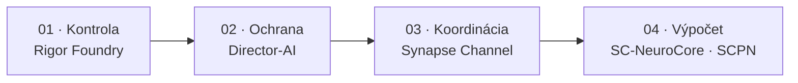

<!--
SPDX-License-Identifier: AGPL-3.0-or-later
Komerčná licencia je dostupná
© Koncepty 1996–2026 Miroslav Šotek. Všetky práva vyhradené.
© Kód 2020–2026 Miroslav Šotek. Všetky práva vyhradené.
ORCID: 0009-0009-3560-0851
Kontakt: www.anulum.li | protoscience@anulum.li
Prehľad osobného profilu GitHub
-->

<p align="center">
  <picture>
    <source media="(prefers-color-scheme: dark)" srcset="assets/profile-header-dark.svg">
    <source media="(prefers-color-scheme: light)" srcset="assets/profile-header-light.svg">
    
  </picture>
</p>

<p align="center">
  <a href="README.md"></a>
  <a href="README.de.md"></a>
  <a href="README.sk.md"></a>
  <a href="README.zh-CN.md"></a>
  <a href="README.ja.md"></a>
</p>

<p align="center">
  <a href="https://anulum.li"></a>
  <a href="https://orcid.org/0009-0009-3560-0851"></a>
  <a href="cv/Miroslav-Sotek-CV.pdf"></a>
  <a href="https://pypi.org/user/anulum/"></a>
  <a href="https://github.com/sponsors/anulum"></a>
  <a href="mailto:protoscience@anulum.li"></a>
</p>

<p align="center">
  <a href="#verified-work">Overená práca</a> · <a href="#current-focus">Aktuálne zameranie</a> ·
  <a href="#portfolio-ecosystem">Ekosystém</a> · <a href="#engineering-practice">Štandardy</a> ·
  <a href="#research-output">Výstupy</a> · <a href="#collaboration">Spolupráca</a>
</p>

# Miroslav Šotek

Nezávislý výskumník a systémový inžinier v
[Anulum Institute](https://anulum.li) vo Švajčiarsku.

Budujem **infraštruktúru riadenú dôkazmi** pre systémy umelej inteligencie,
multiagentové inžinierstvo, vedecké výpočty, neuromorfný hardvér, kvantové
simulácie a riadenie. Práca prepája matematické modely s reprodukovateľným
softvérom, natívnou akceleráciou, formálnymi modelmi a vykonateľnými
hardvérovými cestami.

Tvrdenia majú iba takú hodnotu, akú majú merania, artefakty alebo overenie,
ktoré ich podporujú.

## Jazyky a platformy

**Primárna implementácia:** Python, Rust, TypeScript, JavaScript a Go.

**Vedecké a natívne systémy:** Julia, Mojo, C++, C, Lean 4, Jupyter a LaTeX.

**Hardvér, web a prevádzka:** Verilog, SystemVerilog, WGSL/WebGPU, HTML/CSS,
Shell, Docker a Linux.

<p>
  
  
  
  
  
  
  
  
  
  
  
  
</p>

## Kde začať

| Ak potrebujete… | Prejdite na |
|---|---|
| Paralelných programovacích agentov, ktorí si navzájom neprepisujú prácu | [Synapse Channel](https://github.com/anulum/synapse-channel) · [dokumentácia](https://anulum.github.io/synapse-channel/) |
| Ochranu tvrdení LLM a kontrolu faktickej konzistentnosti | [Director-AI](https://github.com/anulum/director-ai) · [dokumentácia](https://anulum.github.io/director-ai/) |
| Audit repozitárov a plánovanie nápravy | [Rigor Foundry](https://github.com/anulum/rigor-foundry) · [dokumentácia](https://anulum.github.io/rigor-foundry/) |
| Výskum neuromorfných a stochastických výpočtov | [SC-NeuroCore](https://github.com/anulum/sc-neurocore) · [dokumentácia](https://anulum.github.io/sc-neurocore/) |
| Výskum viazaných oscilátorov a kvantových simulácií | [SCPN Quantum Control](https://github.com/anulum/scpn-quantum-control) |

Dokumentácia projektov sa nachádza aj na Pages stránkach jednotlivých
repozitárov a na [anulum.li](https://anulum.li).

<a id="verified-work"></a>
## Overená práca

| Oblasť | Kontrolovateľné dôkazy |
|---|---|
| Multiagentová koordinácia | [Validácia](https://github.com/anulum/synapse-channel/blob/dd65c898a9693b47fad051e3baa92cef07da2e63/VALIDATION.md), [špecifikácia](https://github.com/anulum/synapse-channel/blob/dd65c898a9693b47fad051e3baa92cef07da2e63/docs/coordination-spec.md), [threat model](https://github.com/anulum/synapse-channel/blob/dd65c898a9693b47fad051e3baa92cef07da2e63/docs/sandbox-threat-model.md) |
| Overovanie odpovedí LLM | [Validácia](https://github.com/anulum/director-ai/blob/fc155051367bb48180f2f5dc92f4120c2549cddd/VALIDATION.md), [verejné benchmarky](https://github.com/anulum/director-ai/blob/fc155051367bb48180f2f5dc92f4120c2549cddd/benchmarks/PUBLIC_BENCHMARKS.md), [capability matrix](https://github.com/anulum/director-ai/blob/fc155051367bb48180f2f5dc92f4120c2549cddd/docs/_generated/capability_matrix.md) |
| Neuromorfné výpočty až po RTL | [Validácia](https://github.com/anulum/sc-neurocore/blob/4bbc27b808eef0677848c1e484f40bd41e8ce83d/VALIDATION.md), [výsledky syntézy](https://github.com/anulum/sc-neurocore/blob/4bbc27b808eef0677848c1e484f40bd41e8ce83d/docs/hardware/SYNTHESIS_RESULTS.md), [traceability matrix](https://github.com/anulum/sc-neurocore/blob/4bbc27b808eef0677848c1e484f40bd41e8ce83d/docs/safety/TRACEABILITY_MATRIX.md) |
| Plazma a quantum | [Validácia fúzie](https://github.com/anulum/scpn-fusion-core/blob/3c841fc13109c8efb49bb079d145f70683a4408d/VALIDATION.md), [preregistrácia](https://github.com/anulum/scpn-quantum-control/blob/2bc0f935b75ae7b85a4835caf754b2bfd8770c98/docs/layout_relaxation_preregistration.md), [hardware result packs](https://github.com/anulum/scpn-quantum-control/blob/2bc0f935b75ae7b85a4835caf754b2bfd8770c98/docs/hardware_result_packs.md) |

<a id="current-focus"></a>
## Aktuálne zameranie

<sub>Stav portfólia overený <!-- verified-at -->2026-09-13<!-- /verified-at -->.</sub>

- Spoločné jadrá a riadená pravda zariadení v 25 verejných Reactor repozitároch.
- Koordinácia, pamäť, overovanie odpovedí, kontrola akcií a repo dôkazy s jasnými hranicami vlastníctva.
- Vedecké modely prevedené cez natívnu akceleráciu, formálne kontroly, RTL a kontrolovateľné result packs.

<!-- profile-feeds:releases:start -->
### Najnovšie vydania

| Dátum | Projekt | Vydanie | Zmena |
|---|---|---|---|
| 2026-09-05 | SYNAPSE CHANNEL | [v0.99.26](https://github.com/anulum/synapse-channel/releases/tag/v0.99.26) | Dashboard feeds return unconfigured-store responses without starting report worker processes; configured-store reconstruction retains process isolation. |
| 2026-09-05 | SYNAPSE CHANNEL | [v0.99.25](https://github.com/anulum/synapse-channel/releases/tag/v0.99.25) | Add a repeatable JavaScript SDK integration check against an isolated, authenticated Python hub, covering delivery, claim conflicts, release, snapshots, and reconnect. |
| 2026-09-05 | SCPN-Phase-Orchestrator | [v1.4.3](https://github.com/anulum/scpn-phase-orchestrator/releases/tag/v1.4.3) | Generate identical capability inventory ordering from Git checkouts and exported source trees. |
| 2026-09-04 | SYNAPSE CHANNEL | [v0.99.24](https://github.com/anulum/synapse-channel/releases/tag/v0.99.24) | Keep managed Codex pane bridges waiter-reachable while an already-running provider is blocked by an update chooser, report the pending wake and pane compatibility state explicitly, and coalesce later routing hints until the same live pane becomes safe to… |
| 2026-09-04 | SCPN-Phase-Orchestrator | [v1.4.2](https://github.com/anulum/scpn-phase-orchestrator/releases/tag/v1.4.2) | A fourth sealed L3 request now binds only pulsed_electron_beam_icf to the exact SCPN-ICF-BEAM-CORE review. |

<sub>Vykreslené z [anulum.li/news](https://anulum.li/news/) (súbory CHANGELOG projektov) a [Zenodo](https://zenodo.org/search?q=creators.orcid%3A%220009-0009-3560-0851%22) dňa 2026-09-13.</sub>
<!-- profile-feeds:releases:end -->

<!-- profile-feeds:publication:start -->
### Najnovšia publikácia

| Dátum | Typ | Výstup | DOI |
|---|---|---|---|
| 2026-08-26 | Preprint | A domain-specific modal-growth detector clears a matched false-alarm bar on power-grid instability, and an eigenvalue regime map shows when its form transfers | [10.5281/zenodo.22113116](https://doi.org/10.5281/zenodo.22113116) |

<sub>Vykreslené z [anulum.li/news](https://anulum.li/news/) (súbory CHANGELOG projektov) a [Zenodo](https://zenodo.org/search?q=creators.orcid%3A%220009-0009-3560-0851%22) dňa 2026-09-13.</sub>
<!-- profile-feeds:publication:end -->

## Časová os

| Obdobie | Verejne podložený míľnik |
|---|---|
| od 1996 | Vlastný publikovaný horizont vývoja konceptov |
| 1998 | Začiatok vlastnoručne uvedenej founder role ANULUM CH&LI vo verejnom ORCID zázname |
| 2018 | Založenie verejného GitHub účtu |
| 2025 | Verejné SCPN preview dokumenty a technické správy uložené na Zenodo |
| 2026 | Rozšírenie verejného softvérového a výskumného portfólia v AI assurance, neuromorfných, plazmových a kvantových systémoch |

## Mapa laboratória

Anulum je technologický celok laboratória, nie jeden produkt:

```text
Director-AI          spoľahlivosť výstupov modelov
Rigor Foundry        audit a náprava viazané na dôkazy
Synapse Channel      multiagentová koordinácia, tvrdenia, potvrdenia
SC-NeuroCore         neuromorfné / SC výpočty (Python · Rust · RTL)
SCPN suite           riadenie, plazma, fáza a kvantové výskumné cesty
```

### Typické použitie celku



1. **Rigor Foundry**: zistí, čo je pokazené, nepreukázané alebo nebezpečné tvrdiť.
2. **Director-AI**: chráni výstup modelu, ktorému sa má dôverovať.
3. **Synapse Channel**: riadi multiagentovú prácu s tvrdeniami, schránkami a potvrdeniami.
4. **SC-NeuroCore / SCPN**: pre neuromorfné, fyzikálne alebo riadiace výpočty.

Výskum, validácia a produktová pripravenosť zostávajú oddelené. Aktívny vývoj
nie je tvrdením o pripravenosti.

**Pripnuté repozitáre** na tomto profile zodpovedajú tabuľke vybraných projektov
nižšie. Ostatné verejné repozitáre patria k výskumu rodiny SCPN alebo k
podporným nástrojom.

<a id="portfolio-ecosystem"></a>
## Mapa ekosystému

Aktívna portfóliová mapa obsahuje **39 repozitárov** v piatich nezávislých
skupinách: 33 verejných repozitárov a šesť súkromných produktových plôch.
[HushLine](https://github.com/anulum/HushLine) je samostatný verejný projekt
mimo týchto výskumných a produktových portfólií.

<p align="center">
  <picture>
    <source media="(prefers-color-scheme: dark)" srcset="assets/ecosystem-map-dark.svg">
    <source media="(prefers-color-scheme: light)" srcset="assets/ecosystem-map-light.svg">
    
  </picture>
</p>

Šípky znázorňujú zmluvné, integračné, dôkazové a auditné vzťahy. Nespájajú
vlastníctvo repozitárov a neznamenajú vedeckú validáciu, prevádzkovú pripravenosť
ani oprávnenie na fyzické riadenie.

**Stavy:** `VEREJNÝ` · `VEREJNÝ / IBA ARCHITEKTÚRA` · `SÚKROMNÝ` · `SÚKROMNÝ / PROPRIETÁRNY`

<details>
<summary><strong>SCPN Reactor Systems: 25 zaradených repozitárov</strong></summary>

Fyzika rodín zariadení, spoločné numerické jadrá, reaktorové modely a
vlastníctvo konfigurácií. Samotná existencia repozitára nepreukazuje validovanú
fyziku ani pripravenosť stroja.

- [SCPN Beam Target Core](https://github.com/anulum/scpn-beam-target-core): `VEREJNÝ`
- [SCPN Dense Plasma Focus Core](https://github.com/anulum/scpn-dense-plasma-focus-core): `VEREJNÝ`
- [SCPN FRC Core](https://github.com/anulum/scpn-frc-core): `VEREJNÝ`
- [SCPN Fusion Core](https://github.com/anulum/scpn-fusion-core): `VEREJNÝ`
- [SCPN Fusion-Fission Hybrid Core](https://github.com/anulum/scpn-fusion-fission-hybrid-core): `VEREJNÝ`
- [SCPN ICF Beam Core](https://github.com/anulum/scpn-icf-beam-core): `VEREJNÝ`
- [SCPN ICF Impact Core](https://github.com/anulum/scpn-icf-impact-core): `VEREJNÝ`
- [SCPN ICF Laser Core](https://github.com/anulum/scpn-icf-laser-core): `VEREJNÝ`
- [SCPN IEC Core](https://github.com/anulum/scpn-iec-core): `VEREJNÝ`
- [SCPN Levitated Dipole Core](https://github.com/anulum/scpn-levitated-dipole-core): `VEREJNÝ`
- [SCPN Magnetic Cusp Core](https://github.com/anulum/scpn-magnetic-cusp-core): `VEREJNÝ`
- [SCPN MIF Core](https://github.com/anulum/scpn-mif-core): `VEREJNÝ`
- [SCPN MIF Liner Core](https://github.com/anulum/scpn-mif-liner-core): `VEREJNÝ`
- [SCPN MIF MagLIF Core](https://github.com/anulum/scpn-mif-maglif-core): `VEREJNÝ`
- [SCPN MIF Plasma Jet Core](https://github.com/anulum/scpn-mif-plasma-jet-core): `VEREJNÝ`
- [SCPN Mirror Core](https://github.com/anulum/scpn-mirror-core): `VEREJNÝ`
- [SCPN RFP Core](https://github.com/anulum/scpn-rfp-core): `VEREJNÝ`
- [SCPN Spheromak Core](https://github.com/anulum/scpn-spheromak-core): `VEREJNÝ`
- [SCPN Stellarator Core](https://github.com/anulum/scpn-stellarator-core): `VEREJNÝ`
- [SCPN Theta Pinch Core](https://github.com/anulum/scpn-theta-pinch-core): `VEREJNÝ`
- [SCPN Tokamak Core](https://github.com/anulum/scpn-tokamak-core): `VEREJNÝ`
- [SCPN Z-Pinch Core](https://github.com/anulum/scpn-z-pinch-core): `VEREJNÝ`
- [SCPN Reactor Kernels](https://github.com/anulum/scpn-reactor-kernels): `VEREJNÝ`
- [SCPN Lattice Fusion Core](https://github.com/anulum/scpn-lattice-fusion-core): `VEREJNÝ / IBA ARCHITEKTÚRA`
- [SCPN Muon Fusion Core](https://github.com/anulum/scpn-muon-fusion-core): `VEREJNÝ / IBA ARCHITEKTÚRA`

</details>

<details>
<summary><strong>SCPN Systems Integration and Control: 4 repozitáre</strong></summary>

Horizontálna sémantika, prijímanie riadenia, federácia, zobrazovanie dôkazov a
spoločné zmluvy rozhraní.

- [SCPN Control](https://github.com/anulum/scpn-control): `VEREJNÝ`
- [SCPN Phase Orchestrator](https://github.com/anulum/scpn-phase-orchestrator): `VEREJNÝ`
- **SCPN Studio**: `SÚKROMNÝ / PROPRIETÁRNY`
- **SCPN Studio Platform**: `SÚKROMNÝ / PROPRIETÁRNY`

</details>

<details>
<summary><strong>Agentic Coordination, Assurance and Continuity: 8 repozitárov</strong></summary>

Koordinácia, pamäť, overovanie odpovedí, dôkazy o repozitároch, správa akcií a
komerčné systémy riadiacej roviny.

- [Director-AI](https://github.com/anulum/director-ai): `VEREJNÝ`
- **Director Class AI**: `SÚKROMNÝ / PROPRIETÁRNY`
- **Director AI Cloud**: `SÚKROMNÝ / PROPRIETÁRNY`
- [Rigor Foundry](https://github.com/anulum/rigor-foundry): `VEREJNÝ`
- [Remanentia](https://github.com/anulum/remanentia): `VEREJNÝ`
- **Remanentia Portal**: `SÚKROMNÝ / PROPRIETÁRNY`
- [Synapse Channel](https://github.com/anulum/synapse-channel): `VEREJNÝ`
- **Synapse Channel Fleet**: `SÚKROMNÝ / PROPRIETÁRNY`

</details>

<details>
<summary><strong>SC Neuromorphic Computing Systems: 1 repozitár</strong></summary>

- [SC-NeuroCore](https://github.com/anulum/sc-neurocore): `VEREJNÝ`

Stochastické výpočty, spiking systémy, hyperdimenzionálne reprezentácie,
natívna akcelerácia, kompilátory a RTL/FPGA cesty.

</details>

<details>
<summary><strong>SCPN Quantum Computing Systems: 1 repozitár</strong></summary>

- [SCPN Quantum Control](https://github.com/anulum/scpn-quantum-control): `VEREJNÝ`

Kvantová kompilácia riadená dôkazmi, simulácia, vykonávanie na hardvéri a
experimentálne záznamy viazané hashom.

</details>

<details>
<summary><strong>Samostatný nástroj</strong> &nbsp; 1 verejný repozitár</summary>

- [HushLine](https://github.com/anulum/HushLine): Deterministický príkazový
  wrapper, ktorý filtruje, ohraničuje a voliteľne rediguje stdout a stderr.

</details>

<a id="engineering-practice"></a>
## Inžinierske štandardy

<p>
  
  
  
  
  
  
</p>

Konkrétne praktiky sa vyberajú podľa rizika a rozsahu repozitára; nie každý
repozitár používa každý nástroj.

| Oblasť kvality | Používané praktiky |
|---|---|
| Správnosť | Deterministické pytest a Cargo testy, coverage gates, paritné testy, regresné fixtures a explicitné negatívne prípady |
| Statická kvalita | Ruff, strict mypy tam, kde je deklarovaný, Cargo fmt, Clippy so zakázanými warnings a kontroly API kontraktov |
| Reprodukovateľnosť | Hash-pinned závislosti, preregistrované protokoly, raw result packs, obsahové digesty a opakovateľné auditné záznamy |
| Bezpečnosť | Bandit, CodeQL a scorecards tam, kde sú zapnuté, threat models, minimálna autorita a kontrola závislostí |
| Dodávateľský reťazec | SPDX, REUSE 3.x, SBOM tam, kde je relevantný, pinned CI actions a release manifesty |
| Polyglotné overovanie | Python/Rust parita, PyO3/Maturin, Go a Julia testy, Lean buildy, WebAssembly, RTL a formálne kontroly |
| Dokumentácia | Strict MkDocs/Sphinx buildy, API referencie, architektonické rozhodnutia, validačné záznamy a explicitné non-claims |

## Publikovanie na PyPI

<p align="center">
  <a href="https://pypi.org/user/anulum/"></a>
</p>

Overený [PyPI profil](https://pypi.org/user/anulum/) momentálne obsahuje 19
publikovaných projektov: Python balíky, Rust akcelerované enginy, doménové jadrá
a nástroje príkazového riadka.

<a id="research-output"></a>
## Výskumné výstupy

| Plocha | Overená cesta |
|---|---|
| Kompletný výskumný index | [Publikácie, preprinty a softvérové archívy](PUBLICATIONS.md) |
| Hub publikácií | [anulum.li/papers/](https://anulum.li/papers/): každý záznam na Zenodo s BibTeX |
| Vydania a publikácie | [anulum.li/news/](https://anulum.li/news/) · [RSS](https://anulum.li/news/feed.xml) |
| Životopis | [Jednostranové PDF](cv/Miroslav-Sotek-CV.pdf), [zdroj](cv/Miroslav-Sotek-CV.md), [JSON Resume](cv/resume.json) |
| Výskumná identita | [ORCID 0009-0009-3560-0851](https://orcid.org/0009-0009-3560-0851) |
| Softvér | [19 projektov na PyPI](https://pypi.org/user/anulum/) |
| Quantum Control | [DOI 10.5281/zenodo.18821929](https://doi.org/10.5281/zenodo.18821929) |
| Fusion Core | [DOI 10.5281/zenodo.18820864](https://doi.org/10.5281/zenodo.18820864) |
| Preprinty fázových systémov | [Matched false-alarm](https://doi.org/10.5281/zenodo.22113062), [grid regime map](https://doi.org/10.5281/zenodo.22113116) |
| HushLine | [DOI 10.5281/zenodo.20775432](https://doi.org/10.5281/zenodo.20775432) |

## Vybrané projekty

| Projekt | Úloha | Stav |
|---|---|---|
| [Synapse Channel](https://github.com/anulum/synapse-channel) | Lokálna riadiaca rovina pre flotily programovacích agentov: tvrdenia, roly, trvalé schránky, potvrdenia, audit a federácia | **Použiteľný teraz**: funkčné jadro, aktívny vývoj |
| [Rigor Foundry](https://github.com/anulum/rigor-foundry) | Audit repozitárov a plánovanie nápravy viazané na dôkazy | **Použiteľný teraz**: aktívne spevňovanie |
| [Director-AI](https://github.com/anulum/director-ai) | Ochrana LLM v reálnom čase: NLI + RAG kontrola faktov s voliteľným zastavením prúdu na úrovni tvrdení | **Aktívny výskum**: funkčný systém vo validácii |
| [SC-NeuroCore](https://github.com/anulum/sc-neurocore) | Polyglotný stochastický a neuromorfný rámec (Python, Rust SIMD, Verilog, HDC/VSA) | **Aktívny výskum**: platforma v nepretržitom vývoji |
| [SCPN Quantum Control](https://github.com/anulum/scpn-quantum-control) | Kvantová simulácia synchronizácie viazaných oscilátorov riadená dôkazmi | **Experimentálny**: vopred registrovaný výskumný program |

Súvisiaci výskum riadenia a fúzie sa nachádza v súprave SCPN
([control](https://github.com/anulum/scpn-control),
[fusion-core](https://github.com/anulum/scpn-fusion-core),
[phase orchestrator](https://github.com/anulum/scpn-phase-orchestrator),
[MIF-core](https://github.com/anulum/scpn-mif-core)).

### Označenia zrelosti

| Označenie | Význam |
|---|---|
| **Použiteľný teraz** | Inštalovateľný, zdokumentovaný a podporený CI; stále sa vyvíja |
| **Aktívny výskum** | Skutočný kód a prebiehajúca veda; nie prísľub stability |
| **Experimentálny** | Prieskumný; rozhrania ani tvrdenia nepovažujte za nemenné |
| **Viazaný na dôkazy** | Verejné tvrdenia sú spojené s meraniami alebo artefaktmi |

## Dôkazy namiesto sloganov

Negatívne a nulové výsledky sa zverejňujú, keď sú skutočné. Verejné tvrdenia
zostávajú viazané na artefakty: merania, vopred registrované protokoly, balíky
surových výsledkov alebo vykonateľné overenie: nie na slogany.

Príklad: vopred registrované protokoly kvantového riadenia a balíky výsledkov
viazané hashom v
[scpn-quantum-control](https://github.com/anulum/scpn-quantum-control).

## Pracovné princípy

- Dôkazy pred tvrdeniami.
- Reprodukovateľné artefakty pred prezentáciou.
- Jasné hranice medzi výskumom, validáciou a produktovou pripravenosťou.
- Viacjazyčné implementácie tam, kde sú užitočné pre výkon alebo integráciu
  hardvéru.
- Čestné záznamy zlyhaní: negatívne výsledky sú súčasťou výstupu výskumu.

<a id="collaboration"></a>
## Spolupráca

### Licenčné modely

| Model | Typická hranica |
|---|---|
| Apache-2.0 | Permisívne verejné jadrá, napríklad Director-AI a Rigor Foundry |
| AGPL-3.0-or-later | Verejné sieťové a výskumné systémy s povinnosťami zdieľania zdroja |
| Open core | Verejné jadro so samostatne licencovanými advanced alebo managed plochami |
| BUSL-1.1 | Vybrané súkromné systémy s deklarovanou budúcou zmenou licencie |
| Komerčná licencia | Alternatívne podmienky, ak nemožno použiť verejnú licenciu |

| Forma | Rozsah |
|---|---|
| Výskumná spolupráca | Reprodukovateľné štúdie v AI assurance, neuromorfných systémoch, kvantovej simulácii, fyzike plazmy a riadení |
| Technická spolupráca | Architektonické posúdenie, návrh validácie, formálne a hardvérové cesty a evidence-bound softvérové inžinierstvo |
| Komerčné licencovanie | Dual-licensed a managed systémy cez [Anulum licensing](https://www.anulum.li/licensing) |
| Podpora otvorenej práce | CI, výpočty, hardvérové a kvantové experimenty a dokumentácia cez [GitHub Sponsors](https://github.com/sponsors/anulum) |

Vítam technicky podloženú spoluprácu v neuromorfných systémoch, spoľahlivej
infraštruktúre umelej inteligencie, vedeckých výpočtoch, formálnom overovaní a
riadení.

Spolupráce prijímam selektívne. Verejný GitHub profil je aktuálne označený ako
hireable; nejde o záruku okamžitej kapacity.

Užitočná prvá správa obsahuje problém, obmedzenia, relevantné predchádzajúce
práce a dôkazy, ktoré by predstavovali úspech. Kontaktujte ma cez
[protoscience@anulum.li](mailto:protoscience@anulum.li) alebo cez
[anulum.li](https://anulum.li).

Odpovedám na technické návrhy. Neprijímam nepodloženú reklamne ladenú prácu,
vedecké divadlo „iba na ukážku“ ani tvrdenia, ktoré sa nedajú overiť.

[GitHub Sponsors](https://github.com/sponsors/anulum) pri dlhodobej otvorenej
práci financuje CI infraštruktúru, čas na kvantové a hardvérové experimenty a
verejnú dokumentáciu: nie marketing.

> **Transparentnosť:** Tieto repozitáre zahŕňajú výskumný softvér, vývojárske
> nástroje a produktových kandidátov. Aktívny vývoj neznamená pripravenosť na
> produkciu ani vedeckú validáciu, pokiaľ projekt neposkytuje explicitné dôkazy.

<p align="center"><em>I AM THAT</em></p>

<p align="center">
  
</p>
