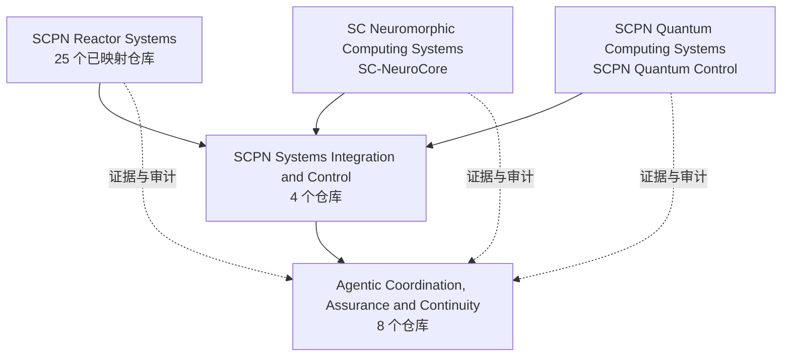

<!--
SPDX-License-Identifier: AGPL-3.0-or-later
可提供商业许可
© 概念 1996–2026 Miroslav Šotek。保留所有权利。
© 代码 2020–2026 Miroslav Šotek。保留所有权利。
ORCID: 0009-0009-3560-0851
联系方式：www.anulum.li | protoscience@anulum.li
GitHub 个人资料概览
-->

<p align="center">
  
</p>

<p align="center">
  <a href="README.md"><kbd>EN</kbd></a>
  <a href="README.de.md"><kbd>DE</kbd></a>
  <a href="README.sk.md"><kbd>SK</kbd></a>
  <a href="README.zh-CN.md"><kbd>中文</kbd></a>
  <a href="README.ja.md"><kbd>日本語</kbd></a>
</p>

<p align="center">
  <a href="https://anulum.li">网站</a> ·
  <a href="https://orcid.org/0009-0009-3560-0851">ORCID</a> ·
  <a href="https://github.com/sponsors/anulum">赞助</a> ·
  <a href="mailto:protoscience@anulum.li">protoscience@anulum.li</a>
</p>

# Miroslav Šotek

瑞士 [Anulum Institute](https://anulum.li) 的独立研究人员与系统工程师。

我为人工智能系统和多智能体工程构建**以证据为治理基础的基础设施**：
带回执的协作机制、面向模型输出的可靠性防护，以及从数学延伸至可执行
硬件路径的研究技术栈。

一项主张的可信度取决于支持它的测量、工件或验证。

**技术栈：** Python · Rust · Verilog · 按需使用形式化与流程工具。

## 从这里开始

| 如果您需要… | 请前往 |
|---|---|
| 不会互相覆盖工作的并行编程智能体 | [Synapse Channel](https://github.com/anulum/synapse-channel) · [文档](https://anulum.github.io/synapse-channel/) |
| LLM 主张防护与事实一致性检查 | [Director-AI](https://github.com/anulum/director-ai) · [文档](https://anulum.github.io/director-ai/) |
| 仓库审计与修复规划 | [Rigor Foundry](https://github.com/anulum/rigor-foundry) · [文档](https://anulum.github.io/rigor-foundry/) |
| 神经形态与随机计算研究 | [SC-NeuroCore](https://github.com/anulum/sc-neurocore) · [文档](https://anulum.github.io/sc-neurocore/) |
| 耦合振荡器与量子模拟研究 | [SCPN Quantum Control](https://github.com/anulum/scpn-quantum-control) |

项目文档也发布在各仓库的 Pages 站点以及
[anulum.li](https://anulum.li)。

## 实验室地图

Anulum 是一套实验室技术栈，而非单一产品：

```text
Director-AI          模型输出可靠性
Rigor Foundry        基于证据的审计与修复
Synapse Channel      多智能体协调、主张、回执
SC-NeuroCore         神经形态 / SC 计算（Python · Rust · RTL）
SCPN suite           控制、等离子体、相位与量子研究路径
```

### 典型技术栈用法

1. **Rigor Foundry** — 找出损坏、未经证明或不应安全宣称的内容。
2. **Director-AI** — 防护将被信任的模型输出。
3. **Synapse Channel** — 通过主张、邮箱和回执运行多智能体工作。
4. **SC-NeuroCore / SCPN** — 用于神经形态、物理或控制级计算问题。

研究、验证和产品就绪度相互分离。活跃开发不代表已经就绪。

本资料页的**置顶仓库**与下方代表性项目表一致。其他公开仓库属于 SCPN
系列研究或支持工具。

## 生态系统地图

当前的项目组合地图由五个独立分组中的 **39 个已映射仓库成员**组成：
31 个公开仓库、6 个私有或专有产品界面，以及 2 个筹备中的反应堆仓库。
[HushLine](https://github.com/anulum/HushLine)
是这些研究和产品组合之外的独立公开项目。



箭头表示契约、集成、证据和审计关系。它们不会合并仓库所有权，也不代表
科学验证、运行就绪状态或执行器控制权限。

**状态说明：** `公开` · `私有 / 专有` · `筹备中`

<details>
<summary><strong>SCPN Reactor Systems — 25 个已映射仓库</strong></summary>

设备族物理、共享数值内核、反应堆模型及配置所有权。仓库的存在本身并不
证明其物理模型已经验证，也不表示相关设备已经就绪。

- [SCPN Beam Target Core](https://github.com/anulum/scpn-beam-target-core) — `公开`
- [SCPN Dense Plasma Focus Core](https://github.com/anulum/scpn-dense-plasma-focus-core) — `公开`
- [SCPN FRC Core](https://github.com/anulum/scpn-frc-core) — `公开`
- [SCPN Fusion Core](https://github.com/anulum/scpn-fusion-core) — `公开`
- [SCPN Fusion-Fission Hybrid Core](https://github.com/anulum/scpn-fusion-fission-hybrid-core) — `公开`
- [SCPN ICF Beam Core](https://github.com/anulum/scpn-icf-beam-core) — `公开`
- [SCPN ICF Impact Core](https://github.com/anulum/scpn-icf-impact-core) — `公开`
- [SCPN ICF Laser Core](https://github.com/anulum/scpn-icf-laser-core) — `公开`
- [SCPN IEC Core](https://github.com/anulum/scpn-iec-core) — `公开`
- [SCPN Levitated Dipole Core](https://github.com/anulum/scpn-levitated-dipole-core) — `公开`
- [SCPN Magnetic Cusp Core](https://github.com/anulum/scpn-magnetic-cusp-core) — `公开`
- [SCPN MIF Core](https://github.com/anulum/scpn-mif-core) — `公开`
- [SCPN MIF Liner Core](https://github.com/anulum/scpn-mif-liner-core) — `公开`
- [SCPN MIF MagLIF Core](https://github.com/anulum/scpn-mif-maglif-core) — `公开`
- [SCPN MIF Plasma Jet Core](https://github.com/anulum/scpn-mif-plasma-jet-core) — `公开`
- [SCPN Mirror Core](https://github.com/anulum/scpn-mirror-core) — `公开`
- [SCPN RFP Core](https://github.com/anulum/scpn-rfp-core) — `公开`
- [SCPN Spheromak Core](https://github.com/anulum/scpn-spheromak-core) — `公开`
- [SCPN Stellarator Core](https://github.com/anulum/scpn-stellarator-core) — `公开`
- [SCPN Theta Pinch Core](https://github.com/anulum/scpn-theta-pinch-core) — `公开`
- [SCPN Tokamak Core](https://github.com/anulum/scpn-tokamak-core) — `公开`
- [SCPN Z-Pinch Core](https://github.com/anulum/scpn-z-pinch-core) — `公开`
- [SCPN Reactor Kernels](https://github.com/anulum/scpn-reactor-kernels) — `公开`
- **SCPN Lattice Fusion Core** — `筹备中`
- **SCPN Muon Fusion Core** — `筹备中`

</details>

<details>
<summary><strong>SCPN Systems Integration and Control — 4 个仓库</strong></summary>

跨领域语义、控制准入、联邦协作、证据呈现以及共享接口契约。

- [SCPN Control](https://github.com/anulum/scpn-control) — `公开`
- [SCPN Phase Orchestrator](https://github.com/anulum/scpn-phase-orchestrator) — `公开`
- **SCPN Studio** — `私有 / 专有`
- **SCPN Studio Platform** — `私有 / 专有`

</details>

<details>
<summary><strong>Agentic Coordination, Assurance and Continuity — 8 个仓库</strong></summary>

智能体协调、记忆、响应保障、仓库证据、动作治理以及商业控制平面系统。

- [Director-AI](https://github.com/anulum/director-ai) — `公开`
- **Director Class AI** — `私有 / 专有`
- **Director AI Cloud** — `私有 / 专有`
- [Rigor Foundry](https://github.com/anulum/rigor-foundry) — `公开`
- [Remanentia](https://github.com/anulum/remanentia) — `公开`
- **Remanentia Portal** — `私有 / 专有`
- [Synapse Channel](https://github.com/anulum/synapse-channel) — `公开`
- **Synapse Channel Fleet** — `私有 / 专有`

</details>

<details>
<summary><strong>SC Neuromorphic Computing Systems — 1 个仓库</strong></summary>

- [SC-NeuroCore](https://github.com/anulum/sc-neurocore) — `公开`

随机计算、脉冲系统、超维表示、原生加速、编译器以及 RTL/FPGA 路径。

</details>

<details>
<summary><strong>SCPN Quantum Computing Systems — 1 个仓库</strong></summary>

- [SCPN Quantum Control](https://github.com/anulum/scpn-quantum-control) — `公开`

以证据为约束的量子编译、模拟、硬件执行以及哈希绑定的实验记录。

</details>

## 代表性项目

| 项目 | 功能 | 成熟度 |
|---|---|---|
| [Synapse Channel](https://github.com/anulum/synapse-channel) | 面向编程智能体集群的本地优先控制平面：主张、角色、持久邮箱、回执、审计和联邦协作 | **现在可用** — 功能核心可用，持续开发中 |
| [Rigor Foundry](https://github.com/anulum/rigor-foundry) | 基于证据的仓库审计和修复规划 | **现在可用** — 持续强化中 |
| [Director-AI](https://github.com/anulum/director-ai) | 实时 LLM 防护：NLI 与 RAG 事实检查，以及可选的主张级流式停止 | **活跃研究** — 正在验证的功能系统 |
| [SC-NeuroCore](https://github.com/anulum/sc-neurocore) | 多语言随机与神经形态框架（Python、Rust SIMD、Verilog、HDC/VSA） | **活跃研究** — 持续开发的平台 |
| [SCPN Quantum Control](https://github.com/anulum/scpn-quantum-control) | 基于证据的耦合振荡器同步量子模拟 | **实验性** — 预注册研究计划 |

相关控制与聚变研究位于 SCPN 系列中：
[control](https://github.com/anulum/scpn-control)、
[fusion-core](https://github.com/anulum/scpn-fusion-core)、
[phase orchestrator](https://github.com/anulum/scpn-phase-orchestrator)、
[MIF-core](https://github.com/anulum/scpn-mif-core)。

### 成熟度标签

| 标签 | 含义 |
|---|---|
| **现在可用** | 可安装、有文档并由 CI 支持；仍在演进 |
| **活跃研究** | 有真实代码和持续研究；不承诺接口稳定 |
| **实验性** | 探索阶段；请勿将接口或主张视为固定 |
| **证据约束** | 公开主张与测量或工件相绑定 |

## 证据，而非口号

真实的负面结果和零结果会被公开。公开主张始终绑定到测量、预注册协议、
原始结果包或可执行验证等工件，而不是口号。

示例：[scpn-quantum-control](https://github.com/anulum/scpn-quantum-control)
中的预注册量子控制协议与哈希绑定结果包。

## 工作原则

- 证据先于主张。
- 可复现工件先于展示。
- 明确区分研究、验证和产品就绪度。
- 在性能或硬件集成确有需要时采用跨语言实现。
- 如实记录失败：负面结果也是研究产出的一部分。

## 合作

欢迎在神经形态系统、可靠人工智能基础设施、科学计算、形式化验证和控制
领域开展有技术依据的合作。

有效的首次联系应包括问题、约束、相关前期工作，以及何种证据可以视为
成功。请通过 [protoscience@anulum.li](mailto:protoscience@anulum.li) 或
[anulum.li](https://anulum.li) 的联系渠道与我联系。

我会回应技术提案，但不接受缺乏依据的炒作工作、“仅供演示”的科学表演，
或无法核验的主张。

[GitHub Sponsors](https://github.com/sponsors/anulum) 的支持用于持续开放
工作的 CI 运行器、量子与硬件实验时间以及公开文档，而非营销。

> **透明度：** 这些仓库涵盖研究软件、开发者工具和候选产品。除非项目
> 提供明确证据，否则活跃开发并不代表生产就绪或科学验证。

<p align="center"><em>I AM THAT</em></p>

<p align="center">
  
</p>
