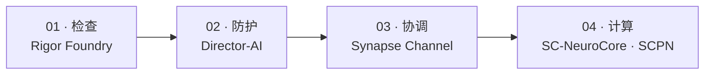

<!--
SPDX-License-Identifier: AGPL-3.0-or-later
可提供商业许可
© 概念 1996–2026 Miroslav Šotek。保留所有权利。
© 代码 2020–2026 Miroslav Šotek。保留所有权利。
ORCID: 0009-0009-3560-0851
联系方式：www.anulum.li | protoscience@anulum.li
GitHub 个人资料概览
-->

<p align="center">
  <picture>
    <source media="(prefers-color-scheme: dark)" srcset="assets/profile-header-dark.svg">
    <source media="(prefers-color-scheme: light)" srcset="assets/profile-header-light.svg">
    
  </picture>
</p>

<p align="center">
  <a href="README.md"></a>
  <a href="README.de.md"></a>
  <a href="README.sk.md"></a>
  <a href="README.zh-CN.md"></a>
  <a href="README.ja.md"></a>
</p>

<p align="center">
  <a href="https://anulum.li"></a>
  <a href="https://orcid.org/0009-0009-3560-0851"></a>
  <a href="cv/Miroslav-Sotek-CV.pdf"></a>
  <a href="https://pypi.org/user/anulum/"></a>
  <a href="https://github.com/sponsors/anulum"></a>
  <a href="mailto:protoscience@anulum.li"></a>
</p>

<p align="center">
  <a href="#verified-work">已验证工作</a> · <a href="#current-focus">当前重点</a> ·
  <a href="#portfolio-ecosystem">生态系统</a> · <a href="#engineering-practice">工程标准</a> ·
  <a href="#research-output">研究产出</a> · <a href="#collaboration">合作</a>
</p>

# Miroslav Šotek

瑞士 [Anulum Institute](https://anulum.li) 的独立研究人员与系统工程师。

我为人工智能系统、多智能体工程、科学计算、神经形态硬件、量子模拟和控制
构建**以证据为治理基础的基础设施**。相关工作把数学模型连接到可复现软件、
原生加速、形式化模型和可执行硬件路径。

一项主张的可信度取决于支持它的测量、工件或验证。

## 语言与平台

**主要实现：** Python、Rust、TypeScript、JavaScript 和 Go。

**科学、原生与形式化工作：** Julia、Mojo、C++、C、Lean 4、Jupyter 和 LaTeX。

**硬件、Web 与运维：** Verilog、SystemVerilog、WGSL/WebGPU、HTML/CSS、
Shell、Docker 和 Linux。

<p>
  
  
  
  
  
  
  
  
  
  
  
  
</p>

## 从这里开始

| 如果您需要… | 请前往 |
|---|---|
| 不会互相覆盖工作的并行编程智能体 | [Synapse Channel](https://github.com/anulum/synapse-channel) · [文档](https://anulum.github.io/synapse-channel/) |
| LLM 主张防护与事实一致性检查 | [Director-AI](https://github.com/anulum/director-ai) · [文档](https://anulum.github.io/director-ai/) |
| 仓库审计与修复规划 | [Rigor Foundry](https://github.com/anulum/rigor-foundry) · [文档](https://anulum.github.io/rigor-foundry/) |
| 神经形态与随机计算研究 | [SC-NeuroCore](https://github.com/anulum/sc-neurocore) · [文档](https://anulum.github.io/sc-neurocore/) |
| 耦合振荡器与量子模拟研究 | [SCPN Quantum Control](https://github.com/anulum/scpn-quantum-control) |

项目文档也发布在各仓库的 Pages 站点以及
[anulum.li](https://anulum.li)。

<a id="verified-work"></a>
## 已验证工作

| 领域 | 可检查证据 |
|---|---|
| 多智能体协调 | [验证](https://github.com/anulum/synapse-channel/blob/dd65c898a9693b47fad051e3baa92cef07da2e63/VALIDATION.md)、[协调规范](https://github.com/anulum/synapse-channel/blob/dd65c898a9693b47fad051e3baa92cef07da2e63/docs/coordination-spec.md)、[威胁模型](https://github.com/anulum/synapse-channel/blob/dd65c898a9693b47fad051e3baa92cef07da2e63/docs/sandbox-threat-model.md) |
| LLM 响应保障 | [验证](https://github.com/anulum/director-ai/blob/fc155051367bb48180f2f5dc92f4120c2549cddd/VALIDATION.md)、[公开基准](https://github.com/anulum/director-ai/blob/fc155051367bb48180f2f5dc92f4120c2549cddd/benchmarks/PUBLIC_BENCHMARKS.md)、[能力矩阵](https://github.com/anulum/director-ai/blob/fc155051367bb48180f2f5dc92f4120c2549cddd/docs/_generated/capability_matrix.md) |
| 神经形态计算到 RTL | [验证](https://github.com/anulum/sc-neurocore/blob/4bbc27b808eef0677848c1e484f40bd41e8ce83d/VALIDATION.md)、[综合结果](https://github.com/anulum/sc-neurocore/blob/4bbc27b808eef0677848c1e484f40bd41e8ce83d/docs/hardware/SYNTHESIS_RESULTS.md)、[可追溯矩阵](https://github.com/anulum/sc-neurocore/blob/4bbc27b808eef0677848c1e484f40bd41e8ce83d/docs/safety/TRACEABILITY_MATRIX.md) |
| 等离子体与量子 | [聚变验证](https://github.com/anulum/scpn-fusion-core/blob/3c841fc13109c8efb49bb079d145f70683a4408d/VALIDATION.md)、[预注册](https://github.com/anulum/scpn-quantum-control/blob/2bc0f935b75ae7b85a4835caf754b2bfd8770c98/docs/layout_relaxation_preregistration.md)、[硬件结果包](https://github.com/anulum/scpn-quantum-control/blob/2bc0f935b75ae7b85a4835caf754b2bfd8770c98/docs/hardware_result_packs.md) |

<a id="current-focus"></a>
## 当前重点

<sub>项目组合状态于 <!-- verified-at -->2026-09-13<!-- /verified-at --> 验证。</sub>

- 在 25 个公开 Reactor 仓库中整合共享内核和受治理的设备事实。
- 在清晰所有权边界下连接协调、记忆、响应保障、动作审查和仓库证据。
- 将科学模型推进到原生加速、形式化检查、RTL 和可检查结果包。

<!-- profile-feeds:releases:start -->
### 最新发布

| 日期 | 项目 | 版本 | 变更 |
|---|---|---|---|
| 2026-09-05 | SYNAPSE CHANNEL | [v0.99.26](https://github.com/anulum/synapse-channel/releases/tag/v0.99.26) | Dashboard feeds return unconfigured-store responses without starting report worker processes; configured-store reconstruction retains process isolation. |
| 2026-09-05 | SYNAPSE CHANNEL | [v0.99.25](https://github.com/anulum/synapse-channel/releases/tag/v0.99.25) | Add a repeatable JavaScript SDK integration check against an isolated, authenticated Python hub, covering delivery, claim conflicts, release, snapshots, and reconnect. |
| 2026-09-05 | SCPN-Phase-Orchestrator | [v1.4.3](https://github.com/anulum/scpn-phase-orchestrator/releases/tag/v1.4.3) | Generate identical capability inventory ordering from Git checkouts and exported source trees. |
| 2026-09-04 | SYNAPSE CHANNEL | [v0.99.24](https://github.com/anulum/synapse-channel/releases/tag/v0.99.24) | Keep managed Codex pane bridges waiter-reachable while an already-running provider is blocked by an update chooser, report the pending wake and pane compatibility state explicitly, and coalesce later routing hints until the same live pane becomes safe to… |
| 2026-09-04 | SCPN-Phase-Orchestrator | [v1.4.2](https://github.com/anulum/scpn-phase-orchestrator/releases/tag/v1.4.2) | A fourth sealed L3 request now binds only pulsed_electron_beam_icf to the exact SCPN-ICF-BEAM-CORE review. |

<sub>根据 [anulum.li/news](https://anulum.li/news/)（各项目的 CHANGELOG 文件）和 [Zenodo](https://zenodo.org/search?q=creators.orcid%3A%220009-0009-3560-0851%22) 于 2026-09-13 生成。</sub>
<!-- profile-feeds:releases:end -->

<!-- profile-feeds:publication:start -->
### 最新出版物

| 日期 | 类型 | 成果 | DOI |
|---|---|---|---|
| 2026-08-26 | Preprint | A domain-specific modal-growth detector clears a matched false-alarm bar on power-grid instability, and an eigenvalue regime map shows when its form transfers | [10.5281/zenodo.22113116](https://doi.org/10.5281/zenodo.22113116) |

<sub>根据 [anulum.li/news](https://anulum.li/news/)（各项目的 CHANGELOG 文件）和 [Zenodo](https://zenodo.org/search?q=creators.orcid%3A%220009-0009-3560-0851%22) 于 2026-09-13 生成。</sub>
<!-- profile-feeds:publication:end -->

## 时间线

| 时期 | 有公开依据的里程碑 |
|---|---|
| 1996 年起 | 自行发布的概念开发时间范围 |
| 1998 | 公开 ORCID 记录中自行填写的 ANULUM CH&LI 创始人角色开始 |
| 2018 | 建立公开 GitHub 账户 |
| 2025 | 在 Zenodo 发布 SCPN 预览材料与技术报告 |
| 2026 | 公开软件与研究组合扩展至 AI 保障、神经形态、等离子体和量子系统 |

## 实验室地图

Anulum 是一套实验室技术栈，而非单一产品：

```text
Director-AI          模型输出可靠性
Rigor Foundry        基于证据的审计与修复
Synapse Channel      多智能体协调、主张、回执
SC-NeuroCore         神经形态 / SC 计算（Python · Rust · RTL）
SCPN suite           控制、等离子体、相位与量子研究路径
```

### 典型技术栈用法



1. **Rigor Foundry**: 找出损坏、未经证明或不应安全宣称的内容。
2. **Director-AI**: 防护将被信任的模型输出。
3. **Synapse Channel**: 通过主张、邮箱和回执运行多智能体工作。
4. **SC-NeuroCore / SCPN**: 用于神经形态、物理或控制级计算问题。

研究、验证和产品就绪度相互分离。活跃开发不代表已经就绪。

本资料页的**置顶仓库**与下方代表性项目表一致。其他公开仓库属于 SCPN
系列研究或支持工具。

<a id="portfolio-ecosystem"></a>
## 生态系统地图

当前项目组合由五个独立分组中的 **39 个仓库**组成：33 个公开仓库和
6 个私有产品界面。
[HushLine](https://github.com/anulum/HushLine)
是这些研究和产品组合之外的独立公开项目。

<p align="center">
  <picture>
    <source media="(prefers-color-scheme: dark)" srcset="assets/ecosystem-map-dark.svg">
    <source media="(prefers-color-scheme: light)" srcset="assets/ecosystem-map-light.svg">
    
  </picture>
</p>

箭头表示契约、集成、证据和审计关系。它们不会合并仓库所有权，也不代表
科学验证、运行就绪状态或执行器控制权限。

**状态说明：** `公开` · `公开 / 仅架构` · `私有` · `私有 / 专有`

<details>
<summary><strong>SCPN Reactor Systems: 25 个已映射仓库</strong></summary>

设备族物理、共享数值内核、反应堆模型及配置所有权。仓库的存在本身并不
证明其物理模型已经验证，也不表示相关设备已经就绪。

- [SCPN Beam Target Core](https://github.com/anulum/scpn-beam-target-core): `公开`
- [SCPN Dense Plasma Focus Core](https://github.com/anulum/scpn-dense-plasma-focus-core): `公开`
- [SCPN FRC Core](https://github.com/anulum/scpn-frc-core): `公开`
- [SCPN Fusion Core](https://github.com/anulum/scpn-fusion-core): `公开`
- [SCPN Fusion-Fission Hybrid Core](https://github.com/anulum/scpn-fusion-fission-hybrid-core): `公开`
- [SCPN ICF Beam Core](https://github.com/anulum/scpn-icf-beam-core): `公开`
- [SCPN ICF Impact Core](https://github.com/anulum/scpn-icf-impact-core): `公开`
- [SCPN ICF Laser Core](https://github.com/anulum/scpn-icf-laser-core): `公开`
- [SCPN IEC Core](https://github.com/anulum/scpn-iec-core): `公开`
- [SCPN Levitated Dipole Core](https://github.com/anulum/scpn-levitated-dipole-core): `公开`
- [SCPN Magnetic Cusp Core](https://github.com/anulum/scpn-magnetic-cusp-core): `公开`
- [SCPN MIF Core](https://github.com/anulum/scpn-mif-core): `公开`
- [SCPN MIF Liner Core](https://github.com/anulum/scpn-mif-liner-core): `公开`
- [SCPN MIF MagLIF Core](https://github.com/anulum/scpn-mif-maglif-core): `公开`
- [SCPN MIF Plasma Jet Core](https://github.com/anulum/scpn-mif-plasma-jet-core): `公开`
- [SCPN Mirror Core](https://github.com/anulum/scpn-mirror-core): `公开`
- [SCPN RFP Core](https://github.com/anulum/scpn-rfp-core): `公开`
- [SCPN Spheromak Core](https://github.com/anulum/scpn-spheromak-core): `公开`
- [SCPN Stellarator Core](https://github.com/anulum/scpn-stellarator-core): `公开`
- [SCPN Theta Pinch Core](https://github.com/anulum/scpn-theta-pinch-core): `公开`
- [SCPN Tokamak Core](https://github.com/anulum/scpn-tokamak-core): `公开`
- [SCPN Z-Pinch Core](https://github.com/anulum/scpn-z-pinch-core): `公开`
- [SCPN Reactor Kernels](https://github.com/anulum/scpn-reactor-kernels): `公开`
- [SCPN Lattice Fusion Core](https://github.com/anulum/scpn-lattice-fusion-core): `公开 / 仅架构`
- [SCPN Muon Fusion Core](https://github.com/anulum/scpn-muon-fusion-core): `公开 / 仅架构`

</details>

<details>
<summary><strong>SCPN Systems Integration and Control: 4 个仓库</strong></summary>

跨领域语义、控制准入、联邦协作、证据呈现以及共享接口契约。

- [SCPN Control](https://github.com/anulum/scpn-control): `公开`
- [SCPN Phase Orchestrator](https://github.com/anulum/scpn-phase-orchestrator): `公开`
- **SCPN Studio**: `私有 / 专有`
- **SCPN Studio Platform**: `私有 / 专有`

</details>

<details>
<summary><strong>Agentic Coordination, Assurance and Continuity: 8 个仓库</strong></summary>

智能体协调、记忆、响应保障、仓库证据、动作治理以及商业控制平面系统。

- [Director-AI](https://github.com/anulum/director-ai): `公开`
- **Director Class AI**: `私有 / 专有`
- **Director AI Cloud**: `私有 / 专有`
- [Rigor Foundry](https://github.com/anulum/rigor-foundry): `公开`
- [Remanentia](https://github.com/anulum/remanentia): `公开`
- **Remanentia Portal**: `私有 / 专有`
- [Synapse Channel](https://github.com/anulum/synapse-channel): `公开`
- **Synapse Channel Fleet**: `私有 / 专有`

</details>

<details>
<summary><strong>SC Neuromorphic Computing Systems: 1 个仓库</strong></summary>

- [SC-NeuroCore](https://github.com/anulum/sc-neurocore): `公开`

随机计算、脉冲系统、超维表示、原生加速、编译器以及 RTL/FPGA 路径。

</details>

<details>
<summary><strong>SCPN Quantum Computing Systems: 1 个仓库</strong></summary>

- [SCPN Quantum Control](https://github.com/anulum/scpn-quantum-control): `公开`

以证据为约束的量子编译、模拟、硬件执行以及哈希绑定的实验记录。

</details>

<details>
<summary><strong>独立工具</strong> &nbsp; 1 个公开仓库</summary>

- [HushLine](https://github.com/anulum/HushLine)：用于过滤、限制并可选
  脱敏 stdout 和 stderr 的确定性命令包装器。

</details>

<a id="engineering-practice"></a>
## 工程标准

<p>
  
  
  
  
  
  
</p>

具体实践依据每个仓库的风险和范围选择，并非每个仓库都运行所有工具。

| 质量维度 | 项目组合中使用的实践 |
|---|---|
| 正确性 | 确定性 pytest 与 Cargo 测试、覆盖率门槛、等价性测试、回归夹具和显式负面用例 |
| 静态质量 | Ruff、声明处的严格 mypy、Cargo fmt、禁止警告的 Clippy 以及 API 契约检查 |
| 可复现性 | 哈希固定依赖、预注册协议、原始结果包、内容摘要和可重放审计记录 |
| 安全 | 按需启用 Bandit、CodeQL 和 Scorecards，并使用威胁模型、最小权限与依赖审查 |
| 供应链 | SPDX、REUSE 3.x、适用时的 SBOM、固定版本 CI Actions 和发布清单 |
| 多语言验证 | Python/Rust 等价性、PyO3/Maturin、Go 与 Julia 测试、Lean 构建、WebAssembly、RTL 和形式化检查 |
| 文档 | 严格 MkDocs/Sphinx 构建、API 参考、架构决策、验证记录和明确的非主张 |

## PyPI 发布

<p align="center">
  <a href="https://pypi.org/user/anulum/"></a>
</p>

经验证的 [PyPI 主页](https://pypi.org/user/anulum/) 当前包含 19 个已发布
项目，包括 Python 包、Rust 加速引擎、领域内核和命令行工具。

<a id="research-output"></a>
## 研究产出

| 界面 | 已验证路径 |
|---|---|
| 完整研究索引 | [出版物、预印本和软件存档](PUBLICATIONS.md) |
| 出版物中心 | [anulum.li/papers/](https://anulum.li/papers/)：每条 Zenodo 记录及 BibTeX |
| 发布与出版物流 | [anulum.li/news/](https://anulum.li/news/) · [RSS](https://anulum.li/news/feed.xml) |
| 简历 | [单页 PDF](cv/Miroslav-Sotek-CV.pdf)、[Markdown 源文件](cv/Miroslav-Sotek-CV.md)、[JSON Resume](cv/resume.json) |
| 研究身份 | [ORCID 0009-0009-3560-0851](https://orcid.org/0009-0009-3560-0851) |
| 软件发布 | [PyPI 上的 19 个项目](https://pypi.org/user/anulum/) |
| Quantum Control | [DOI 10.5281/zenodo.18821929](https://doi.org/10.5281/zenodo.18821929) |
| Fusion Core | [DOI 10.5281/zenodo.18820864](https://doi.org/10.5281/zenodo.18820864) |
| 相位系统预印本 | [Matched false-alarm](https://doi.org/10.5281/zenodo.22113062)、[grid regime map](https://doi.org/10.5281/zenodo.22113116) |
| HushLine | [DOI 10.5281/zenodo.20775432](https://doi.org/10.5281/zenodo.20775432) |

## 代表性项目

| 项目 | 功能 | 成熟度 |
|---|---|---|
| [Synapse Channel](https://github.com/anulum/synapse-channel) | 面向编程智能体集群的本地优先控制平面：主张、角色、持久邮箱、回执、审计和联邦协作 | **现在可用**: 功能核心可用，持续开发中 |
| [Rigor Foundry](https://github.com/anulum/rigor-foundry) | 基于证据的仓库审计和修复规划 | **现在可用**: 持续强化中 |
| [Director-AI](https://github.com/anulum/director-ai) | 实时 LLM 防护：NLI 与 RAG 事实检查，以及可选的主张级流式停止 | **活跃研究**: 正在验证的功能系统 |
| [SC-NeuroCore](https://github.com/anulum/sc-neurocore) | 多语言随机与神经形态框架（Python、Rust SIMD、Verilog、HDC/VSA） | **活跃研究**: 持续开发的平台 |
| [SCPN Quantum Control](https://github.com/anulum/scpn-quantum-control) | 基于证据的耦合振荡器同步量子模拟 | **实验性**: 预注册研究计划 |

相关控制与聚变研究位于 SCPN 系列中：
[control](https://github.com/anulum/scpn-control)、
[fusion-core](https://github.com/anulum/scpn-fusion-core)、
[phase orchestrator](https://github.com/anulum/scpn-phase-orchestrator)、
[MIF-core](https://github.com/anulum/scpn-mif-core)。

### 成熟度标签

| 标签 | 含义 |
|---|---|
| **现在可用** | 可安装、有文档并由 CI 支持；仍在演进 |
| **活跃研究** | 有真实代码和持续研究；不承诺接口稳定 |
| **实验性** | 探索阶段；请勿将接口或主张视为固定 |
| **证据约束** | 公开主张与测量或工件相绑定 |

## 证据，而非口号

真实的负面结果和零结果会被公开。公开主张始终绑定到测量、预注册协议、
原始结果包或可执行验证等工件，而不是口号。

示例：[scpn-quantum-control](https://github.com/anulum/scpn-quantum-control)
中的预注册量子控制协议与哈希绑定结果包。

## 工作原则

- 证据先于主张。
- 可复现工件先于展示。
- 明确区分研究、验证和产品就绪度。
- 在性能或硬件集成确有需要时采用跨语言实现。
- 如实记录失败：负面结果也是研究产出的一部分。

<a id="collaboration"></a>
## 合作

### 许可模型

| 模型 | 典型边界 |
|---|---|
| Apache-2.0 | Director-AI 和 Rigor Foundry 等宽松许可的公开核心 |
| AGPL-3.0-or-later | 带源码共享义务的公开网络与研究系统 |
| Open core | 公开核心与单独许可的高级或托管产品界面 |
| BUSL-1.1 | 声明未来许可证变更的部分私有系统 |
| 商业许可 | 无法采用公开许可证时提供的替代条款 |

| 方式 | 范围 |
|---|---|
| 研究合作 | AI 保障、神经形态系统、量子模拟、等离子体物理和控制领域的可复现研究 |
| 技术合作 | 架构审查、验证设计、形式化或硬件路径以及证据约束的软件工程 |
| 商业许可 | 通过 [Anulum licensing](https://www.anulum.li/licensing) 提供双许可证和托管产品界面 |
| 开放工作赞助 | 通过 [GitHub Sponsors](https://github.com/sponsors/anulum) 支持 CI、计算、硬件与量子实验和公开文档 |

欢迎在神经形态系统、可靠人工智能基础设施、科学计算、形式化验证和控制
领域开展有技术依据的合作。

合作会选择性接受。公开 GitHub 资料当前标记为 hireable，但这并不保证
立即可用的工作容量。

有效的首次联系应包括问题、约束、相关前期工作，以及何种证据可以视为
成功。请通过 [protoscience@anulum.li](mailto:protoscience@anulum.li) 或
[anulum.li](https://anulum.li) 的联系渠道与我联系。

我会回应技术提案，但不接受缺乏依据的炒作工作、“仅供演示”的科学表演，
或无法核验的主张。

[GitHub Sponsors](https://github.com/sponsors/anulum) 的支持用于持续开放
工作的 CI 运行器、量子与硬件实验时间以及公开文档，而非营销。

> **透明度：** 这些仓库涵盖研究软件、开发者工具和候选产品。除非项目
> 提供明确证据，否则活跃开发并不代表生产就绪或科学验证。

<p align="center"><em>I AM THAT</em></p>

<p align="center">
  
</p>
